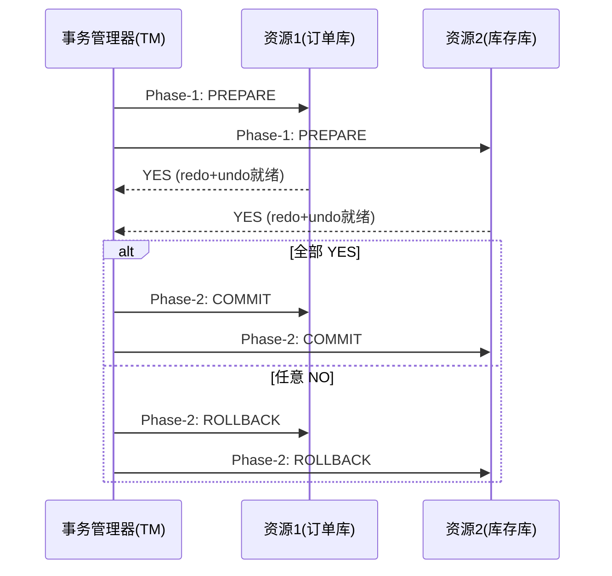
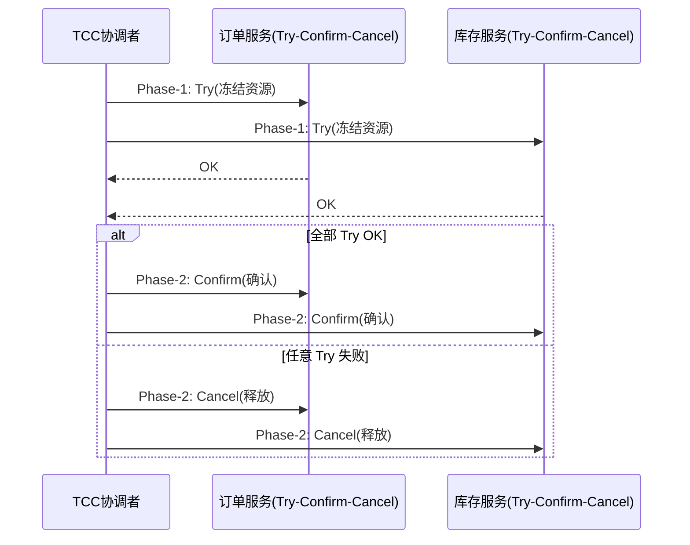
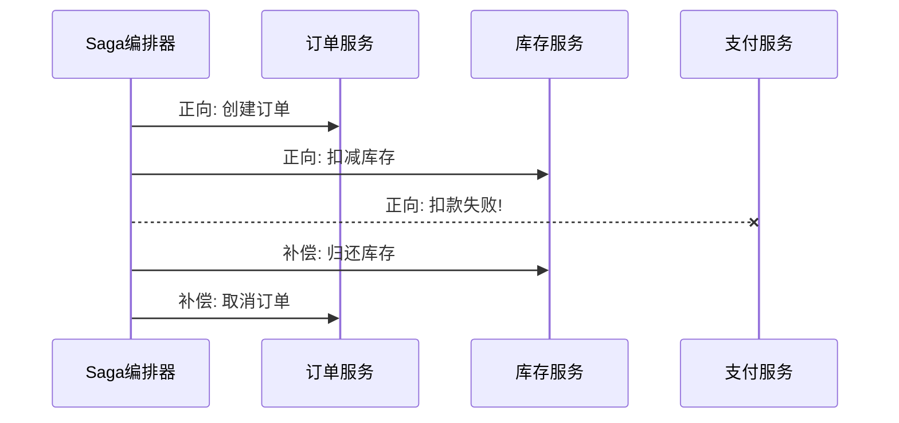
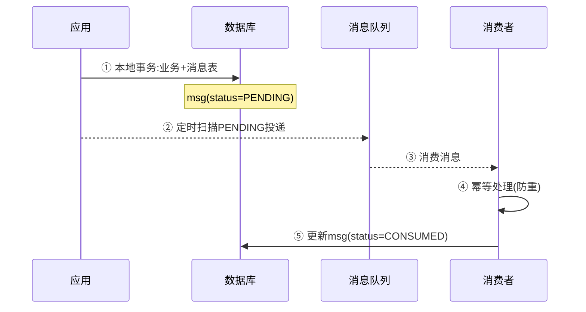

# 分布式事务方案

> 对应代码: [TransactionDemo.java](../../java/base/distributed/TransactionDemo.java)

## 方案对比总览

| 方案 | 一致性 | 性能 | 业务侵入 | 隔离性 | 适用场景 |
|------|--------|------|----------|--------|----------|
| 2PC (XA) | 强一致 | 差 | 无 | 有 | 传统单体拆分、少量资源 |
| TCC | 最终一致 | 好 | 大 | 无 | 高并发资金、积分 |
| Saga | 最终一致 | 好 | 中 | 无 | 长流程、异构系统 |
| MQ 可靠消息 | 最终一致 | 好 | 小 | 无 | 异步解耦、允许最终一致 |
| Seata AT | 强一致 | 中 | 无 | 有 | 默认推荐、无侵入 |

## 1. 2PC (Two-Phase Commit)



**缺点**:
- 同步阻塞：prepare 阶段锁定资源直到 commit/rollback
- 单点故障：TM 宕机后参与者阻塞
- 数据不一致：Phase-2 部分提交成功部分失败时无保障

## 2. TCC (Try-Confirm-Cancel)



## 3. Saga



## 4. MQ 可靠消息最终一致性



## 5. Seata AT 模式

```mermaid
sequenceDiagram
    participant TC as Seata-Server
    participant TM as 事务发起方
    participant RM as 资源参与方

    TM->>TC: ① 开启全局事务 XID
    TM->>RM: ② 执行业务SQL
    RM->>RM:   自动生成 undo_log(before image)
    RM->>TC:   ③ 注册分支事务
    TM->>TC:   ④ 提交/回滚全局事务
    TC->>RM:   ⑤ 异步清理undo_log(提交)
    or
    TC->>RM:   ⑤ 回滚undo_log数据

```

## 选型决策

```
强一致? ──Yes→ 2PC / Seata AT
└─No→ 高并发资金? ──Yes→ TCC
      └─No→ 长流程? ──Yes→ Saga
           └─No→ 异步? ──Yes→ MQ 可靠消息
                └─No→ 尽量规避分布式事务！
```