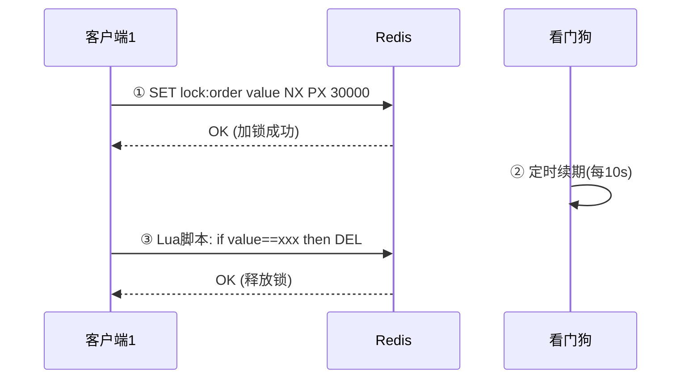
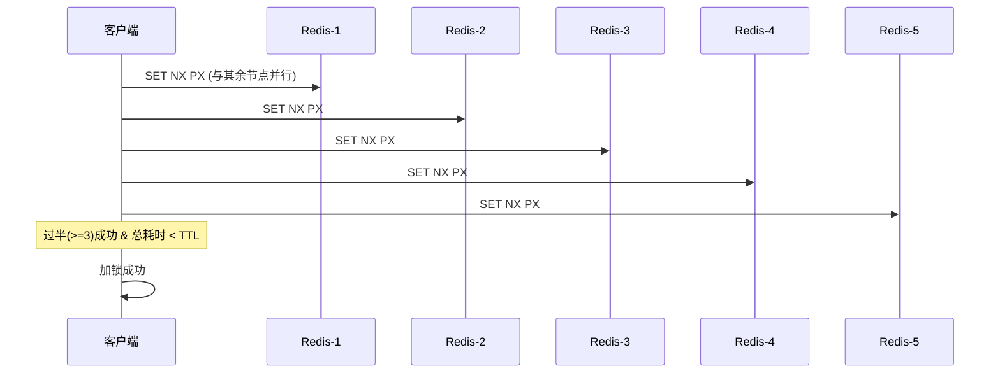
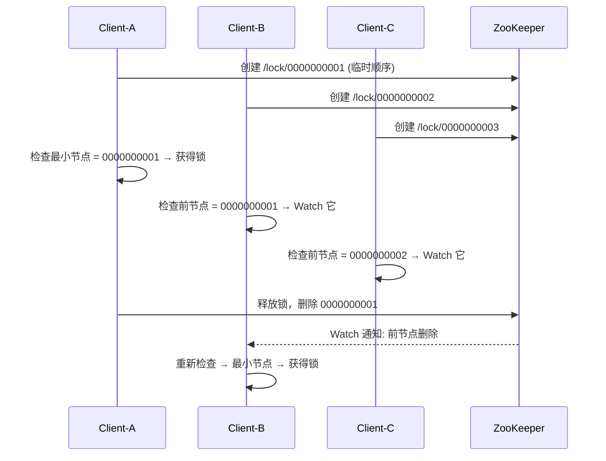
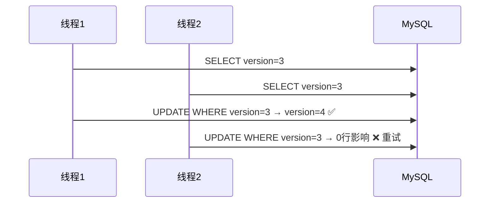

# 分布式锁方案

> 对应代码: [LockDemo.java](../../java/base/distributed/LockDemo.java)

## 三种方案对比

| 维度 | Redis | ZooKeeper | MySQL |
|------|-------|-----------|-------|
| CAP 模型 | AP | CP | CA |
| 性能 | 高(内存操作) | 中等(过半写入) | 低(磁盘IO) |
| 锁释放 | Lua 脚本 + TTL | 会话断开自动删除 | 手动释放/超时 |
| 公平性 | 非公平 | 公平(序号) | 非公平 |
| 锁续期 | 看门狗定时续期 | 临时节点自带 | 需手动续期 |
| 锁丢失风险 | 主从切换可能丢失 | 几乎无 | 无 |
| 复杂度 | 低 | 中 | 高 |
| 典型框架 | **Redisson** | **Curator** | 手写 |

## 1. Redis 分布式锁



### RedLock 算法（多实例过半）



**RedLock 争议点**: Martin Kleppmann 指出 GC 暂停、时钟跳变等场景下 RedLock 安全性不足。

## 2. ZooKeeper 分布式锁



## 3. MySQL 分布式锁

### 悲观锁 (FOR UPDATE)
```sql
-- 加锁
SELECT * FROM distributed_lock WHERE resource = 'order:123' FOR UPDATE;
-- 释放（事务提交）
COMMIT;
```

### 乐观锁 (版本号 CAS)
```sql
-- 读取当前版本
SELECT stock, version FROM product WHERE id = 1;  -- version=3
-- 更新带版本条件
UPDATE product SET stock = stock - 10, version = version + 1
WHERE id = 1 AND version = 3;
-- affected rows = 1 → 成功; = 0 → 版本冲突，重试
```



## 选型决策

```
                    需要分布式锁?
                    /          \
               高并发?        低并发?
              /                   \
         Redis(SET NX)        ZK(顺序节点)
         + Redisson           强一致场景
         + WatchDog           (如定时任务)
```