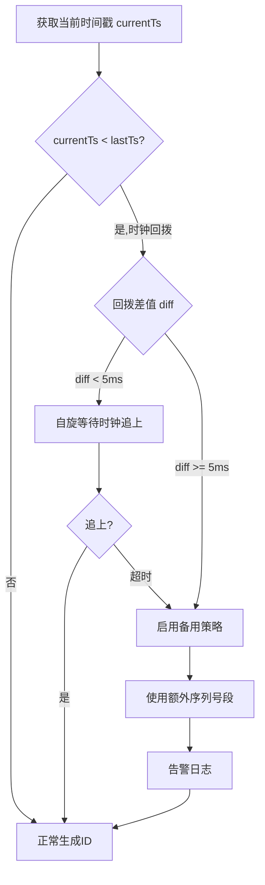
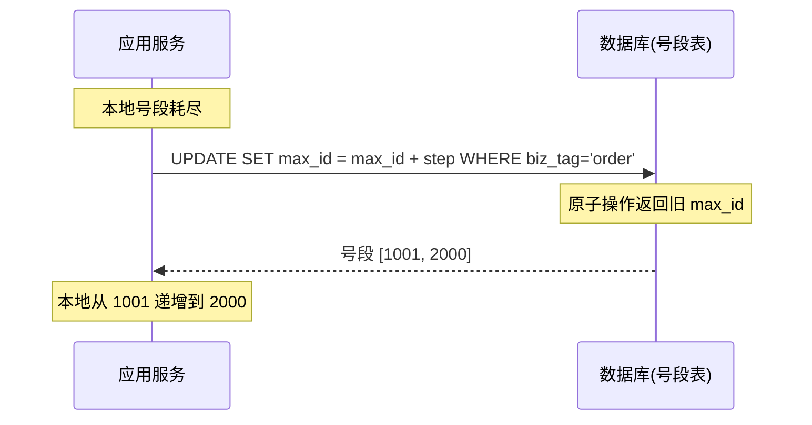
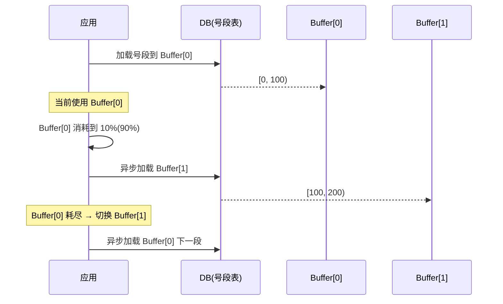

# 分布式 ID 生成方案

> 对应代码: [IDGeneratorDemo.java](../../java/base/distributed/IDGeneratorDemo.java)

## 方案对比

| 方案 | 趋势递增 | 依赖 | 性能 | 缺点 |
|------|----------|------|------|------|
| **Snowflake** | 是(时间序) | 无 | 极高 | 时钟回拨 |
| **号段模式** | 是(号段序) | DB | 高 | DB 单点 |
| **Leaf 双缓冲** | 是 | DB | 极高 | DB 单点 |
| **有序 UUID** | 是(v7) | 无 | 高 | 字符串长 |

## 1. Snowflake（雪花算法）

### 位分配

```
 ┌─1 bit 保留(0)───┬───────41 bits 毫秒时间戳──────────┬──10 bits Worker ID──┬──12 bits 序列号──┐
 │                 │   (可用 ~69 年)                   │ (最多 1024 节点)    │ (每ms 4096个)   │
 └─────────────────┴──────────────────────────────────┴─────────────────────┴─────────────────┘
 63                22                                   12                    0
```

### 时钟回拨处理



## 2. 号段模式 (Segment)



## 3. Leaf 双缓冲（美团）

双 buffer 异步加载，避免 ID 获取阻塞在 DB 号段拉取。



## 4. 有序 UUID (v7)

```
UUID v4 (完全随机): B+Tree 插入随机位置，页分裂严重
UUID v7 (时间戳序): 48bit Timestamp | 12bit Random | 62bit Random
                   B+Tree 近似顺序插入，性能接近自增ID
```

### UUID 版本对比

| 版本 | 格式 | 特点 |
|------|------|------|
| v1 | 时间+MAC | 有序，但暴露 MAC 地址 |
| v4 | 全随机 | 无序，B+Tree 页分裂 |
| **v7** | 48bit时间戳+随机 | **有序 + 不泄露信息** |

## 选型建议

```
需要全局唯一ID?
├── 需要趋势递增(B+Tree友好)?
│   ├── 不能依赖DB → Snowflake (美团Leaf推荐)
│   └── 可以依赖DB → 号段模式 / Leaf双缓冲
└── 不需要趋势递增
    └── UUID v7 (简单)
```