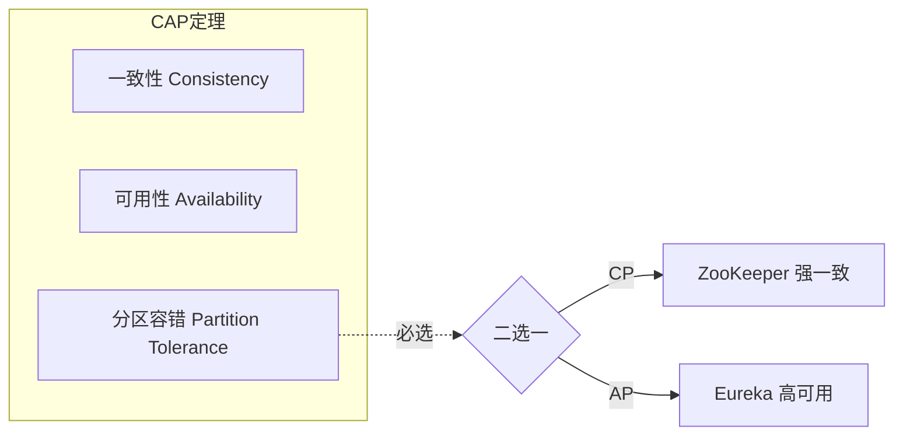
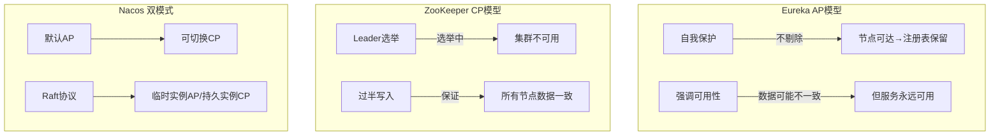
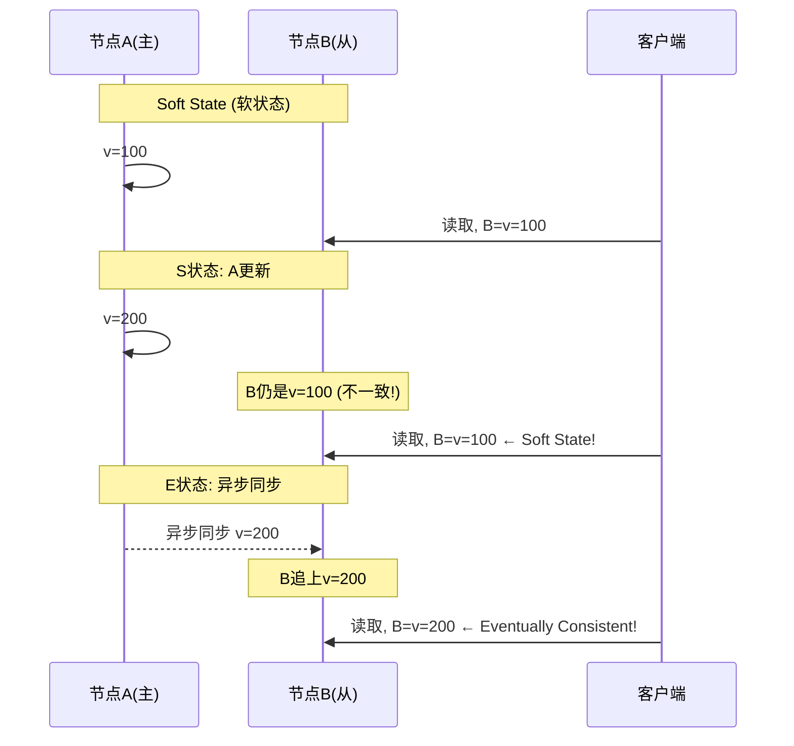

# CAP 定理与 BASE 理论

> 对应代码: [CAPBaseDemo.java](../../java/base/distributed/CAPBaseDemo.java)

## 1. CAP 定理

**CAP（布鲁尔定理，2000年）**：分布式系统最多同时满足三项中的两项。

```
              Consistency (一致性)
                   /\
                  /  \
                 /    \
                /      \
    Availability ────── Partition Tolerance
       (可用性)           (分区容错性)

    P 必选 → C 和 A 只能二选一
```



## 2. 注册中心 CAP 模型



### 对比表

| 组件 | CAP | 一致性协议 | 故障处理 |
|------|-----|-----------|---------|
| **Eureka** | AP | 无 | 自我保护(不剔除) |
| **ZooKeeper** | CP | ZAB | Leader选举(不可用) |
| **Nacos** | AP+CP | Raft(CP模式) | 临时/持久实例区分 |
| **Consul** | CP | Raft | Leader选举 |
| **Etcd** | CP | Raft | Leader选举 |

## 3. BASE 理论

BASE 是 CAP 的工程实践妥协：

```
BA (Basically Available)  : 基本可用 —— 降级响应，不中断服务
S  (Soft state)           : 软状态 —— 允许系统存在中间态(不一致)
E  (Eventually consistent): 最终一致 —— 经过时间后所有副本达到一致
```



### BASE vs ACID

```
┌─────────────────┬───────────────────────────┐
│      ACID       │          BASE             │
├─────────────────┼───────────────────────────┤
│ 强一致性         │ 最终一致性                  │
│ 事务隔离         │ 无隔离保证                  │
│ 悲观锁           │ 乐观锁 + 补偿               │
│ 同步阻塞         │ 异步非阻塞                  │
│ 适用于单机DB     │ 适用于分布式系统             │
│ 银行转账         │ 电商下单(库存最终扣减)       │
└─────────────────┴───────────────────────────┘
```

## 4. 面试高频

**Q: CAP 为什么 P 必选？**
- 分布式系统中网络分区不可避免（交换机故障、网线断、GC停顿等）
- 如果放弃 P，当分区发生→系统停止服务→等于单机系统
- 所以实际工程中只能在 C 和 A 间权衡

**Q: Eureka 的自我保护模式是什么？**
- 当 Eureka Server 短时间内丢失大量客户端心跳时
- 进入自我保护 → 不剔除任何实例（避免因网络分区误删健康实例）
- 这是 AP 模型的典型实现：宁可保留过期实例，也不误删

**Q: BASE 和 ACID 哪个更重要？**
- 看场景：支付用 ACID，商品浏览用 BASE
- 分布式系统中 BASE 更常见 —— 强一致成本太高
- 大部分互联网场景接受最终一致（如微博粉丝数、点赞数）