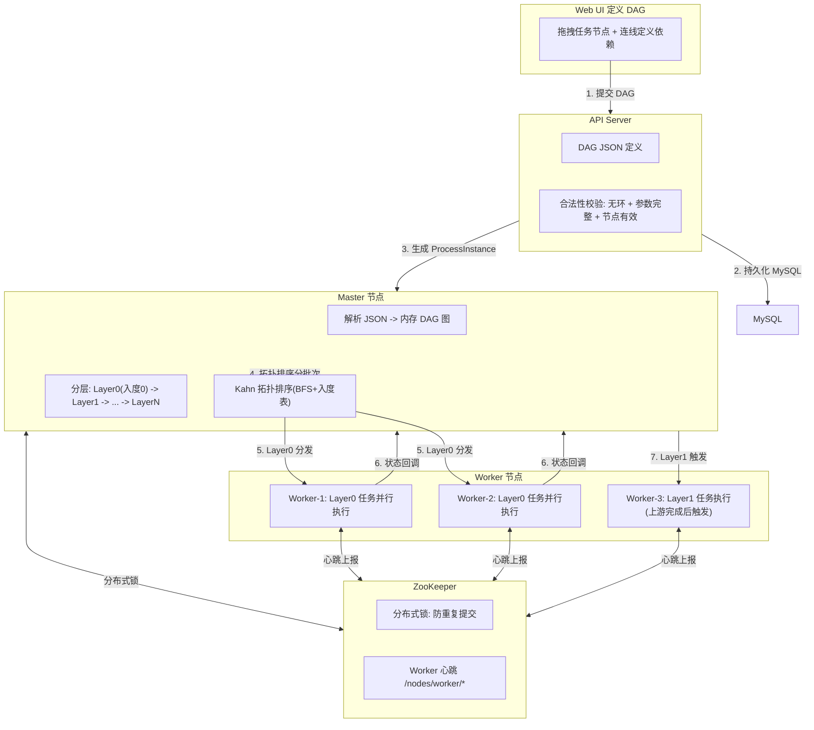
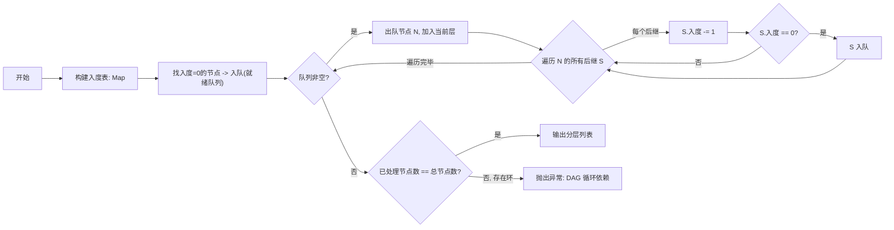
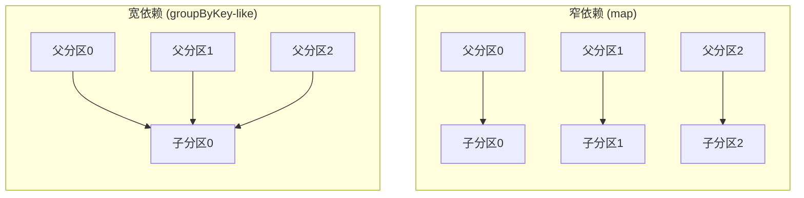
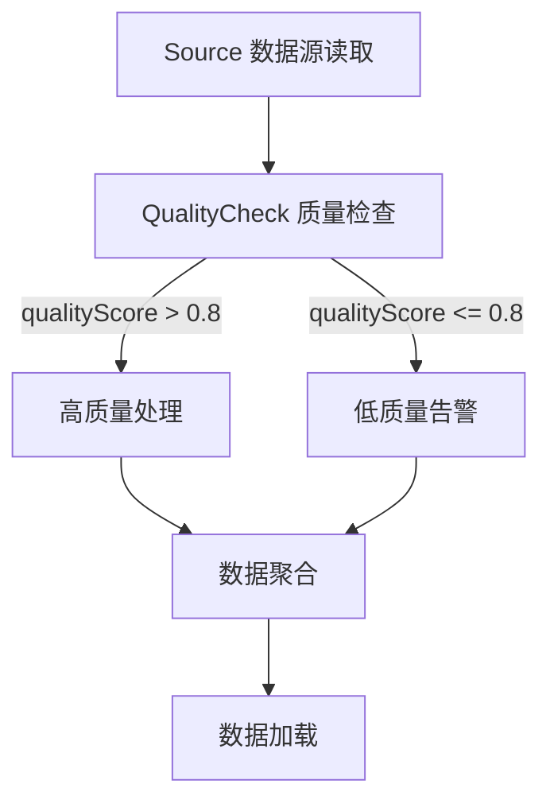
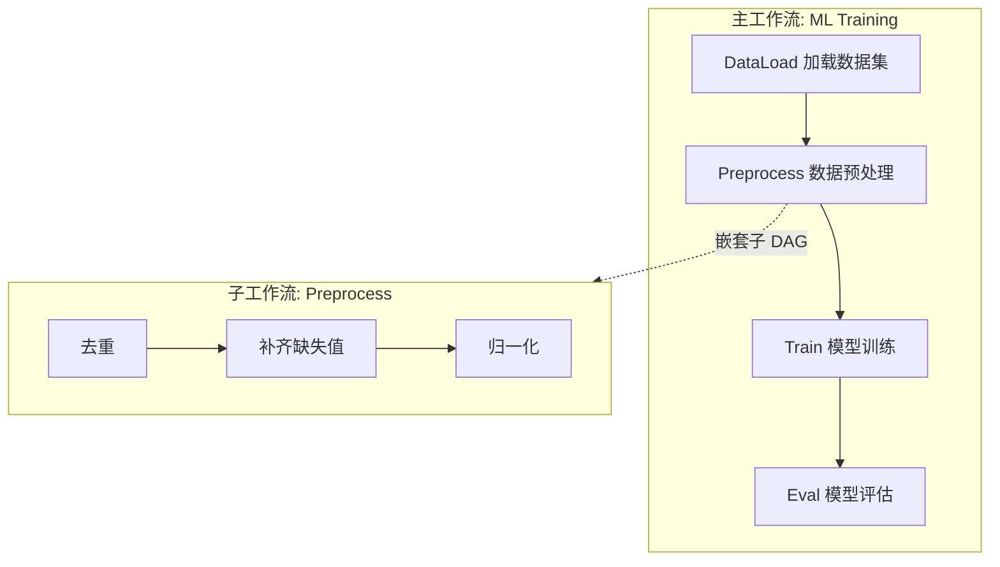

# 01-DAG 编排引擎

## DAG 封装模型

## Kahn 拓扑排序核心算法

### 算法复杂度

| 指标 | 值 |
|------|-----|
| 时间复杂度 | O(V + E) |
| 空间复杂度 | O(V) |
| 环检测 | 处理节点数 < V 则存在环 |

## 窄依赖 vs 宽依赖

| 依赖类型 | 特征 | Shuffle | DolphinScheduler 表现 |
|---------|------|---------|----------------------|
| 窄依赖 | 1:1 或 N:1(父分区->子分区) 一对一 | 无 | 不需要数据重分布，pipeline 执行 |
| 宽依赖 | N:M 或多父->1子 | 有 | 上游全部分区完成后，下游才可执行 |

## 条件分支

## 子工作流 SubProcess

## 面试要点

1. **Kahn 拓扑排序为什么用 BFS 而不是 DFS？** BFS 天然支持分层，同一层入度同时为 0 的任务可并行调度。DFS 只能得到一条有效序列，但无法表达并行关系。

2. **DolphinScheduler 的 DAG 定义支持哪种数据类型？** JSON。Web UI 拖拽后将 DAG 结构序列化为 JSON，存储在 MySQL `t_ds_process_definition` 表中。

3. **如何保证 DAG 不会重复执行？** ZooKeeper 分布式锁。提交时 Master 获取 processInstance 的锁，同一实例不会同时被两个 Master 调度。

4. **DAG 中的条件节点是如何实现的？** 上游任务执行完毕后，Master 根据其输出参数 (全局参数 varPool) 评估条件表达式，决定走 succeed / failed 分支。条件节点的两个分支在 JSON 中都有定义。