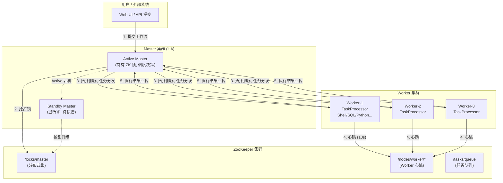
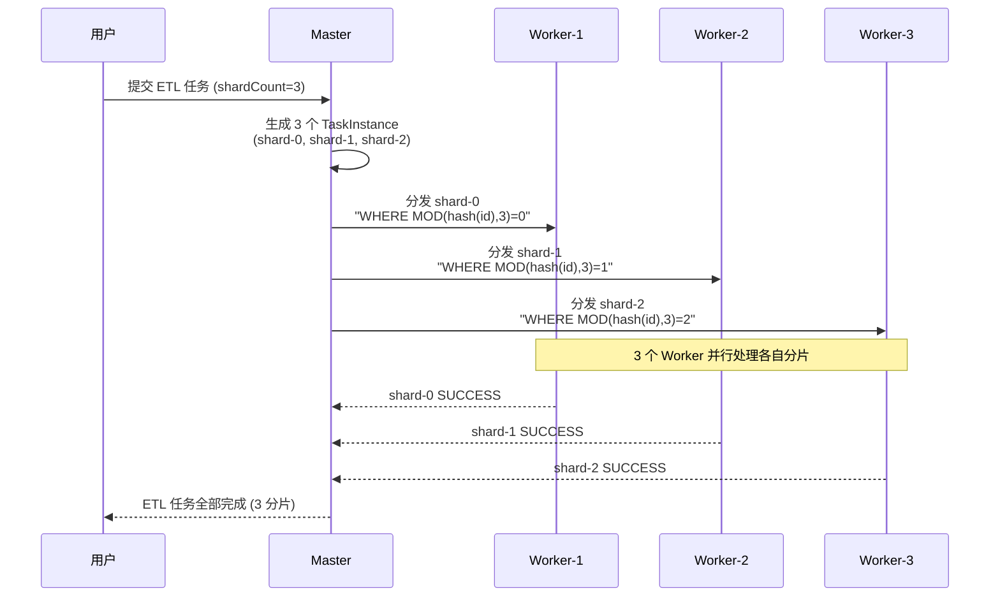
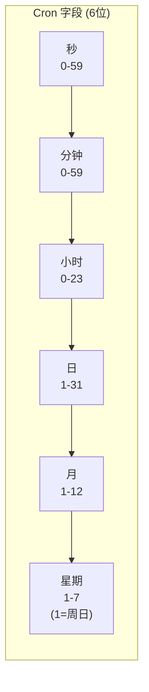
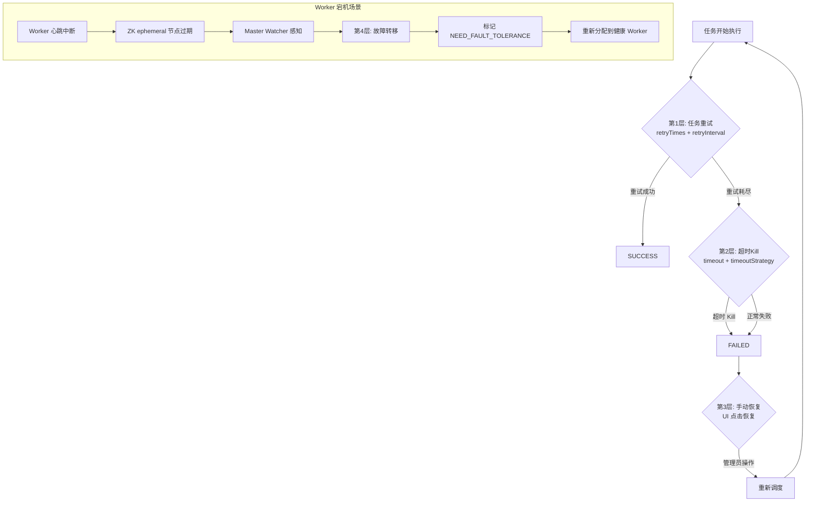
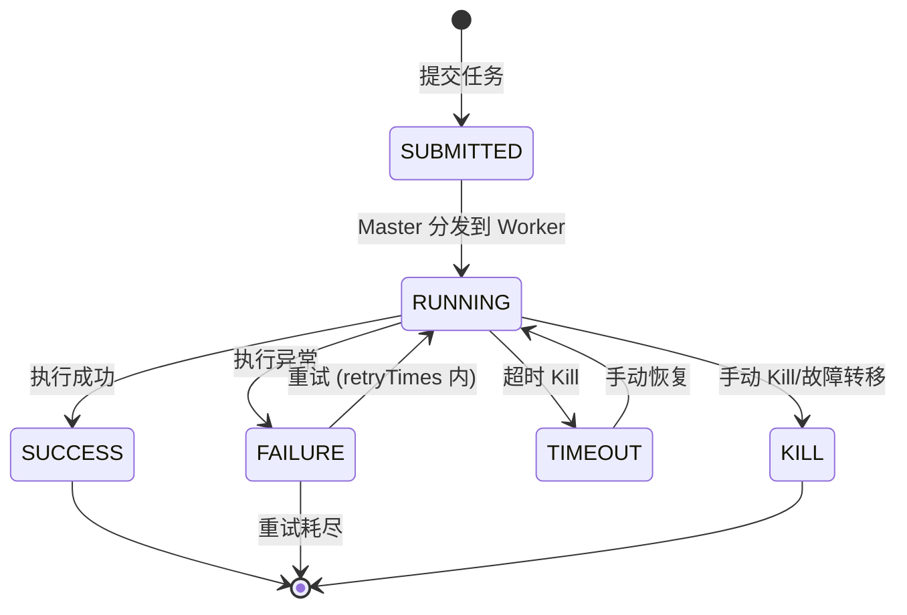
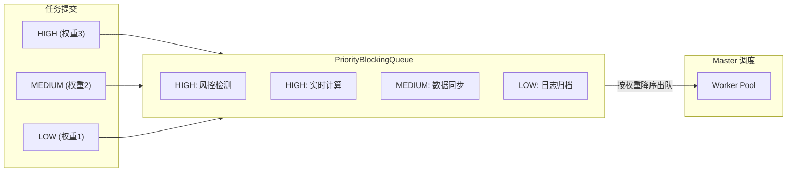

# 02-任务调度与容错

## Master-Worker 架构

## 任务分片机制

## Cron 表达式字段含义

| 表达式 | 含义 |
|--------|------|
| `0 0 2 * * ?` | 每天凌晨 2:00 |
| `0 */5 * * * ?` | 每 5 分钟 |
| `0 0 9-18/2 * * ?` | 9:00-18:00 每 2 小时 |
| `0 30 1 1,15 * ?` | 每月 1 号和 15 号 1:30 |
| `0 0 8 ? * MON-FRI` | 周一到周五 8:00 |

## 容错机制 4 层

## 任务状态机

## 优先级队列调度

## 面试要点

1. **Master 如何防止单点故障？** 通过 ZooKeeper 分布式锁实现 HA。Active Master 持有临时节点锁，宕机后锁过期，Standby Master 通过 Watcher 感知并抢锁升级。

2. **Worker 宕机后，正在执行的任务如何处理？** 
   - Master 监听到 Worker 心跳中断 (10s)
   - 将该 Worker 上所有 RUNNING 的 TaskInstance 标记 NEED_FAULT_TOLERANCE
   - 通过 RPC 调用旧 Worker 的 `killTask` 接口确保不重复执行
   - 将 NEED_FAULT_TOLERANCE 的任务重新分发到健康 Worker

3. **任务分片的数据倾斜如何处理？** 
   - 分片键选择：避免用自增 ID 分片 (会导致尾部热点)
   - hash 分片：`MOD(CRC32(bizKey), shardCount)`
   - 二次分片：如果某个分片数据量仍然过大，可单独对该分片再次分片
   - 动态分片：根据数据量动态调整分片数 (高级特性)

4. **Cron 表达式 vs 依赖触发，何时用哪个？**
   - Cron：定时批量任务 (T+1 日终批量)
   - 依赖触发：上游数据就绪后触发 (实时/准实时链路)