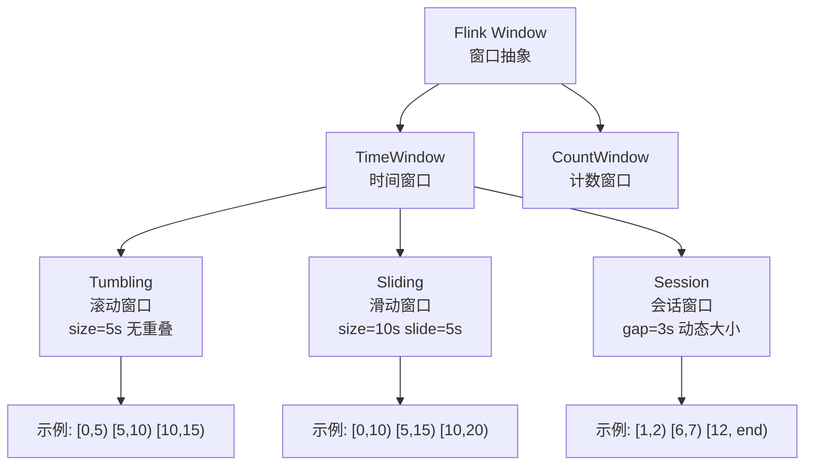
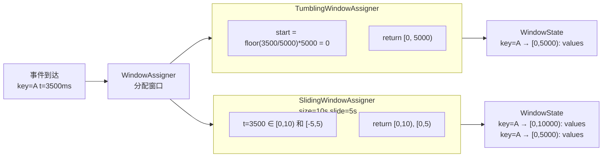
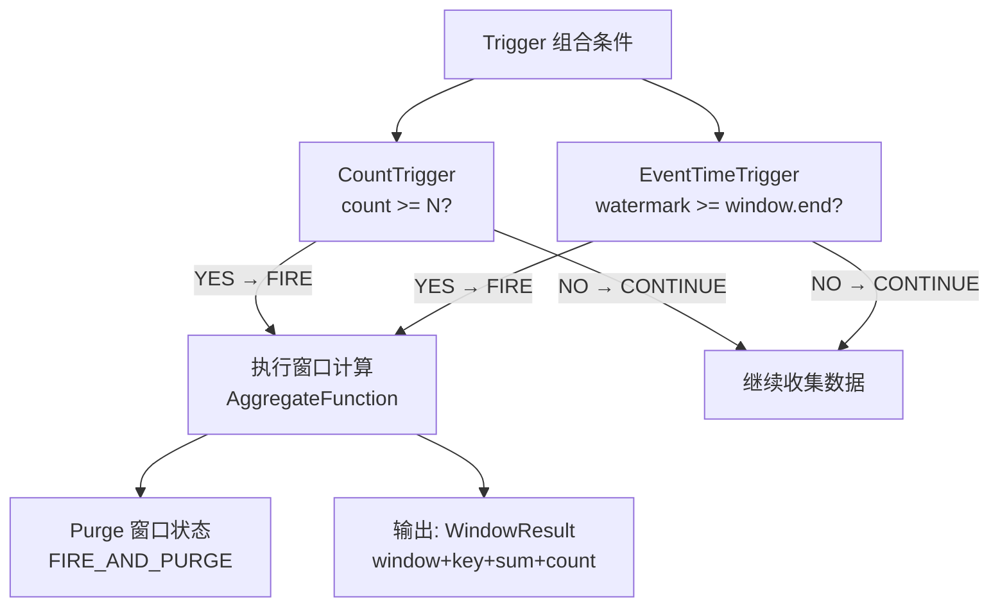
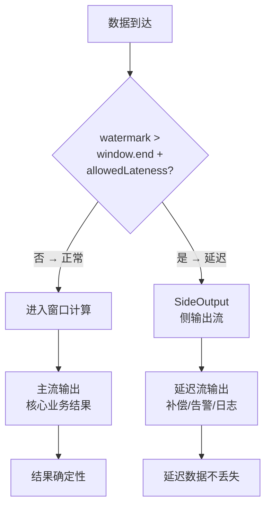

# Flink 窗口机制

> 纯 Java 手写 WindowAssigner + Trigger + SideOutput，理解 Flink 窗口核心原理。

## 1. 窗口分类总览



## 2. WindowAssigner 分配流程



## 3. Trigger 触发流程



## 4. SideOutput 延迟数据处理



## 5. Tumbling vs Sliding 数据分配对比

```
Tumbling Window (size=5s):
─────────────────────────────────────────────
[0──────5)     [5──────10)    [10─────15)
   ↑               ↑              ↑
 t=1,2,3        t=6,7         t=12

每条数据只属于 1 个窗口


Sliding Window (size=10s, slide=5s):
─────────────────────────────────────────────
[0─────────10)
     [5──────────15)
          [10─────────20)
               [15──────────25)
   ↑     ↑        ↑
 t=6 属于 2 个窗口: [0,10) 和 [5,15)

数据在多个窗口中重复计算！

窗口数 = floor((timestamp + slide) / slide)
```

## 6. 核心类关系

| 类 | 职责 | 触发条件 |
|----|------|----------|
| `WindowAssigner` | 决定数据分配到哪些窗口 | 每条数据到达时 |
| `Trigger` | 决定窗口何时触发计算 | Watermark + Count + 定时器 |
| `WindowOperator` | 组合 Assigner + Trigger 处理数据 | 数据流持续 |
| `SideOutputCollector` | 收集延迟数据 | 超过 allowedLateness |
| `WindowResult` | 窗口聚合结果 | Trigger 触发后 |