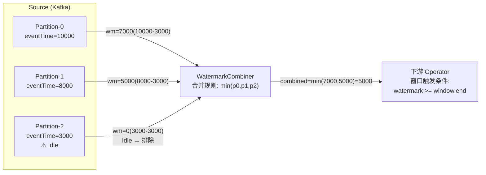
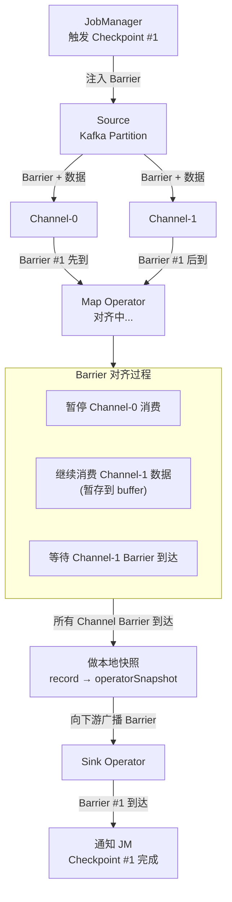
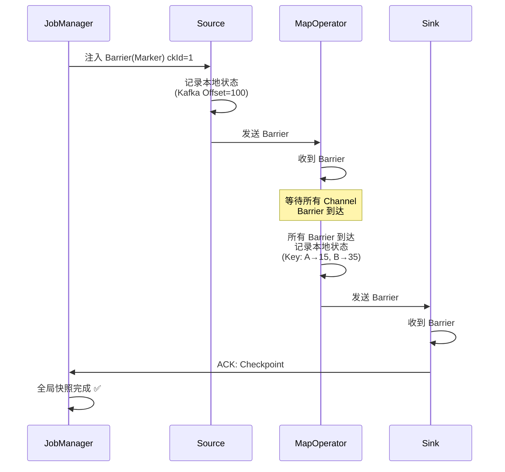
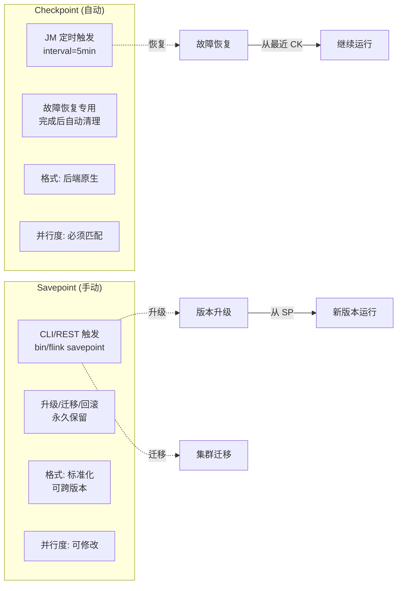
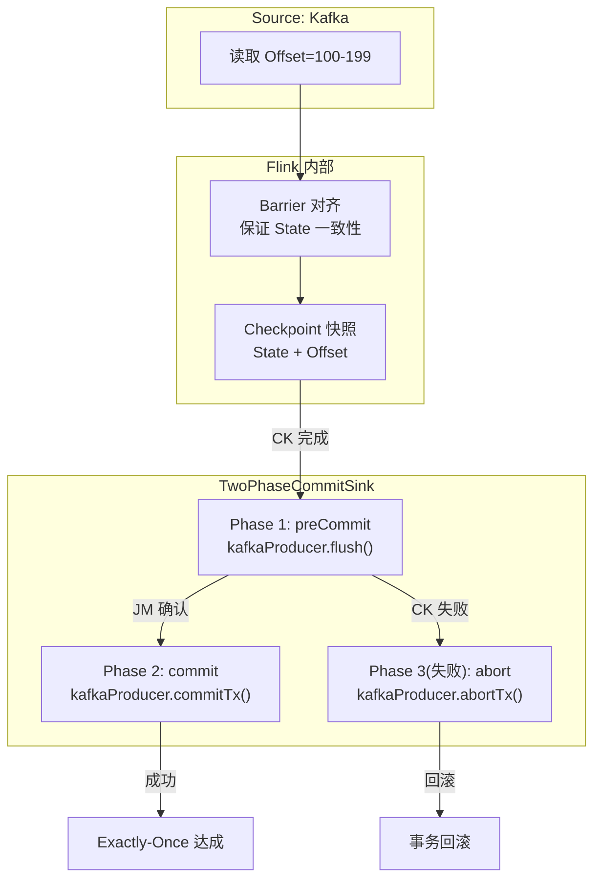

# Watermark 与 Checkpoint

> 水位线生成合并 + Checkpoint Barrier 对齐 + Chandy-Lamport 分布式快照原理。

## 1. Watermark 生成与传递

## 2. Checkpoint Barrier 对齐流程

## 3. Chandy-Lamport 分布式快照

## 4. Savepoint vs Checkpoint 对比图

## 5. Exactly-Once 端到端流程

## 6. Watermark + Checkpoint 协同

| 机制 | 作用 | 触发周期 |
|------|------|----------|
| Watermark | 处理乱序数据，触发窗口计算 | 每条数据/每200ms |
| Checkpoint | 故障恢复，保证状态一致性 | 每 5min |
| Savepoint | 手动触发的升级/迁移快照 | 按需 |

**协同关系**：
- Watermark 保证数据语义正确（乱序容忍）
- Checkpoint 保证 Exactly-Once（故障恢复不丢不重）
- Savepoint 保证兼容升级（状态跨版本迁移）