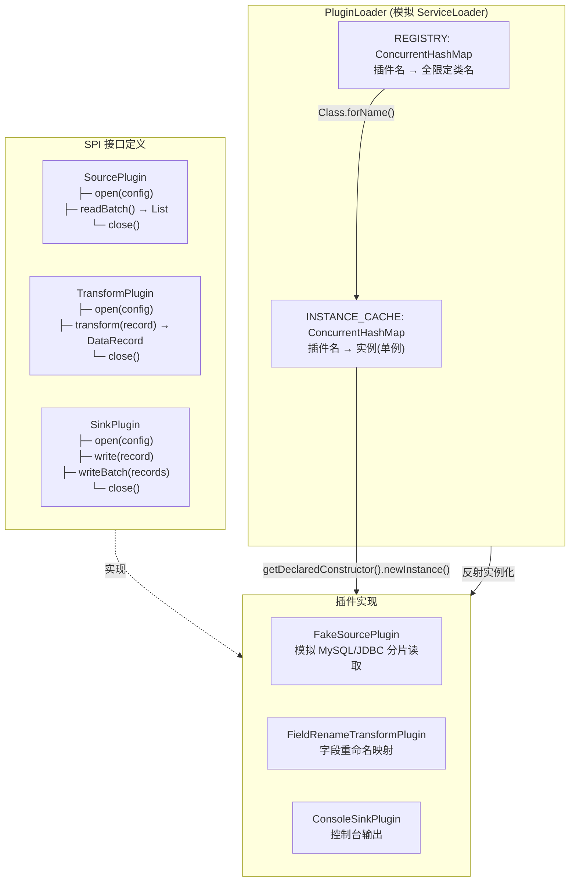
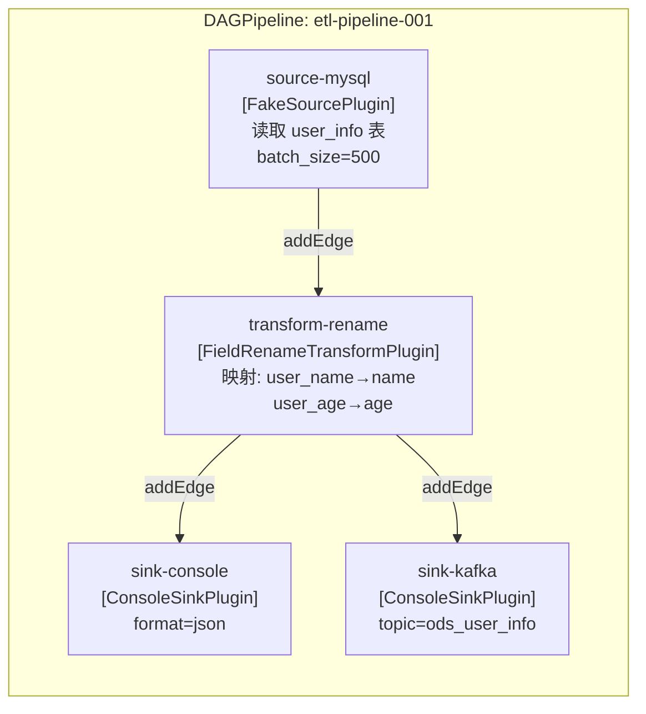

# 01-Seatunnel插件模型与DAG编排

## SPI 插件加载机制

**插件生命周期：**
1. **register(name, className)**: 将插件注册到 REGISTRY
2. **load(name, type)**: 查找 REGISTRY → 查 CACHE → 反射创建实例 → 放入 CACHE → 返回
3. **open(config)**: 初始化连接/资源（JDBC Connection、Kafka Consumer 等）
4. **process**: Source 拉取 → Transform 转换 → Sink 写入
5. **close()**: 释放资源

## DAG 编排模型

**DAG 关键设计：**
| 组件 | 说明 |
|------|------|
| DAGNode | 节点：nodeId + pluginName + config + 下游节点列表 |
| DAGEdge | 边：from → to，描述数据流向 |
| DAGPipeline | 管线：管理节点/边，查找源节点，沿拓扑传播数据 |
| propagateData() | 递归传播：对每条 record.copy() 防止多路输出污染 |

**执行流程：**
1. `findSourceNode()`: 查找入度为 0 的源节点
2. `source.readBatch()`: 轮询拉取批次数据
3. `propagateData(batch, downstream)`: 沿 DAG 边递归传播
4. 多路输出时 `record.copy()` 确保各分支数据独立
5. 全部批次完成后生成 `CheckpointState`

## 面试要点

1. **为什么使用 SPI 机制？** 解耦接口与实现，新增数据源只需实现接口并注册，无需修改核心代码。JDK ServiceLoader 扫描 META-INF/services/ 目录。
2. **DAG 如何避免死循环？** 通过保证边方向从 Source → Transform → Sink，且用 `record.copy()` 避免数据在分叉路径上被意外修改。
3. **为什么需要 PluginLoader 缓存？** 避免重复反射创建实例，确保同一插件在管线中被多次引用时共享状态。