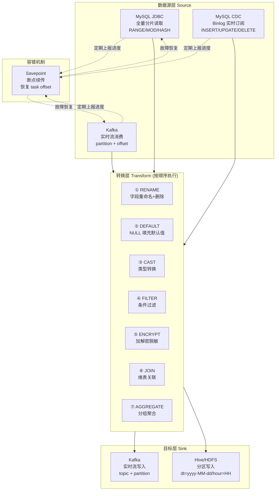
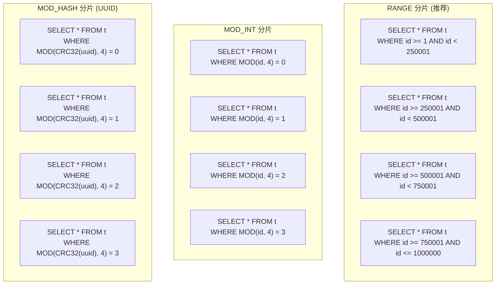
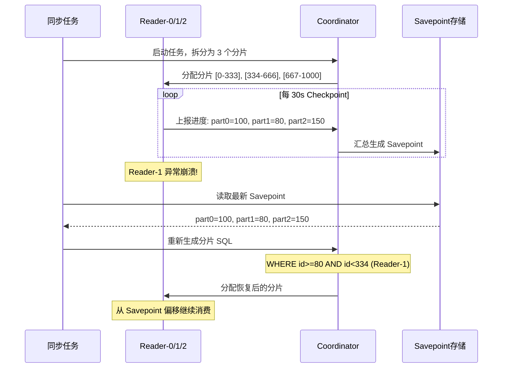

# 02-多数据源集成与转换链

## 多数据源集成架构

## JDBC 分片策略对比

| 策略 | 索引利用 | 数据均匀度 | 适用场景 | 性能 |
|------|---------|-----------|---------|------|
| RANGE | 走主键索引 | 依赖分布 | 自增 ID 表 | 最优 |
| MOD_INT | TABLE SCAN | 天然均匀 | 小表/倾斜表 | 较差 |
| MOD_HASH | TABLE SCAN | 哈希均匀 | UUID 主键 | 较差 |

## 转换链执行顺序

```mermaid
flowchart LR
    RAW["原始 Row\n{user_id, user_name, age,\n phone, email, dept_id,\n salary, status}"]

    R["① RENAME\nuser_name→name\ndept_id→department_id\nstatus→user_status\nDROP phone"]
    --> D["② DEFAULT\nage=null → 0\nemail=null → unknown@\ndepartment_id=null → 999"]
    --> C["③ CAST\nage: String→Integer\nsalary: Double→Long\n脏数据 age=-5 丢弃"]
    --> F["④ FILTER\nstatus='active' AND\nsalary BETWEEN 1000-50000\nAND email NOT NULL"]
    --> E["⑤ ENCRYPT\nemail → SHA256(email_hash)\nname → AES(name_encrypted)"]
    --> J["⑥ JOIN\n维表关联 dept_id\n→ dept_name/location/level"]
    --> AGG["⑦ AGGREGATE\nGROUP BY dept_name\nCOUNT/SUM/AVG/MAX/MIN"]

    RAW --> R
    AGG --> RESULT["聚合结果\n{dept_name, employee_count,\n total_salary, avg_salary,\n max_salary, min_salary}"]
```

**转换链设计原则：**
- **RENAME 最先**：后续转换基于标准化字段名操作
- **DEFAULT 其次**：填充缺失值，避免 CAST/FILTER 因 NULL 异常
- **CAST 第三**：类型统一后再做过滤和加密
- **FILTER 在加密前**：明文字段条件过滤，加密后无法直接比较
- **ENCRYPT 在 JOIN 前**：敏感字段脱敏后再关联维表
- **AGGREGATE 最后**：所有明细处理完毕后聚合

## 断点续传 Savepoint 流程

**Savepoint 关键设计：**
| 要点 | 说明 |
|------|------|
| 存储内容 | taskId + Map(partition → offset) + checkpointTime |
| 触发间隔 | 可配置，默认 30s（checkpoint.interval） |
| 语义保证 | At-Least-Once（可能重复，但不会丢失） |
| 恢复方式 | 读取 Savepoint → 重新生成分片 WHERE 条件带起始位置 |

## 面试要点

1. **RANGE vs MOD 分片如何选择？** 优先 RANGE（走索引），主键分布不均或 UUID 主键时用 MOD_HASH，分片数设为并发度的 2-4 倍。
2. **转换链为什么是这个顺序？** RENAME/DEFAULT/CAST 属于数据清洗，必须在 FILTER 之前；FILTER 要在 ENCRYPT 之前（加密后无法过滤明文）；AGGREGATE 最后（依赖明细）。
3. **Savepoint 如何保证不丢数据？** 采用 At-Least-Once 语义，任务重启后从上次 Savepoint 位置重新消费，下游需做好幂等处理。