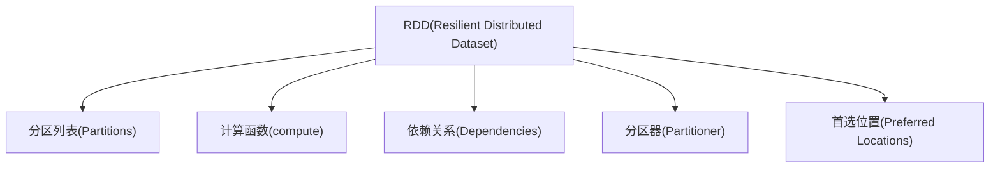
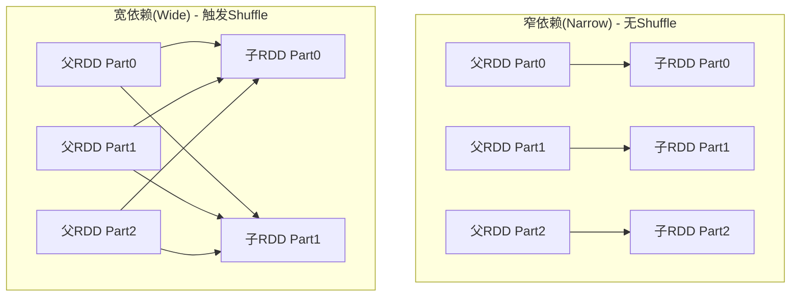
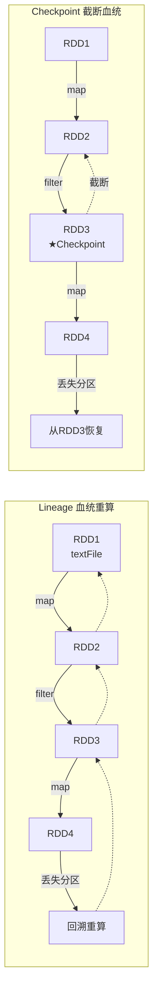
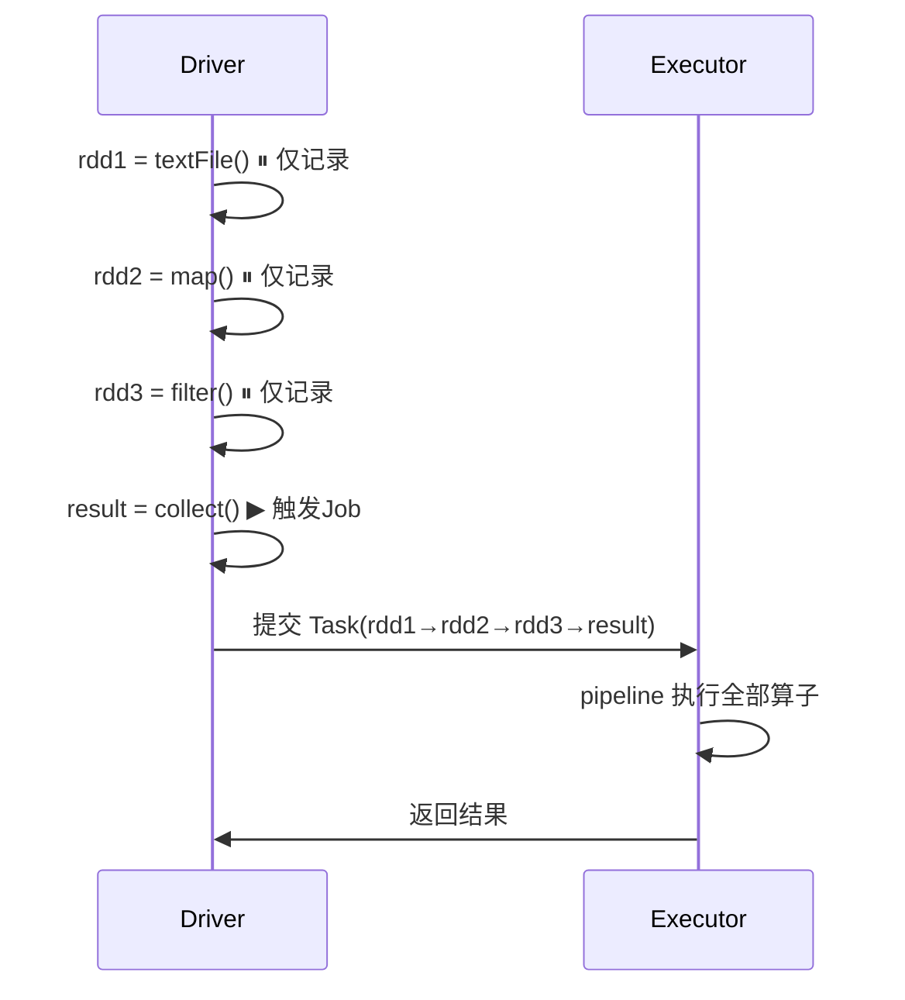

# RDD 弹性分布式数据集核心原理

## 1. RDD 定义与五大特性



**三大核心属性：**
- **弹性**：数据可内存/磁盘存储，故障自动恢复
- **分布式**：数据分布在多节点，分区并行计算
- **数据集**：只读、可分区的记录集合

## 2. Transformation vs Action

```mermaid
flowchart LR
    subgraph Transformation["Transformation 转换(惰性)"]
        Map["map()"]
        Filter["filter()"]
        FlatMap["flatMap()"]
        RBK["reduceByKey()"]
        GBK["groupByKey()"]
        Join["join()"]
    end

    subgraph Action["Action 行动(触发计算)"]
        Collect["collect()"]
        Count["count()"]
        Reduce["reduce()"]
        Save["saveAsTextFile()"]
        Foreach["foreach()"]
    End

    Input["输入 RDD"] --> Transformation --> RDD2["新 RDD"]
    RDD2 --> Action --> Result["结果"]
```

| 算子类型 | 特征 | 示例 | 执行时机 |
|---------|------|------|---------|
| Transformation | 返回新 RDD, 惰性 | map/filter/join | 不立即执行 |
| Action | 返回值/写存储 | collect/count/reduce | 立即触发 Job |

## 3. 窄依赖 vs 宽依赖



| 对比 | 窄依赖 | 宽依赖 |
|------|--------|--------|
| 分区关系 | 1父→最多1子 | 1父→多个子 |
| 典型算子 | map/filter/union | reduceByKey/groupByKey/join |
| Shuffle | 无 | 有(写磁盘+网络传输) |
| Stage划分 | 可合并到同一Stage | 必须划分新Stage |
| 恢复代价 | 只需重算丢失分区 | 可能需重算所有父分区 |

## 4. Lineage 血统与 Checkpoint



**Lineage**：记录 RDD 转换操作的有向无环图(DAG)，故障时重算丢失分区 -- 零存储成本
**Checkpoint**：将 RDD 物化到可靠存储(HDFS)，截断血缘链 -- 快速恢复，但有物化开销

适用场景：
- 短链(< 5个操作)：Lineage 足够
- 长链(10+操作)：建议 Checkpoint
- 迭代计算(ML/GraphX)：每 N 轮 Checkpoint
- Shuffle 后：建议 Checkpoint(Shuffle 代价高)

## 5. 惰性求值 (Lazy Evaluation)



惰性求值允许 Catalyst 优化器在全局视角进行算子合并、谓词下推等优化。