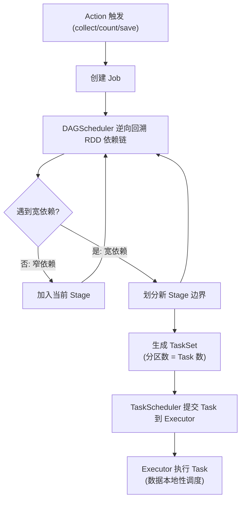
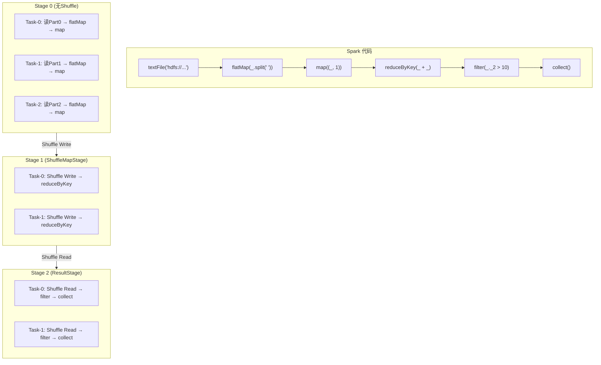
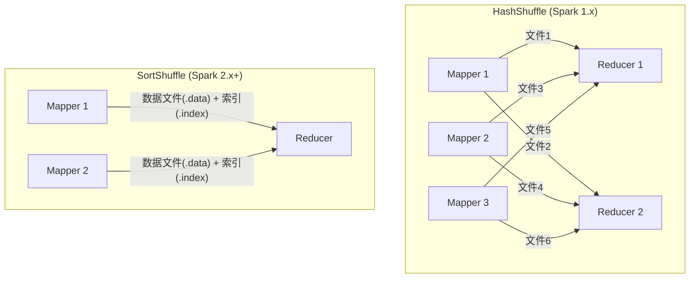
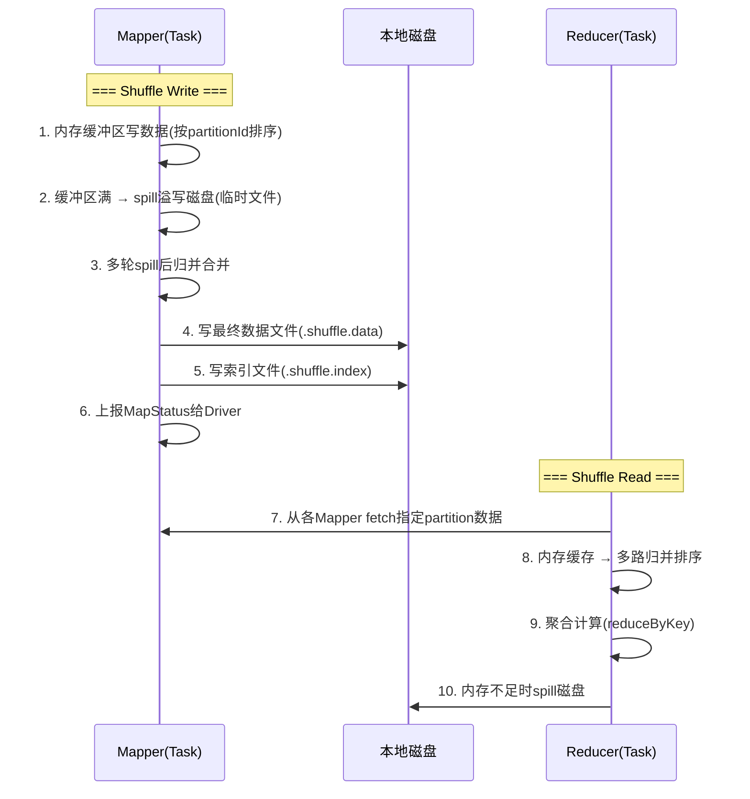
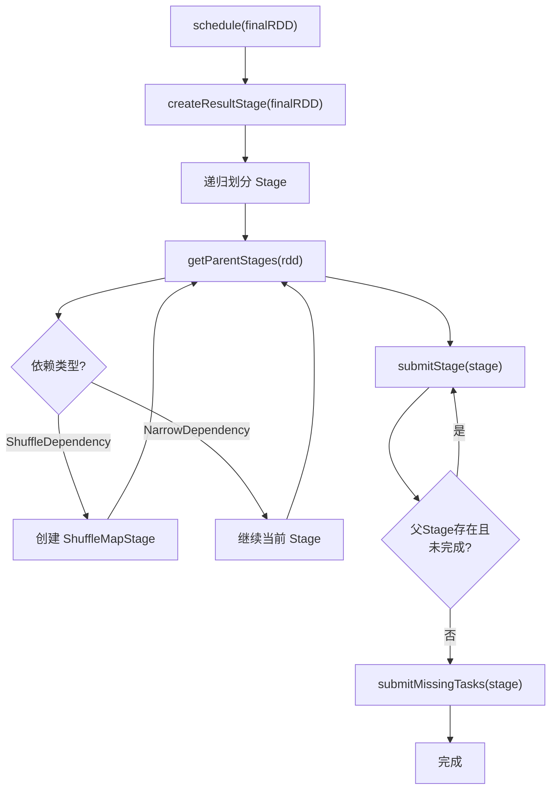

# DAG 调度与 Shuffle 机制

## 1. DAG Scheduler 作业划分流程



## 2. Job → Stage → Task 实例



## 3. HashShuffle vs SortShuffle



| 对比 | HashShuffle | SortShuffle |
|------|-----------|------------|
| 文件数 | M * R | 2 * M |
| M=1000,R=1000 | 100万个文件 | 2000个文件 |
| Mapper端排序 | 无 | 有(TimSort) |
| Reducer端 | 自己排序 | 归并已排序数据 |
| 内存占用 | 低 | 需要排序缓冲区 |

## 4. Shuffle Write/Read 完整流程



**Shuffle Write 三个阶段：**
1. **内存缓冲** -- 按 (partitionId, key) 排序，写入内存缓冲区
2. **Spill 溢写** -- 缓冲区满则溢写到磁盘临时文件
3. **Merge 合并** -- 多轮 spill 后归并合并为最终数据文件+索引文件

**Shuffle Read 三个阶段：**
1. **Fetch 拉取** -- 从每个 Mapper 节点拉取对应分区的数据块
2. **Merge 归并** -- 将来自多个 Mapper 的数据块进行多路归并排序
3. **Aggregate 聚合** -- 执行 reduceByKey/groupByKey 等聚合操作

## 5. 手写简易 DAGScheduler 核心逻辑



核心代码逻辑：
```java
// 递归按宽依赖划分 Stage
void createStage(RDD rdd) {
    for (Dependency dep : rdd.dependencies()) {
        if (dep instanceof ShuffleDependency) {
            // 宽依赖 → 创建父 Stage
            createStage(dep.rdd);
        }
        // 窄依赖 → 归入当前 Stage
    }
}
```