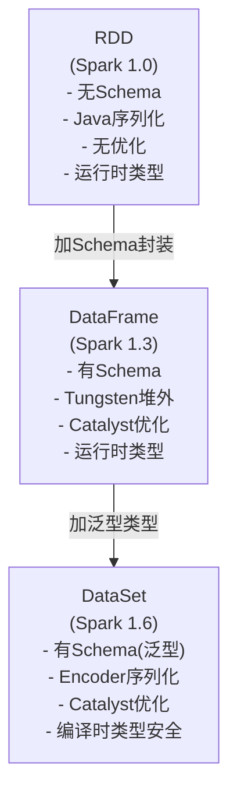
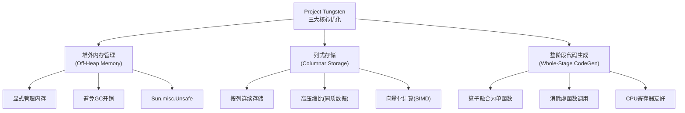
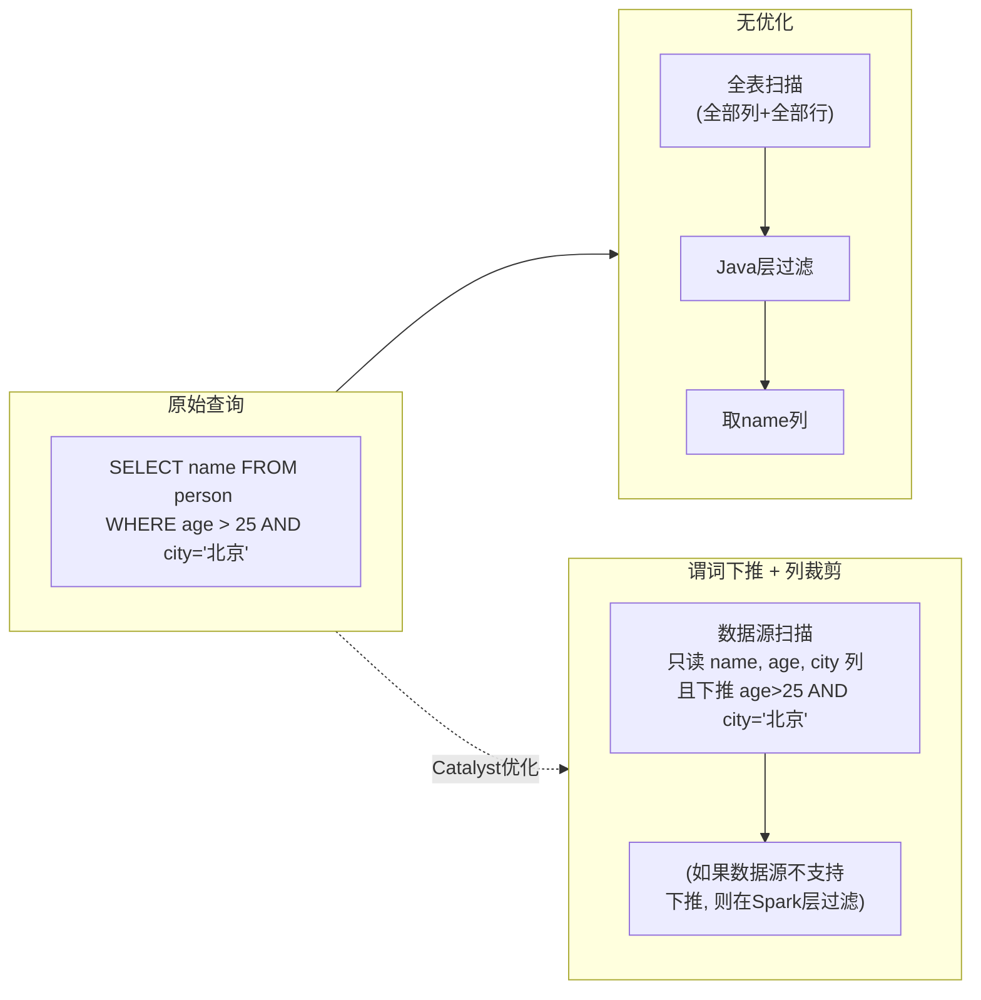
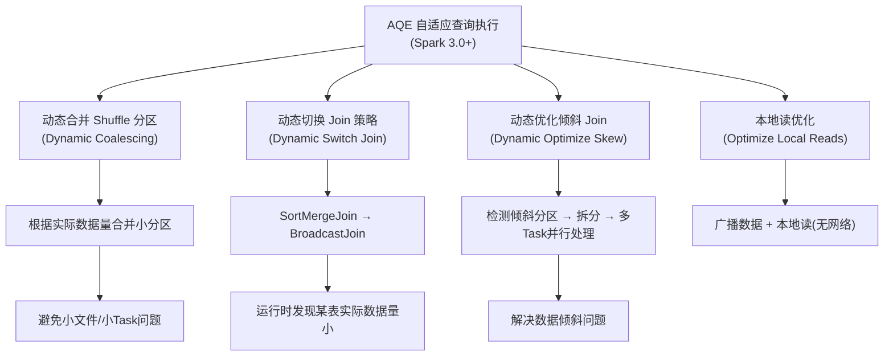

# DataFrame / DataSet / Catalyst 优化器

## 1. RDD vs DataFrame vs DataSet



| 维度 | RDD | DataFrame | DataSet |
|------|-----|-----------|---------|
| 序列化 | Java/Kryo | Tungsten(堆外) | Encoder |
| Schema | 无 | 有(运行时) | 有(编译时泛型) |
| 优化器 | 无 | Catalyst | Catalyst |
| 类型安全 | 运行时 | 运行时 | 编译时 |
| API 级别 | 低级 | 中级 | 高级 |
| 适用场景 | 非结构化数据 | 半结构化(JSON/CSV) | 强类型结构化 |

## 2. Catalyst 优化器四阶段

```mermaid
flowchart TD
    SQL["SQL / DataFrame DSL"]
    
    subgraph Stage1["阶段1: Analysis"]
        Unresolved["Unresolved Logical Plan\n(未解析的SQL语法树)"]
        Catalog["SessionCatalog\n解析表名/列名/函数"]
        Resolved["Resolved Logical Plan\n(已解析的逻辑计划)"]
        Unresolved --> Catalog --> Resolved
    end

    subgraph Stage2["阶段2: Logical Optimize"]
        Rules["优化规则(RuleExecutor):\n- 谓词下推\n- 列裁剪\n- 常量折叠\n- 投影合并"]
        Optimized["Optimized Logical Plan"]
        Rules --> Optimized
    end

    subgraph Stage3["阶段3: Physical Plan"]
        Strategies["物理策略:\n- Join选择\n- Scan选择\n- Agg选择"]
        CBO["CBO 成本评估\n(统计信息+代价模型)"]
        Physical["Physical Plan\n(最优物理执行计划)"]
        Strategies --> CBO --> Physical
    end

    subgraph Stage4["阶段4: Code Generation"]
        CodeGen["Whole-Stage CodeGen\n(算子融合+Janino编译)"]
        Bytecode["RDD DAG\n(可执行的字节码)"]
        CodeGen --> Bytecode
    end

    SQL --> Stage1 --> Stage2 --> Stage3 --> Stage4
```



### 阶段详解

**阶段1 - Analysis (分析)：**
- 输入：SQL 字符串 / DataFrame DSL
- 核心：通过 SessionCatalog 解析表名、列名、函数、类型
- 输出：Resolved Logical Plan (已解析的逻辑计划树)
- 例如：确认 `people` 表存在，`age` 列为 Int 类型

**阶段2 - Logical Optimize (逻辑优化)：**
- 输入：Resolved Logical Plan
- 核心：应用 50+ 条标准化规则(Rule-Based)
  - 谓词下推(Predicate Pushdown)：`WHERE age > 25` 推至数据源 Scan 节点
  - 列裁剪(Column Pruning)：`SELECT name, age` 只读两列
  - 常量折叠(Constant Folding)：`price * 0.9` 提前计算常量部分
  - 投影裁剪：提前删除后续不再使用的列
- 输出：Optimized Logical Plan

**阶段3 - Physical Plan (物理计划)：**
- 输入：Optimized Logical Plan
- 核心：生成多个候选物理计划，CBO 选最优
  - Join 策略：BroadcastHashJoin / SortMergeJoin / ShuffledHashJoin / CartesianProduct
  - Scan 策略：文件格式决定
  - Aggregate 策略：HashAggregate / SortAggregate
- 输出：Physical Plan (最优)

**阶段4 - Code Generation (代码生成)：**
- 输入：Physical Plan
- 核心：Whole-Stage CodeGen 将多个算子融合为单个函数
  ```
  // 融合前(虚函数调用):
  scan() { while(hasNext) emit(row) }
  filter() { if(pred) emit(row) }
  project() { emit(columns) }

  // 融合后(一个循环):
  for(row in rows) { if(age>25) { result.add(name); } }
  ```
- 输出：编译后字节码 (Janino 编译器)

## 3. Tungsten 项目核心优化



**堆外内存 vs 堆内内存：**
```
JVM Heap (堆内)                Off-Heap (堆外)
┌─────────────────┐           ┌─────────────────┐
│ 对象头 + 数据    │           │ 纯数据(紧凑)     │
│ GC 管理          │           │ 手动管理(Unsafe) │
│ 频繁 GC 停顿     │           │ 零 GC 影响       │
│ 对象对齐填充     │           │ 无对齐开销       │
│ 序列化/反序列化  │           │ 直接内存操作     │
└─────────────────┘           └─────────────────┘
```

**列式存储 vs 行式存储：**
```
行式存储 (OLTP):              列式存储 (OLAP):
┌──────────────────────┐     ┌──────────────────────┐
│ row0: [张三,28,85000] │     │ name列: [张,李,王,赵] │
│ row1: [李四,35,120K] │     │ age列:  [28,35,22,40]│
│ row2: [王五,22,65000] │     │ sal列: [85K,120K,65K]│
│ row3: [赵六,40,150K] │     └──────────────────────┘
└──────────────────────┘     优势: 高压缩比+向量化+只读需要的列
优势: 单行读取快(事务)
```

## 4. 谓词下推 vs 列裁剪



**谓词下推 (Predicate Pushdown)：**
- 将 WHERE 条件下推到数据源端执行
- Parquet/ORC: 利用 min/max 统计跳过不需要的行组
- JDBC: 生成 SQL WHERE 子句在数据库端过滤
- 效果：减少扫描行数 + 减少网络传输

**列裁剪 (Column Pruning)：**
- 只读取 SELECT 实际需要的列
- Parquet/ORC: 按列存储，天然支持只读特定列
- 效果：减少 I/O 量 + 减少内存占用

**协同效果**：既减少行数(谓词下推)又减少列数(列裁剪)，最小化数据移动。

## 5. AQE (Adaptive Query Execution)



AQE 的核心思想：**运行时根据中间结果统计信息动态调整执行计划**，弥补了 Catalyst 静态优化的不足。