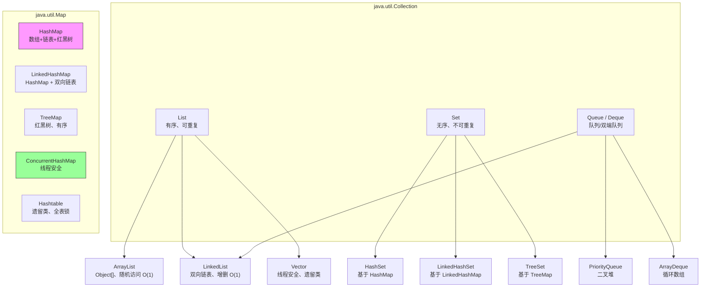
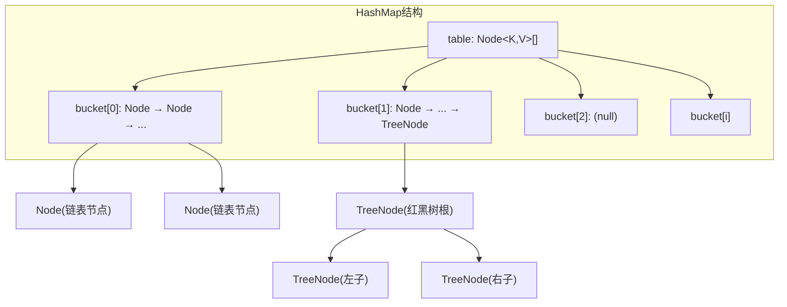
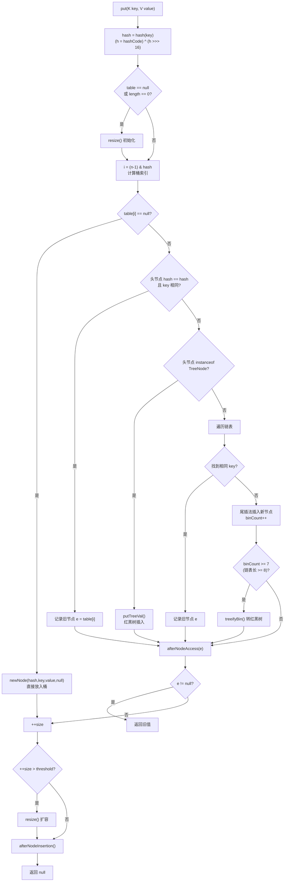
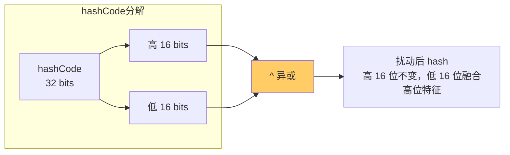

# 01 - 集合框架概述与 HashMap 原理

## Java 集合框架全景



| 类型 | 实现 | 底层结构 | 有序性 | 线程安全 | null |
|------|------|---------|--------|---------|------|
| **HashMap** | — | 数组+链表+红黑树 | 无序 | 否 | 允许 key/value 为 null |
| **LinkedHashMap** | 继承 HashMap | HashMap + 双向链表 | 插入/访问序 | 否 | 允许 |
| **TreeMap** | — | 红黑树 | 自然序/比较器 | 否 | key 不允许 null |
| **ConcurrentHashMap** | — | 数组+链表+红黑树 | 无序 | 是（CAS+synchronized） | 不允许 |
| **Hashtable** | — | 数组+链表 | 无序 | 是（synchronized 全表锁） | 不允许 |

---

## HashMap 核心原理

### 底层数据结构（JDK 8）



- **Node&lt;K,V&gt;[] table**：主数组，每个位置称为"桶"（bucket）
- **Node** 是链表节点，包含 `hash, key, value, next` 四个字段
- **TreeNode** 继承自 Node，是红黑树节点，包含 `parent, left, right, prev, red` 等字段
- 链表转红黑树条件：
  - 链表长度 ≥ **TREEIFY_THRESHOLD = 8**
  - 同时 table.length ≥ **MIN_TREEIFY_CAPACITY = 64**
- 红黑树退化为链表条件：节点数 ≤ **UNTREEIFY_THRESHOLD = 6**

### 关键常量

| 常量 | 值 | 说明 |
|------|-----|------|
| DEFAULT_INITIAL_CAPACITY | 16 (1 &lt;&lt; 4) | 默认初始容量，必须是 2 的幂 |
| MAXIMUM_CAPACITY | 1 &lt;&lt; 30 | 最大容量 |
| DEFAULT_LOAD_FACTOR | 0.75f | 默认负载因子 |
| TREEIFY_THRESHOLD | 8 | 链表转红黑树阈值 |
| UNTREEIFY_THRESHOLD | 6 | 红黑树退链表阈值 |
| MIN_TREEIFY_CAPACITY | 64 | 最小树化容量 |

---

## put 完整流程



关键步骤：
1. **hash 扰动**：`(h = key.hashCode()) ^ (h >>> 16)`，让高 16 位参与低位运算
2. **索引计算**：`(n - 1) & hash`，位运算等价于 `hash % n`
3. **碰撞处理**：链表 / 红黑树
4. **扩容判断**：`size > threshold` 时触发 `resize()`

---

## hash 扰动函数详解

```java
static final int hash(Object key) {
    int h;
    return (key == null) ? 0 : (h = key.hashCode()) ^ (h >>> 16);
}
```

**为什么需要扰动？**

`(n - 1) & hash` 计算索引时，当 n 不大（如 16）时，只用到了 hash 的低 4 位（n-1=15=0b1111）。

如果 hashCode 实现只在高位有差异（很多类的 hashCode 确实如此），这些差异在取模时就被丢弃了，导致严重碰撞。

扰动函数将 hashCode 的高 16 位与低 16 位做异或，让高位特征融入低位，大幅减少碰撞。



---

## 为什么容量必须是 2 的幂？

**三个原因：**

1. **位运算取模**：`(n - 1) & hash` 等价于 `hash % n`，位运算远快于取模
2. **扩容时重新分配简单**：只需要判断 `(hash & oldCap) == 0` 即可确定新索引
   - `== 0`：留在原位
   - `!= 0`：新索引 = 旧索引 + oldCap
3. **保证 (n-1) 二进制全 1**：如 n=16, n-1=15=0b1111，做 `&` 运算时结果均匀分布在 0~15

```java
// n 不是 2 的幂时，(n-1) 的二进制不是全 1
// 例如 n=10, n-1=9=0b1001
// 某些位永远是 0，导致某些桶永远用不到！
```

---

## 为什么负载因子是 0.75？

**时间与空间的折中：**

| 负载因子 | 利弊 |
|---------|------|
| 1.0 | 空间利用率高，但碰撞概率大增，查询变慢 |
| 0.5 | 碰撞少、查询快，但一半空间浪费 |
| **0.75** | **两者平衡** |

泊松分布下，负载因子 0.75 时，链表长度 k 的概率：

| k | 概率 |
|---|------|
| 0 | 0.60653066 |
| 1 | 0.30326533 |
| 2 | 0.07581633 |
| 3 | 0.01263606 |
| 4 | 0.00157952 |
| 5 | 0.00015795 |
| 6 | 0.00001316 |
| 7 | 0.00000094 |
| **8** | **0.00000006** |

链表长度超过 8 的概率仅 **千万分之六**。这就是 TREEIFY_THRESHOLD = 8 的数学依据。

---

## 联系代码演示

| 知识点 | 演示文件 |
|--------|---------|
| 基础用法、碰撞演示、null key | [HashMapDemo.java](../../../../java/base/collection/HashMapDemo.java) |
| hash 扰动、tableSizeFor、扩容索引 | [HashMapSourceAnalysis.java](../../../../java/base/collection/HashMapSourceAnalysis.java) |
| 容量调优、遍历性能 | [HashMapTuning.java](../../../../java/base/collection/HashMapTuning.java) |