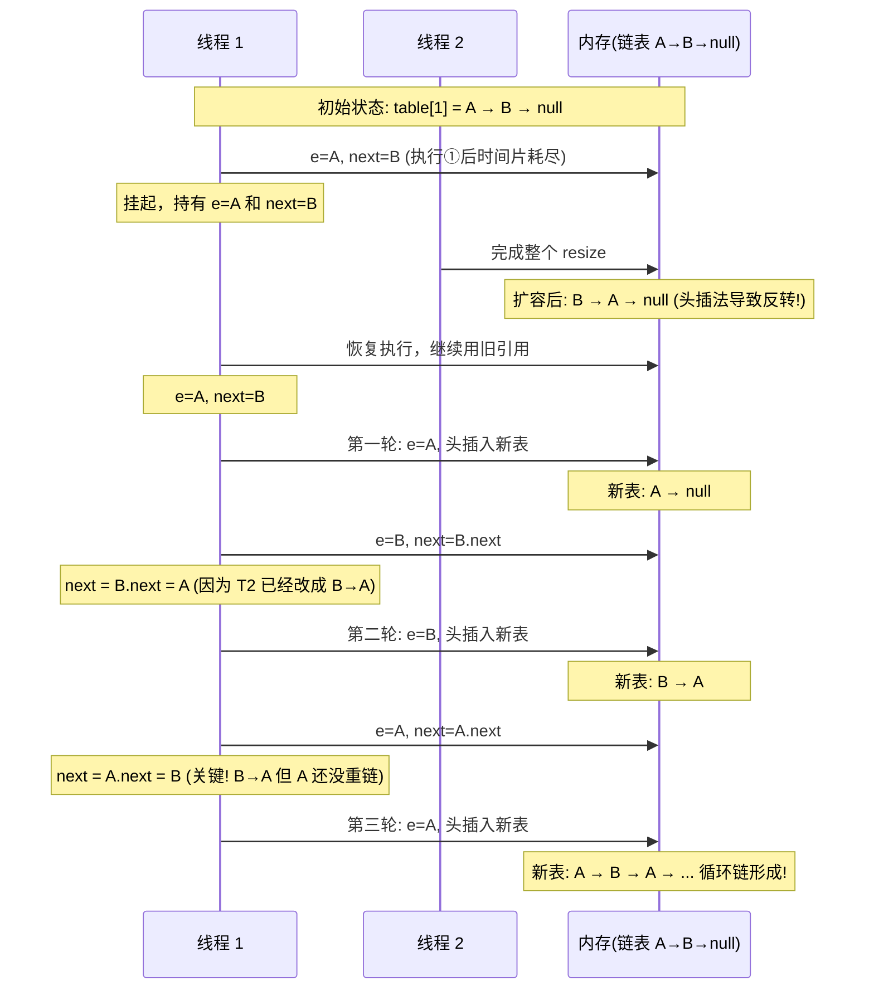

# 02 - HashMap 源码分析

## 核心内部类

### Node&lt;K,V&gt; — 链表节点

```java
static class Node<K,V> implements Map.Entry<K,V> {
    final int hash;        // key 的 hash 值（扰动后），不变
    final K key;
    V value;
    Node<K,V> next;        // 链表下一个节点

    Node(int hash, K key, V value, Node<K,V> next) {
        this.hash = hash;
        this.key = key;
        this.value = value;
        this.next = next;
    }

    public final K getKey()        { return key; }
    public final V getValue()      { return value; }
    public final String toString() { return key + "=" + value; }

    public final int hashCode() {
        return Objects.hashCode(key) ^ Objects.hashCode(value);
    }

    public final V setValue(V newValue) {
        V oldValue = value;
        value = newValue;
        return oldValue;
    }

    public final boolean equals(Object o) {
        if (o == this) return true;
        if (o instanceof Map.Entry) {
            Map.Entry<?,?> e = (Map.Entry<?,?>)o;
            return Objects.equals(key, e.getKey())
                && Objects.equals(value, e.getValue());
        }
        return false;
    }
}
```

**设计要点：**
- `hash` 字段缓存 key 的 hash 值，避免重复计算
- `key` 是 `final`，不可变（与 Entry 接口的契约一致）
- `value` 可修改（`setValue`），支持相同 key 覆盖

### TreeNode&lt;K,V&gt; — 红黑树节点

```java
static final class TreeNode<K,V> extends LinkedHashMap.Entry<K,V> {
    TreeNode<K,V> parent;   // 父节点
    TreeNode<K,V> left;     // 左子
    TreeNode<K,V> right;    // 右子
    TreeNode<K,V> prev;     // 删除时需要断开链表
    boolean red;            // 颜色：红=true，黑=false
}
```

**继承链：** `TreeNode` → `LinkedHashMap.Entry` → `HashMap.Node` → `Map.Entry`

`LinkedHashMap.Entry` 在 Node 基础上增加了 `before` 和 `after` 两个指针用于维护插入顺序。

---

## putVal 源码逐行解读

```java
final V putVal(int hash, K key, V value, boolean onlyIfAbsent, boolean evict) {
    Node<K,V>[] tab; Node<K,V> p; int n, i;

    // ===== 步骤 1：table 为空则初始化 =====
    if ((tab = table) == null || (n = tab.length) == 0)
        n = (tab = resize()).length;
    // resize() 返回新数组：newCap = DEFAULT_INITIAL_CAPACITY = 16
    // threshold = (int)(16 * 0.75) = 12

    // ===== 步骤 2：桶位置为空 → 直接插入 =====
    if ((p = tab[i = (n - 1) & hash]) == null)
        tab[i] = newNode(hash, key, value, null);
    // (n-1) & hash → 计算桶索引
    // newNode 创建普通 Node 节点

    // ===== 步骤 3：桶非空 → 碰撞处理 =====
    else {
        Node<K,V> e; K k;

        // 3a：头节点 key 相同 → 记录 e，后续替换 value
        if (p.hash == hash &&
            ((k = p.key) == key || (key != null && key.equals(k))))
            e = p;

        // 3b：头节点是红黑树 → 调用树插入方法
        else if (p instanceof TreeNode)
            e = ((TreeNode<K,V>)p).putTreeVal(this, tab, hash, key, value);

        // 3c：遍历链表
        else {
            for (int binCount = 0; ; ++binCount) {
                if ((e = p.next) == null) {
                    // 遍历到末尾 → 尾插法插入新节点
                    p.next = newNode(hash, key, value, null);
                    // 链表长度 >= 8 → 转红黑树
                    if (binCount >= TREEIFY_THRESHOLD - 1)
                        treeifyBin(tab, hash);
                    break;
                }
                // 找到相同 key → 记录 e
                if (e.hash == hash &&
                    ((k = e.key) == key || (key != null && key.equals(k))))
                    break;
                p = e;  // p = p.next
            }
        }

        // ===== 步骤 4：存在旧值则替换 =====
        if (e != null) {
            V oldValue = e.value;
            if (!onlyIfAbsent || oldValue == null)
                e.value = value;
            afterNodeAccess(e);  // LinkedHashMap 钩子
            return oldValue;
        }
    }

    // ===== 步骤 5：modCount 和 size 维护 =====
    ++modCount;
    if (++size > threshold)
        resize();
    afterNodeInsertion(evict);  // LinkedHashMap 钩子
    return null;
}
```

### 关键设计：只有 hash + key 都匹配才认为是同一个 entry

```java
// 比较逻辑：
e.hash == hash                     // hash 必须相等
&& ((k = e.key) == key             // 引用相同
    || (key != null && key.equals(k)))  // 或 equals 相等
```

**先判断引用(`==`)再判断 `equals()`** 是一个常见优化：引用相同时无需调用 equals。

---

## resize 扩容机制

```mermaid
flowchart TD
    Start["resize() 被调用"] --> OldCap{"oldCap > 0?"}
    OldCap -->|否"table 为 null, 初始化"| Init["newCap = DEFAULT_CAPACITY (16)<br/>newThr = 16 * 0.75 = 12"]
    OldCap -->|是| CheckLimit{"oldCap >= MAX_CAPACITY?"}
    CheckLimit -->|是| MaxLimit["threshold = Integer.MAX_VALUE<br/>不再扩容，返回旧表"]
    CheckLimit -->|否| Double["newCap = oldCap &lt;&lt; 1<br/>newThr = oldThr &lt;&lt; 1"]

    Init --> NewTable["创建 newTab = new Node[newCap]"]
    MaxLimit --> ReturnOld["return oldTab"]
    Double --> NewTable

    NewTable --> ForEach["遍历 oldTab 每个桶"]
    ForEach --> BucketNull{"桶 e == null?"}
    BucketNull -->|是| Continue["continue"]
    BucketNull -->|否"桶非空"| NextNull{"e.next == null?"}
    NextNull -->|是"单节点"| SingleNode["newTab[e.hash & (newCap-1)] = e"]
    NextNull -->|否"链表或树"| IsTree{"e instanceof TreeNode?"}
    IsTree -->|是| TreeSplit["split() 分裂红黑树"]
    IsTree -->|否| ListSplit["loHead/loTail 低位链<br/>hiHead/hiTail 高位链"]

    ListSplit --> LoHi{"(e.hash & oldCap) == 0?"}
    LoHi -->|0 → 原位| LoTail["添加到 lo 链"]
    LoHi -->|非 0 → 高位| HiTail["添加到 hi 链"]
    LoTail --> Continue2["处理下一个节点"]
    HiTail --> Continue2
    Continue2 --> NextNode{"还有节点?"}
    NextNode -->|是| LoHi
    NextNode -->|否"链分裂完成"| Assign["newTab[j] = loHead<br/>newTab[j+oldCap] = hiHead"]

    SingleNode --> Continue
    TreeSplit --> Assign
    Assign --> Continue
    Continue --> NextBucket{"还有桶?"}
    NextBucket -->|是| ForEach
    NextBucket -->|否| UpdateMembers["table = newTab<br/>threshold = newThr"]
    UpdateMembers --> ReturnNew["return newTab"]

    style LoHi fill:#fc6
```

### 扩容索引重分配的数学原理

```java
// 扩容前 n=16, 索引 = hash & 15 = hash & 0b1111
// 扩容后 n=32, 索引 = hash & 31 = hash & 0b11111
//                        多出来的这一位 ↑
// 这一位对应的值 = hash & 16 = hash & oldCap
// 如果为 0 → 新索引 = 旧索引
// 如果为 1 → 新索引 = 旧索引 + 16（oldCap）
```

示例：

```
hash           = 0b...0101 1100
n=16, n-1      = 0b...0000 1111
旧索引          = 0b...0000 1100 = 12

n=32, n-1      = 0b...0001 1111
新索引          = 0b...0001 1100 = 28 = 12 + 16

验证 hash & oldCap:
0b...0101 1100 & 0b...0001 0000 = 0b...0001 0000 ≠ 0
→ need to move: newIdx = 12 + 16 = 28 ✓
```

---

## treeifyBin — 链表转为红黑树

```java
final void treeifyBin(Node<K,V>[] tab, int hash) {
    int n, index; Node<K,V> e;
    // 第一重检查：数组长度 < 64 时不树化，先扩容
    if (tab == null || (n = tab.length) < MIN_TREEIFY_CAPACITY)
        resize();
    else if ((e = tab[index = (n - 1) & hash]) != null) {
        TreeNode<K,V> hd = null, tl = null;
        // 1. 将链表节点全部替换为 TreeNode，形成双向链表
        do {
            TreeNode<K,V> p = replacementTreeNode(e, null);
            if (tl == null) hd = p;
            else { p.prev = tl; tl.next = p; }
            tl = p;
        } while ((e = e.next) != null);
        // 2. 调用 treeify 将双向链表转化为红黑树
        if ((tab[index] = hd) != null)
            hd.treeify(tab);
    }
}
```

**为什么先扩容而不是直接树化？**

小数组树化收益低。扩容把元素分散到更多桶，可能碰撞就消失了（每个桶的元素变少），这样既解决了查询慢的问题，又避免了红黑树的维护开销。

---

## JDK 7 vs JDK 8 关键差异

| 方面 | JDK 7 | JDK 8 |
|------|-------|-------|
| 数据结构 | 数组 + 链表 | 数组 + 链表 + 红黑树 |
| 插入方式 | **头插法**（新节点插入链表头部） | **尾插法**（新节点插入链表尾部） |
| 扩容条件 | size >= threshold && table[i] != null | size > threshold |
| 扩容重分配 | 每个元素重新 hash | 只需判断 hash & oldCap |
| 多线程扩容 | 可能形成循环链表 → CPU 100% | 不会循环，但可能数据丢失 |
| hash 算法 | 4 次扰动 | 1 次扰动（高 16 位异或低 16 位） |

### 头插法死循环问题

```java
// JDK 7 transfer 方法（简化）
void transfer(Entry[] newTable) {
    for (Entry<K,V> e : table) {
        while (null != e) {
            Entry<K,V> next = e.next;   // ① 记录 next
            int i = indexFor(e.hash, newTable.length);
            e.next = newTable[i];        // ② 头插：e 指向新桶头部
            newTable[i] = e;             // ③ 新桶头部设为 e
            e = next;                    // ④ 处理下一个
        }
    }
}
```

**死循环时序：**



**JDK 8 如何修复：** 尾插法保证链表顺序不变，扩容只是将一条链拆分为 lo 链和 hi 链，不存在并发反转问题。

---

## 联系代码演示

分析代码详见 [HashMapSourceAnalysis.java](../../../../java/base/collection/HashMapSourceAnalysis.java)，可直接运行验证 hash 扰动、tableSizeFor、扩容索引计算。

死循环演示见 [Q01_HashMapDeadLoop.java](../../../../java/base/collection/interview/Q01_HashMapDeadLoop.java)。