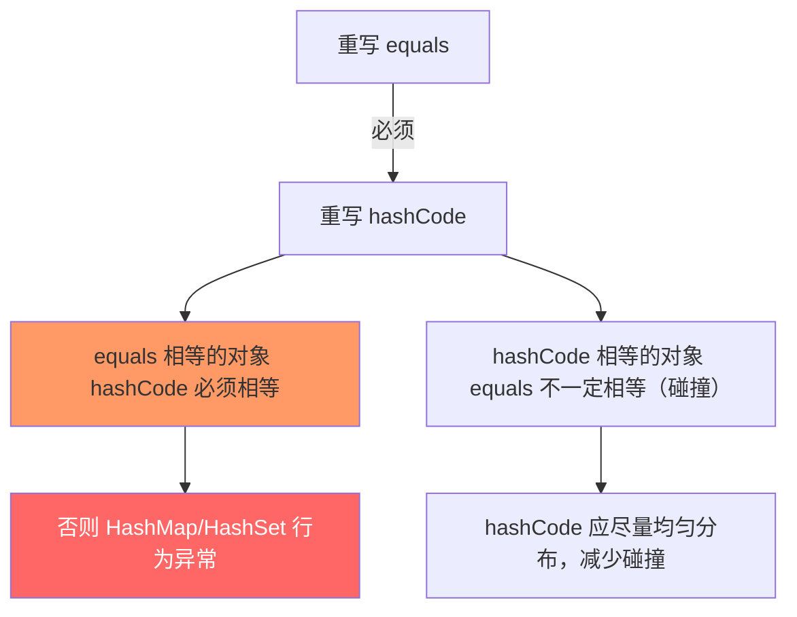
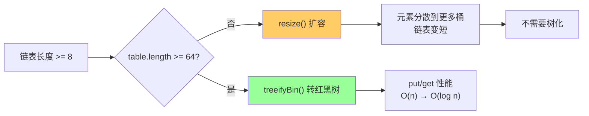

# 03 - HashMap 调优实战

## 一、容量调优：避免频繁扩容

### 问题

HashMap 默认初始容量 16。大数据量写入时经历多次扩容：

```
16 → 32 → 64 → 128 → 256 → 512 → 1024 → 2048 → ... → 1,048,576
```

100 万条数据需要 **17 次扩容**，每次扩容涉及 rehash 和数据迁移。

### 解决方案

**公式：** `initialCapacity = expectedSize / loadFactor + 1`

```java
int expectedSize = 1_000_000;
int initialCapacity = (int) (expectedSize / 0.75f) + 1;
Map<String, Object> map = new HashMap<>(initialCapacity);
```

### 深入理解

```java
// HashMap 构造器内部会调用 tableSizeFor 将容量向上取整到 2 的幂
public HashMap(int initialCapacity, float loadFactor) {
    // ...
    this.threshold = tableSizeFor(initialCapacity);
    // threshold = 2^21 = 2,097,152（存储计算结果）
}

// 首次 put 时 resize() 将 threshold 赋值给容量并重新计算真正的 threshold
// newCap = threshold = 2,097,152
// newThr = 2,097,152 * 0.75 = 1,572,864
```

| expectedSize | 你的入参 | tableSizeFor 后 | 实际数组大小 | 实际 threshold |
|-------------|---------|----------------|------------|---------------|
| 1,000 | 1,334 | 2,048 | 2,048 | 1,536 |
| 10,000 | 13,334 | 16,384 | 16,384 | 12,288 |
| 100,000 | 133,334 | 262,144 | 262,144 | 196,608 |
| 1,000,000 | 1,333,334 | 2,097,152 | 2,097,152 | 1,572,864 |

### JDK 19+ 新增方法

```java
// JDK 19 起，可以直接调用静态工厂方法，内部自动计算最优容量
Map<String, Object> map = HashMap.newHashMap(expectedSize);
```

---

## 二、hashCode 与 equals：自定义 key 的铁律

### 铁律



### 错误示例

```java
class BadKey {
    private int id;
    BadKey(int id) { this.id = id; }

    @Override
    public boolean equals(Object o) {
        if (!(o instanceof BadKey)) return false;
        return id == ((BadKey) o).id;
    }

    @Override
    public int hashCode() {
        return 1;  // 所有对象 hash 都相同 → 退化为 O(n) 链表
    }
}
```

### 正确示例

```java
class GoodKey {
    private int id;
    private String name;

    @Override
    public boolean equals(Object o) {
        if (this == o) return true;
        if (!(o instanceof GoodKey)) return false;
        GoodKey that = (GoodKey) o;
        return id == that.id && Objects.equals(name, that.name);
    }

    @Override
    public int hashCode() {
        return Objects.hash(id, name);
        // 或手动: return 31 * id + (name != null ? name.hashCode() : 0);
    }
}
```

**性能对比（10,000 元素）：**

| hashCode 实现 | put 耗时 | get 耗时 | 原因 |
|-------------|---------|---------|------|
| `return 1` | ~500ms | ~400ms | O(n²) 链表 |
| `return id` (均匀) | ~5ms | ~3ms | O(1) 分布 |

---

## 三、遍历性能

### 三种遍历方式对比

```java
Map<String, Object> map = new HashMap<>();

// 方式 1：entrySet — 最优
for (Map.Entry<String, Object> entry : map.entrySet()) {
    String key = entry.getKey();
    Object value = entry.getValue();
}

// 方式 2：keySet + get — 较差（每次都要查表）
for (String key : map.keySet()) {
    Object value = map.get(key);  // 额外的哈希查找!
}

// 方式 3：JDK 8 forEach + lambda — 简洁，性能接近 entrySet
map.forEach((key, value) -> {
    // ...
});

// 方式 4：迭代器 + entrySet — 遍历期间可安全 remove
Iterator<Map.Entry<String, Object>> it = map.entrySet().iterator();
while (it.hasNext()) {
    Map.Entry<String, Object> entry = it.next();
    if (shouldRemove(entry)) {
        it.remove();
    }
}
```

**为什么 keySet+get 慢？**

```java
// keySet() 迭代器只拿到了 key
// get(key) 需要重新计算 hash：(n-1) & (h ^ (h>>>16))
// 然后遍历桶里的链表/红黑树
// → 每次循环多做一次 O(1)~O(log n) 的查找
```

---

## 四、JDK 8 红黑树优化

### 转化条件与收益

| 数据结构 | 查找时间复杂度 | 条件 |
|---------|-------------|------|
| 链表 | O(n) | 长度 < 8 |
| 红黑树 | O(log n) | 长度 ≥ 8 且 table.length ≥ 64 |

**触发过程：**



### 退化条件

```java
// resize 时 split() 分裂红黑树
// 如果高位/低位树的节点数 <= UNTREEIFY_THRESHOLD (6)
if (lc <= UNTREEIFY_THRESHOLD)
    tab[index] = loHead.untreeify(map);  // 红黑树 → 链表
```

注意退化阈值(6)与树化阈值(8)之间有 2 的缓冲区，**避免在阈值附近频繁转换**。

---

## 五、线程安全替代方案

| 方案 | 性能 | 说明 |
|------|------|------|
| ConcurrentHashMap | ★★★★★ | JDK 8 CAS+synchronized 桶头，推荐 |
| Collections.synchronizedMap | ★★★ | 全表同步锁，竞争大时性能差 |
| Hashtable | ★★ | 遗留类，全表锁，不推荐 |

```java
// JDK 8 ConcurrentHashMap 核心设计：
// 1. Node.val 和 Node.next 都是 volatile
// 2. put 时 CAS 尝试直接插入空桶，失败则 synchronized 锁桶头
// 3. 扩容时多线程协同，通过 transferIndex 分段领取任务
// 4. ForwardingNode 占位已迁移桶，读请求直接转发
```

---

## 调优检查清单

- [ ] 预知数据量时指定 `initialCapacity = size / 0.75 + 1`
- [ ] 自定义 key 重写 `hashCode()` 保证均匀分布
- [ ] 遍历用 `entrySet` 而非 `keySet + get`
- [ ] 多线程用 `ConcurrentHashMap` 而非自己加锁
- [ ] JDK 19+ 用 `HashMap.newHashMap(size)`

---

## 联系代码演示

调优代码详见 [HashMapTuning.java](../../../../java/base/collection/HashMapTuning.java)，可直接运行对比默认容量 vs 优化容量的性能差异。