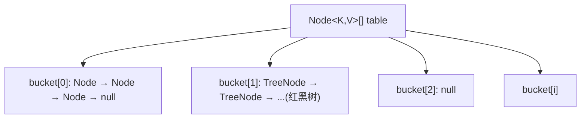
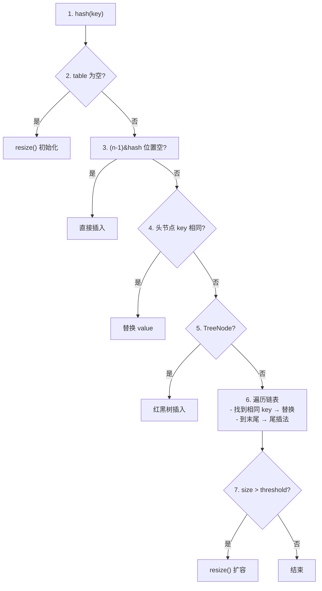

# 04 - 面试高频问题

## Q1：HashMap 底层数据结构？

**答案：** JDK 8 采用 **数组 + 链表 + 红黑树**。



- 数组 + 链表 → 解决 hash 冲突（拉链法）
- 链表转红黑树 → 优化极端碰撞（O(n) → O(log n)）
- 条件：链表长度 ≥ 8 且 数组长度 ≥ 64

---

## Q2：HashMap 扩容机制？

**答案：** 容量翻倍，元素重新分配。

```java
// 扩容条件：++size > threshold
// threshold = capacity * loadFactor（默认 16 * 0.75 = 12）

// JDK 8 优化：不需要重新计算 hash
// 新索引 = 旧索引 或 旧索引 + oldCap
if ((e.hash & oldCap) == 0) {
    // 留在原位
} else {
    // 移到高位 loHead + oldCap
}
```

扩容流程：
1. 创建新数组，容量 = `oldCap &lt;&lt; 1`
2. 遍历旧数组每个桶
3. 单节点：直接 `newTab[e.hash & (newCap-1)] = e`
4. 链表：拆分为 `lo`（低位，原位）和 `hi`（高位，原位+oldCap）
5. 红黑树：`split` 分裂，节点少时退化为链表

---

## Q3：为什么负载因子是 0.75？

**答案：** 时间与空间的折中。

- **0.5**：浪费空间，碰撞少 → 时间优、空间差
- **1.0**：利用率高，碰撞多 → 空间优、时间差
- **0.75**：泊松分布下链表 &gt; 8 的概率 = 0.00000006（千万分之六）

---

## Q4：为什么容量是 2 的幂？

**答案：** 三个核心原因。

1. **位运算取模**：`(n-1) & hash` 比 `hash % n` 快
2. **扩容重分配简单**：只需 `hash & oldCap` 判断
3. **(n-1) 全 1**：如 n=16 → n-1=15=0b1111，元素均匀分布

---

## Q5：JDK 7 vs JDK 8 的 HashMap 差异？

| 维度 | JDK 7 | JDK 8 |
|------|-------|-------|
| 结构 | 数组 + 链表 | 数组 + 链表 + 红黑树 |
| 插入 | 头插法 | 尾插法 |
| hash | 4 次扰动 | 1 次（高 16 ^ 低 16） |
| 扩容重分配 | 全部 rehash | `hash & oldCap` 只需判断 |
| 多线程扩容 | **死循环**（CPU 100%） | 不会死循环（头/尾） |

**死循环根因：** 头插法并发 resize 导致链表形成环。

---

## Q6：HashMap 死循环怎么发生的？

**答案：** JDK 7 `resize()` 使用头插法，多线程并发时链表可能形成环。

详细推导见 [Q01_HashMapDeadLoop.java](../../../../java/base/collection/interview/Q01_HashMapDeadLoop.java) — 包含时序图和同步演示代码。

**核心过程：**
1. 线程 T1 记录 e=A, next=B 后挂起
2. 线程 T2 完成 resize，链表变成 B→A
3. T1 恢复，用旧引用继续操作 → A→B→A 循环

**JDK 8 修复：** 尾插法保证链表顺序不变，扩容 = 分裂 lo/hi 两条链。

---

## Q7：ArrayList 扩容机制？

**答案：**

```java
// 扩容公式（JDK 7+）
int newCapacity = oldCapacity + (oldCapacity >> 1);  // 1.5 倍

// 首次 add 时
// 无参构造 → 空数组 → 首次扩容到 10
// 有参构造 → 直接分配指定大小
```

**完整链路：**
```
add(e) → ensureCapacityInternal(size+1) → ensureExplicitCapacity → grow(minCapacity)
```

| 阶段 | 容量 |
|------|------|
| new ArrayList() | 0（空数组） |
| 首次 add | 10 |
| add 第 11 个 | 15 = 10 + 5 |
| add 第 16 个 | 22 = 15 + 7 |
| … | 1.5 倍递增 |

可运行演示见 [Q02_ArrayListExpansion.java](../../../../java/base/collection/interview/Q02_ArrayListExpansion.java)。

---

## Q8：HashMap vs ConcurrentHashMap？

| 维度 | HashMap (JDK 8) | ConcurrentHashMap (JDK 8) |
|------|-----------------|---------------------------|
| 线程安全 | ❌ | ✅ CAS + synchronized |
| null key/value | ✅ | ❌（抛 NPE） |
| 锁粒度 | 无 | 桶级别（synchronized 桶头） |
| 扩容 | 单线程 | 多线程协同（transferIndex） |
| 迭代器 | fail-fast（CME） | weakly consistent（不抛 CME） |
| size 计算 | int 成员变量 | baseCount + CounterCell 数组 |

**JDK 7 vs JDK 8 CHM：**

| | JDK 7 | JDK 8 |
|---|-------|-------|
| 锁 | Segment(ReentrantLock) | CAS + synchronized |
| 并发度 | 16（Segment 数） | 桶级别（理论上 = 数组长度） |
| size | 分段统计 + 重试 | 分槽计数 + sumCount |

可运行演示见 [Q03_HashMapVsConcurrentHashMap.java](../../../../java/base/collection/interview/Q03_HashMapVsConcurrentHashMap.java)。

---

## Q9：HashMap 的 put 流程？

**答案：** 7 步。



---

## Q10：如何正确设置 HashMap 初始容量？

**答案：**

```java
// Guava 的 Maps.newHashMapWithExpectedSize 等价实现
int initialCapacity = (int) (expectedSize / 0.75f) + 1;

// JDK 19+
Map<String, Object> map = HashMap.newHashMap(expectedSize);
```

**公式推导：** `threshold = capacity × 0.75 ≥ expectedSize` → `capacity ≥ expectedSize / 0.75`

---

## 面试代码演示速查

| 面试题 | 代码文件 |
|--------|---------|
| Q5/Q6 死循环 | [Q01_HashMapDeadLoop.java](../../../../java/base/collection/interview/Q01_HashMapDeadLoop.java) |
| Q7 ArrayList 扩容 | [Q02_ArrayListExpansion.java](../../../../java/base/collection/interview/Q02_ArrayListExpansion.java) |
| Q8 HashMap vs CHM | [Q03_HashMapVsConcurrentHashMap.java](../../../../java/base/collection/interview/Q03_HashMapVsConcurrentHashMap.java) |

所有面试 Java 文件均包含 `main` 方法，可直接 `Run` 验证。运行方式：

```powershell
# 编译
cd custom-study && mvn compile -pl study-base

# 运行（以 Q01 为例）
mvn exec:java -pl study-base -Dexec.mainClass="base.collection.interview.Q01_HashMapDeadLoop"
```