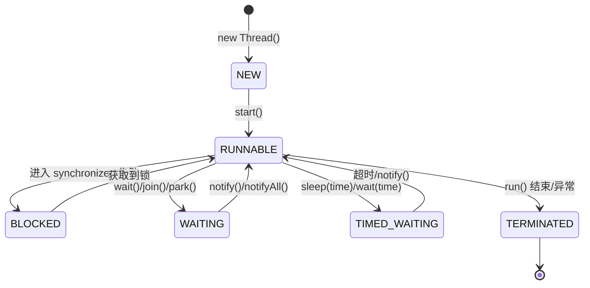
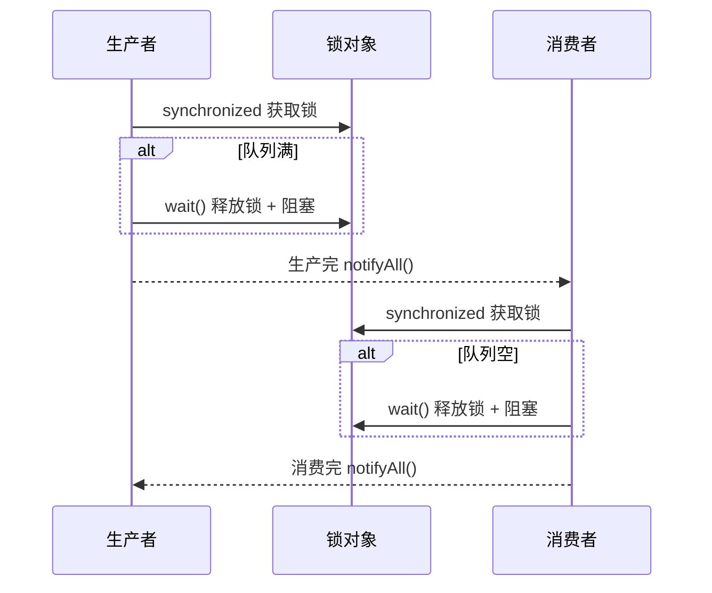
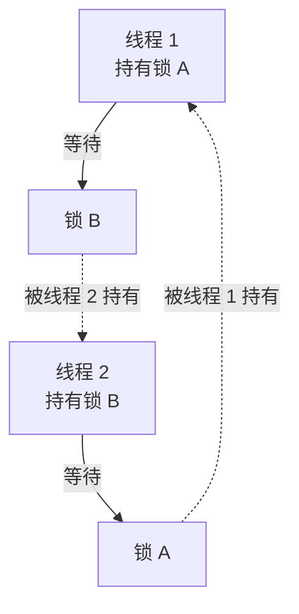

# 01 - 并发基础与 synchronized

## 1. 线程基础

### 1.1 线程生命周期



- **NEW**：Thread 对象创建，未调用 start()
- **RUNNABLE**：Java 层面的可运行状态，包含 OS 的就绪 + 运行
- **BLOCKED**：等待进入 synchronized 块/方法，获取 monitor 锁
- **WAITING**：wait() / join() / LockSupport.park() 后等待唤醒
- **TIMED_WAITING**：带超时的等待（sleep / wait(time) / join(time)）
- **TERMINATED**：run() 执行完毕或异常退出

### 1.2 线程关键方法

| 方法 | 作用 | 释放锁？ |
|------|------|----------|
| `start()` | 启动线程，JVM 调用 run() | - |
| `sleep(n)` | 当前线程休眠 n ms | **不释放** |
| `yield()` | 让出 CPU，进入就绪态 | **不释放** |
| `join()` | 等待该线程执行完毕 | **不释放** |
| `wait()` | 等待，释放锁 | **释放** |
| `notify()` | 随机唤醒一个等待线程 | **不释放** |
| `notifyAll()` | 唤醒所有等待线程 | **不释放** |

---

## 2. synchronized 详解

### 2.1 三种用法

```java
// ① 同步代码块 — 锁指定对象
synchronized (obj) { }

// ② 同步方法 — 锁 this（实例方法）/ Class 对象（静态方法）
public synchronized void method() { }

// ③ 同步静态方法 — 锁 Class 对象
public static synchronized void staticMethod() { }
```

### 2.2 锁升级路径


**升级方向不可逆**（只能升级，不能降级）。

JDK 15+ 默认延迟 4 秒启动偏向锁。

| 锁状态 | Mark Word 后 3 bit | 触发条件 | 特点 |
|--------|-------------------|----------|------|
| 无锁 | 001 | 初始 | - |
| 偏向锁 | 101 | 同一线程反复获取 | CAS 记录线程 ID |
| 轻量级锁 | 00 | 轻度竞争 | CAS 自旋获取 |
| 重量级锁 | 10 | 自旋失败/竞争激烈 | OS mutex，线程阻塞 |

### 2.3 Mark Word 结构（64 位）

```
无锁态:      [ unused:25 | hash:31 | unused:1 | age:4 | biased_lock:0 | 01 ]
偏向锁态:    [ thread:54 | epoch:2 | unused:1 | age:4 | biased_lock:1 | 01 ]
轻量级锁态:  [ ptr_to_lock_record:62 | 00 ]
重量级锁态:  [ ptr_to_monitor:62 | 10 ]
```

### 2.4 wait/notify 机制



**四条规则：**
1. wait/notify 必须在 synchronized 块内调用（持有对象锁）
2. wait 释放锁让出 CPU，notify 不释放锁
3. 必须用 **while** 检查条件（防虚假唤醒 spurious wakeup）
4. notifyAll 优于 notify（防止信号丢失）

### 2.5 死锁



**四个必要条件**（缺一不可）：
1. 互斥：资源独占
2. 持有并等待：持有锁 A，等待锁 B
3. 不可抢占：已获取的锁不能被强制释放
4. 循环等待：T1→等 B→T2→等 A→T1

**预防方案：**
- 统一加锁顺序
- tryLock 超时机制
- 死锁检测（jstack / ThreadMXBean.findDeadlockedThreads()）

---

## 3. 面试要点

- synchronized 锁升级过程和 Mark Word 结构（必问）
- wait/notify 和 sleep 区别（wait 释放锁，sleep 不释放）
- 死锁的条件和预防
- JDK 15+ 偏向锁延迟启动的新变化