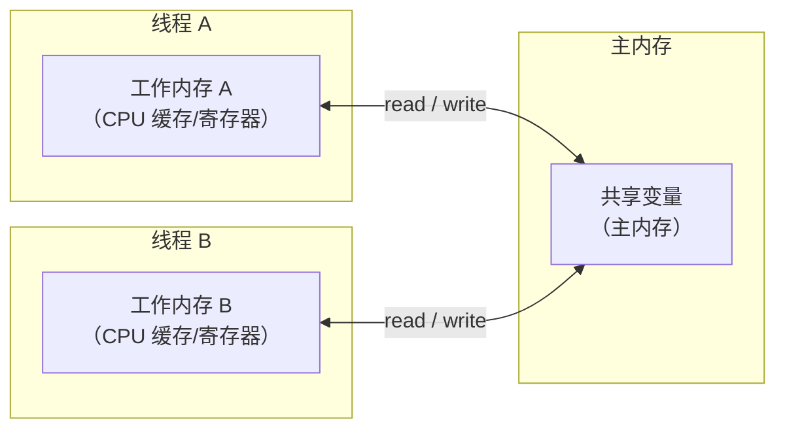
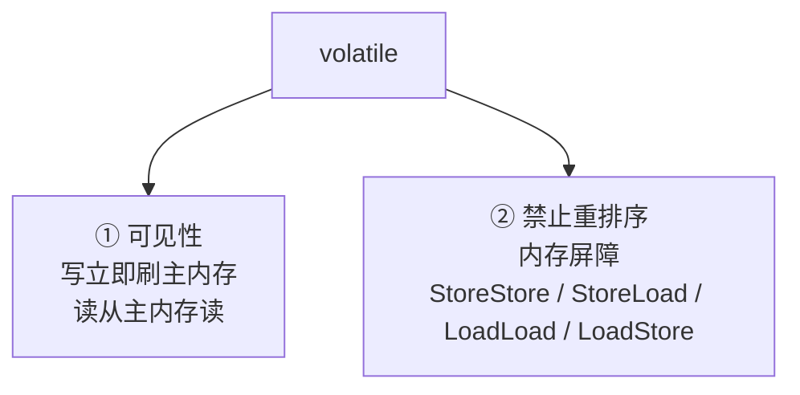
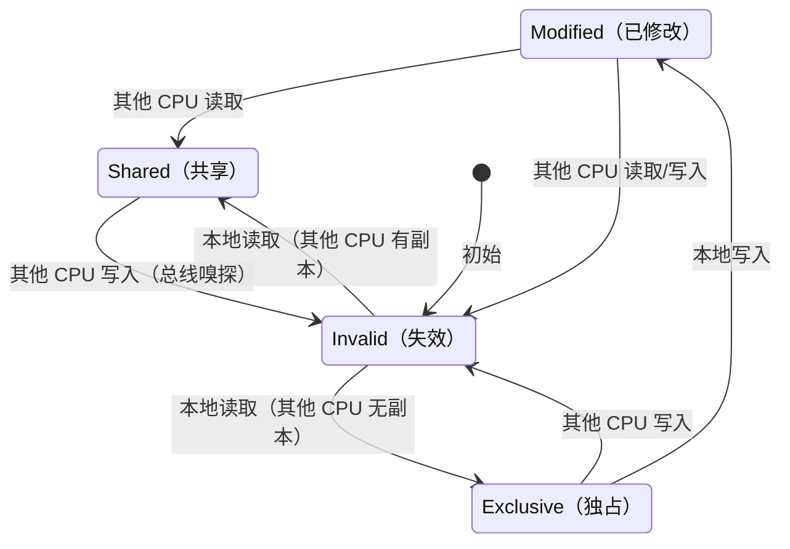
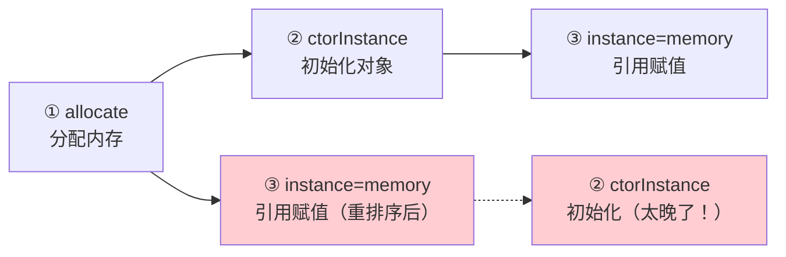
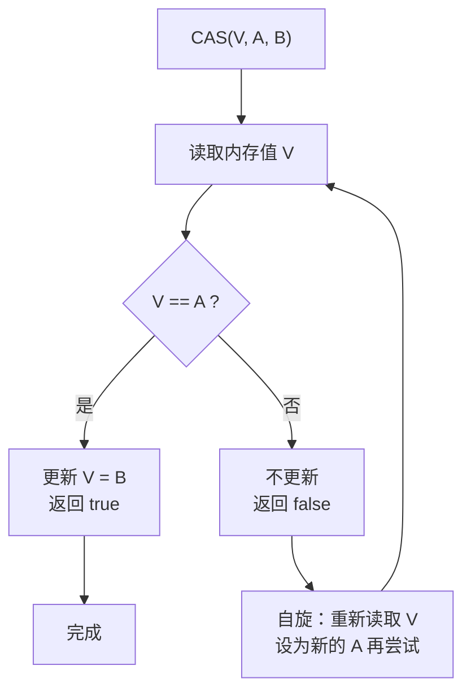
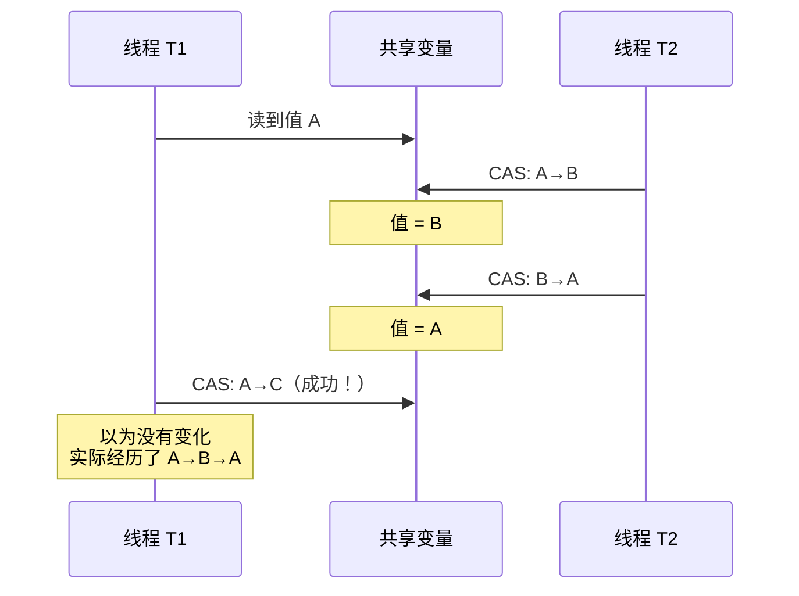
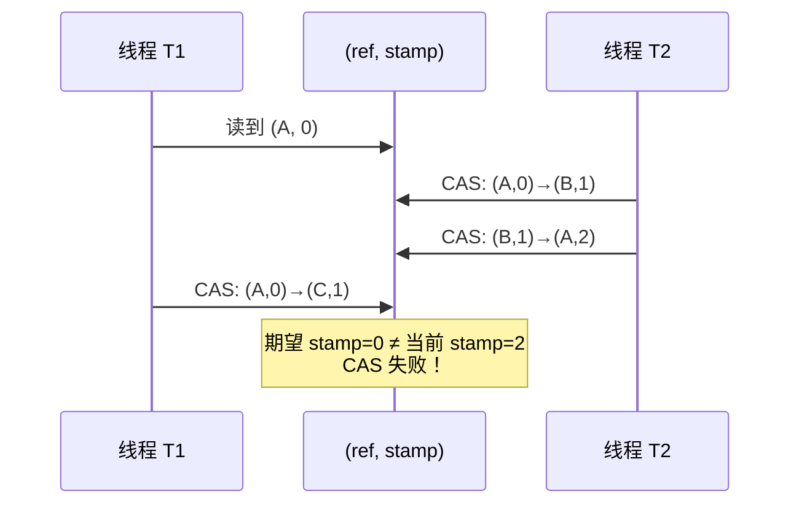

# 02 - volatile 与 CAS

## 1. volatile 详解

### 1.1 JMM 内存模型



- **主内存**：所有线程共享，存储所有共享变量
- **工作内存**：每个线程私有，变量副本 + CPU 缓存 + 寄存器
- 线程间通信必须通过主内存

### 1.2 volatile 两大特性



#### 1.2.1 可见性原理

**volatile 写：**
1. 将工作内存值刷新到主内存
2. Lock 前缀指令 → 总线锁定 → 其他 CPU 缓存行失效（MESI 协议）

**volatile 读：**
1. 本地缓存失效
2. 从主内存重新加载

#### 1.2.2 MESI 缓存一致性协议



volatile 写触发：CPU0 发送 RFO（Read For Ownership）→ 其他 CPU 标记 I。

#### 1.2.3 禁止指令重排序 — 内存屏障

| 屏障类型 | 作用 |
|----------|------|
| **StoreStore** | volatile 写前的普通写完成后，才执行 volatile 写 |
| **StoreLoad** | volatile 写完成后，才执行后续的读操作 |
| **LoadLoad** | volatile 读完成后，才执行后续的读操作 |
| **LoadStore** | volatile 读完成后，才执行后续的写操作 |

**volatile 写插入屏障：**
```
普通写 → StoreStore → volatile 写 → StoreLoad
```

**volatile 读插入屏障：**
```
volatile 读 → LoadLoad → LoadStore
```

### 1.3 volatile 不保证原子性

```java
volatile int count = 0;
count++;  // 非原子！读 → 加1 → 写，三步操作
```

**为什么 count++ 非原子？**

```
线程 A: 读 count(0) → +1 → 写 count(1)
线程 B: 读 count(0) → +1 → 写 count(1)
// 期望 count=2，实际 count=1，丢失一次更新
```

### 1.4 DCL 单例中的 volatile

```java
public class Singleton {
    private static volatile Singleton instance;  // ← 必须 volatile！

    public static Singleton getInstance() {
        if (instance == null) {           // 第一次检查
            synchronized (Singleton.class) {
                if (instance == null) {   // 第二次检查
                    instance = new Singleton();  // 三步非原子操作
                }
            }
        }
        return instance;
    }
}
```

**new Singleton() 三步：**



volatile 通过 StoreStore 屏障保证 ② 必须在 ③ 之前完成。

---

## 2. CAS 详解

### 2.1 CAS 原理



**CAS 自旋模板：**
```java
do {
    oldValue = atomicVar.get();
    newValue = computeNewValue(oldValue);
} while (!atomicVar.compareAndSet(oldValue, newValue));
```

### 2.2 ABA 问题



**经典场景** — 链表栈出栈：
```
head → A → B → C
T1 准备 pop（A→B）
T2 pop A、pop B、push A
T1 CAS：head 仍是 A，CAS 成功 → B 已被释放 → 悬垂指针
```

### 2.3 解决方案：版本号

```java
// AtomicStampedReference 使用 stamp 跟踪版本
AtomicStampedReference<Integer> ref = new AtomicStampedReference<>(100, 0);

// CAS 同时比较引用和版本号
ref.compareAndSet(expectedRef, newRef, expectedStamp, newStamp);
// 版本号不同 → CAS 失败 → 检测到 ABA
```



### 2.4 CAS 优缺点

| 优点 | 缺点 |
|------|------|
| 无锁，无阻塞，无上下文切换 | 自旋 CPU 开销（高竞争时浪费） |
| 适合短临界区 | ABA 问题 |
| 是 JUC 基石 | 只能保证一个变量的原子操作 |

---

## 3. 面试要点

- volatile 两大特性及实现原理（MESI + 内存屏障）
- volatile 为什么不能保证原子性（复合操作）
- DCL 必须加 volatile 的原因（禁止重排序）
- CAS 的 ABA 问题及解决方案（AtomicStampedReference）
- CAS 自旋的开销和适用场景