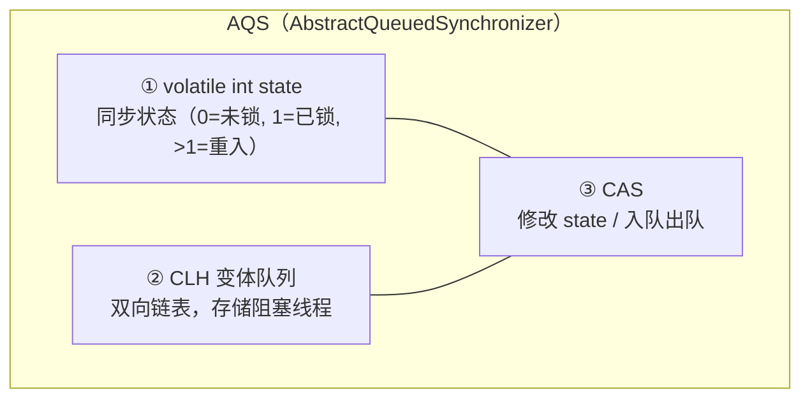
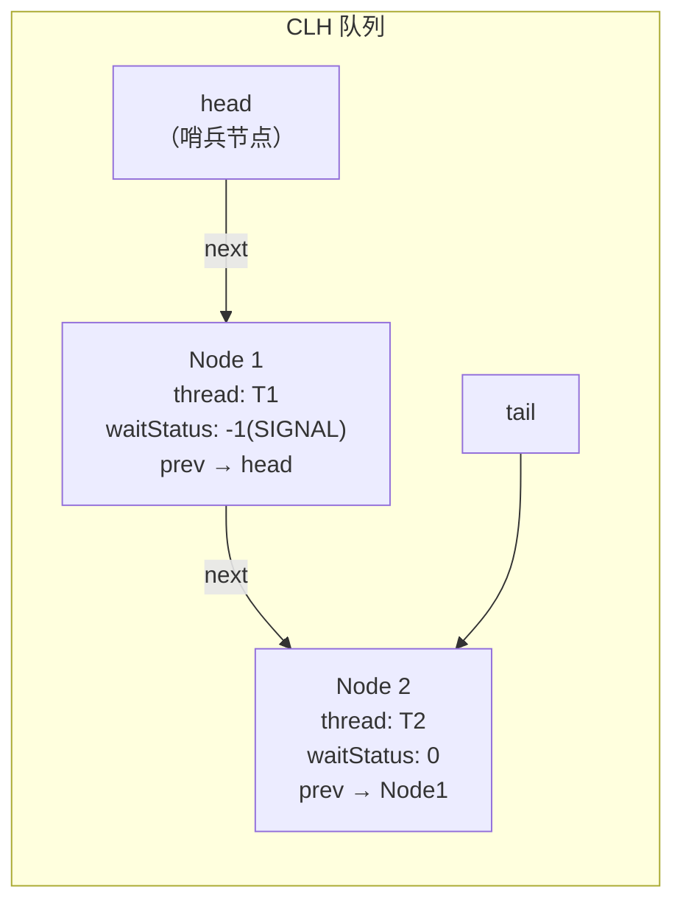
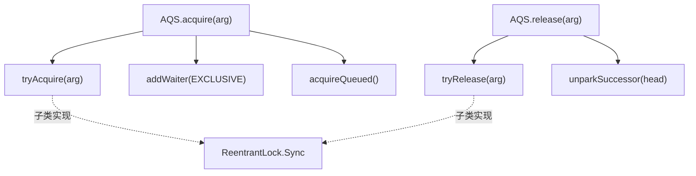
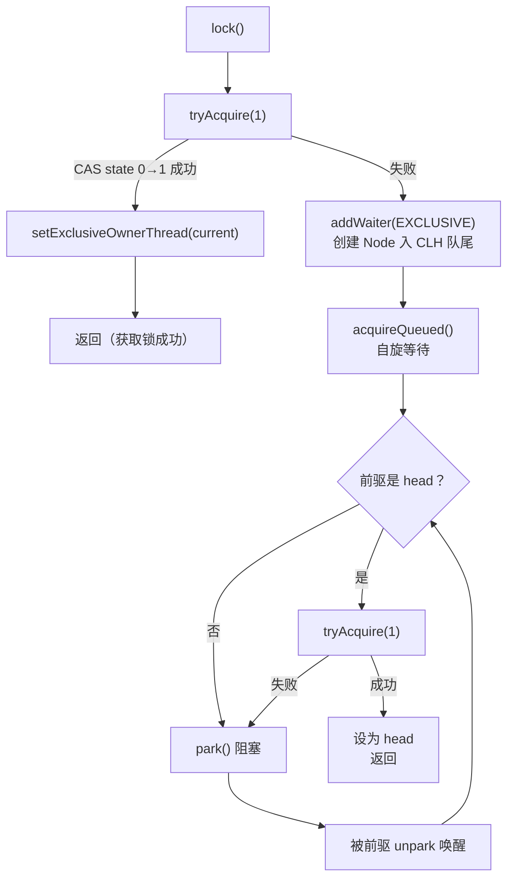
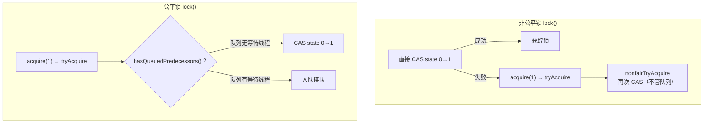
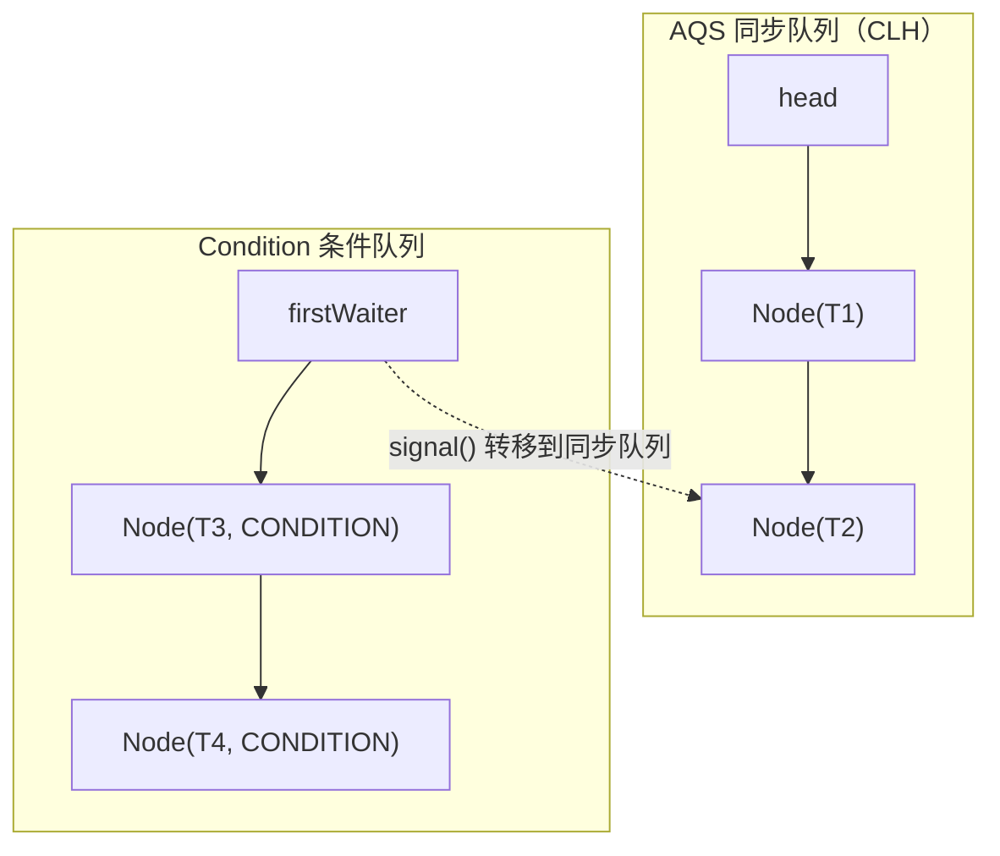

# 03 - AQS 与锁

## 1. AQS 核心架构

### 1.1 三要素



### 1.2 CLH 队列结构



**Node 字段：**
- `prev` / `next`：双向链表指针
- `thread`：当前节点对应的线程
- `waitStatus`：等待状态
  - `0`：初始状态
  - `CANCELLED(1)`：节点取消
  - `SIGNAL(-1)`：后继节点需要被唤醒
  - `CONDITION(-2)`：节点在 Condition 队列中
  - `PROPAGATE(-3)`：共享模式下传播

### 1.3 模板方法模式



AQS 定义骨架（acquire/release），子类实现具体逻辑（tryAcquire/tryRelease）。

---

## 2. ReentrantLock 原理

### 2.1 独占模式 acquire 流程



### 2.2 公平锁 vs 非公平锁



| 特性 | 非公平锁（默认） | 公平锁 |
|------|-----------------|--------|
| 获取顺序 | 可能插队 | 严格 FIFO |
| 吞吐量 | **高** | 低（上下文切换多） |
| 饥饿 | 可能有 | 无 |
| 实现 | lock() 直接 CAS | hasQueuedPredecessors() 检查 |

### 2.3 可重入实现

```java
// state 记录重入次数
tryAcquire(int acquires) {
    if (state == 0) {
        // CAS 抢锁
    } else if (currentThread == getExclusiveOwnerThread()) {
        int nextc = state + acquires;  // state + 1
        setState(nextc);
        return true;
    }
    return false;
}

tryRelease(int releases) {
    int c = getState() - releases;  // state - 1
    if (Thread.currentThread() != getExclusiveOwnerThread())
        throw new IllegalMonitorStateException();
    boolean free = (c == 0);  // state == 0 才真正释放
    if (free) setExclusiveOwnerThread(null);
    setState(c);
    return free;
}
```

---

## 3. Condition 条件队列



- **await()**：当前线程加入 Condition 队列，释放锁
- **signal()**：将 Condition 队列头节点转移到 CLH 同步队列，重新竞争锁
- **signalAll()**：将 Condition 队列所有节点转移到 CLH 同步队列

---

## 4. Lock 接口方法一览

| 方法 | 说明 |
|------|------|
| `lock()` | 获取锁，阻塞直到成功 |
| `lockInterruptibly()` | 可中断获取锁 |
| `tryLock()` | 非阻塞尝试获取锁 |
| `tryLock(time, unit)` | 带超时的尝试获取锁 |
| `unlock()` | 释放锁 |
| `newCondition()` | 创建 Condition 对象 |

---

## 5. 面试要点

- AQS 三要素（state + CLH + CAS）和模板方法模式
- ReentrantLock 的 lock/unlock 完整流程
- 公平锁 vs 非公平锁的区别和实现
- 可重入的实现原理（state 计数）
- Condition 和 Object.wait/notify 的对应关系