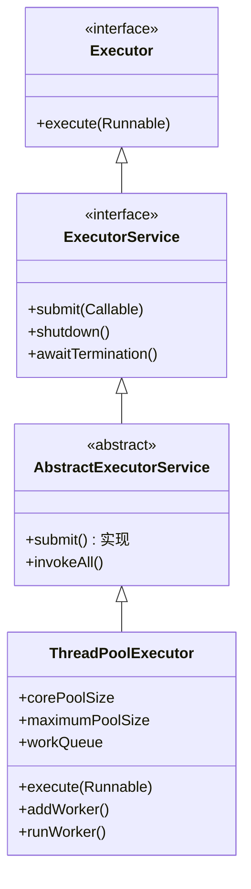
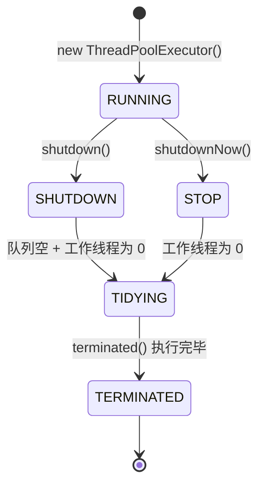
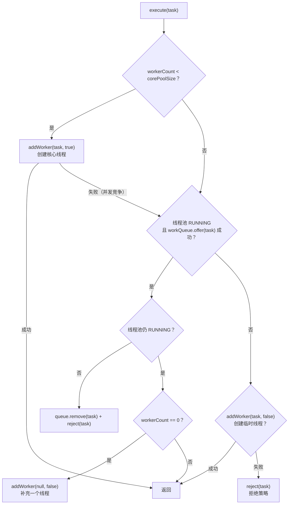
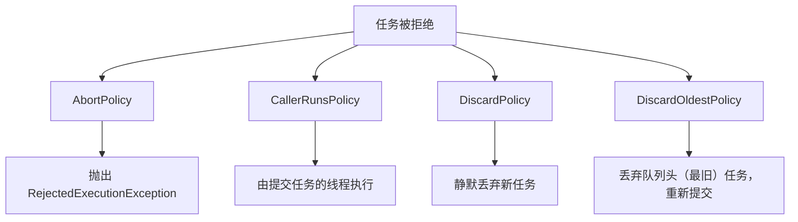
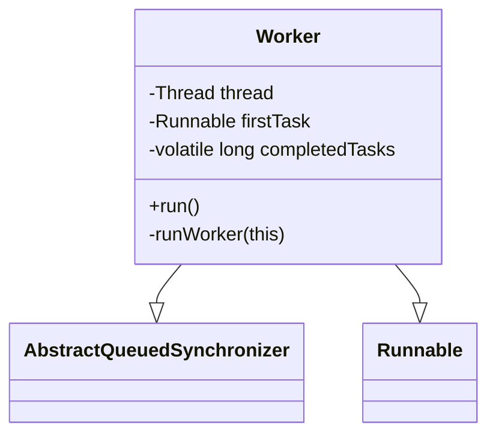
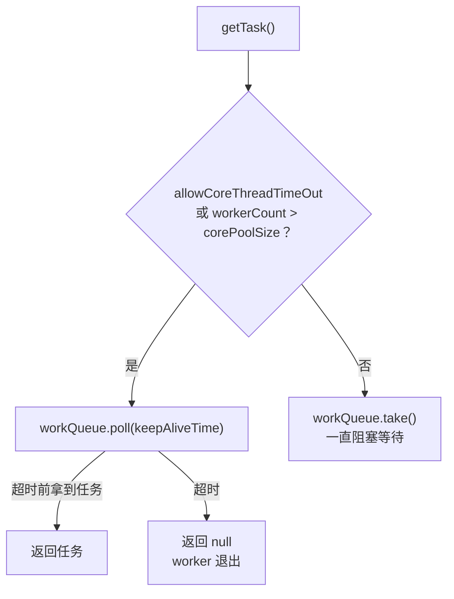
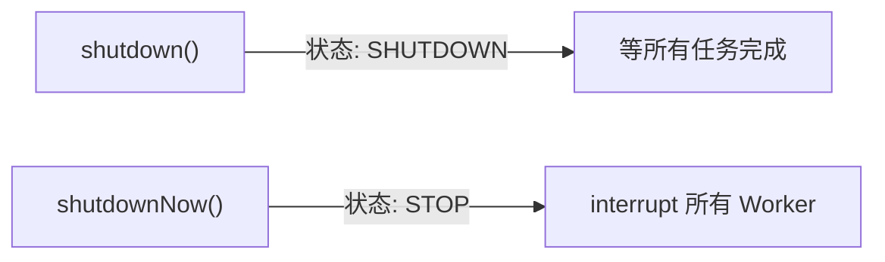

# 04 - 线程池源码

## 1. 线程池架构

### 1.1 类继承体系



### 1.2 线程池状态



**ctl 变量（AtomicInteger）高 3 位存状态，低 29 位存 worker 数量：**

| 状态 | 高 3 位值 | 说明 |
|------|----------|------|
| RUNNING | 111 | 接受新任务，处理队列任务 |
| SHUTDOWN | 000 | 不接受新任务，处理队列中剩余任务 |
| STOP | 001 | 不接受新任务，不处理队列任务，中断正在执行的线程 |
| TIDYING | 010 | 所有任务终止，workerCount=0，执行 terminated() |
| TERMINATED | 011 | terminated() 执行完毕 |

---

## 2. execute() 源码流程



---

## 3. 七大参数详解

### 3.1 核心线程 vs 临时线程

| 维度 | 核心线程 (core) | 临时线程 (非 core) |
|------|----------------|-------------------|
| 创建时机 | workerCount < corePoolSize | 队列满且 workerCount < maxPoolSize |
| 存活时间 | 一直存活（除非 allowCoreThreadTimeOut） | keepAliveTime 后回收 |
| 创建参数 | addWorker(task, true) | addWorker(task, false) |

### 3.2 阻塞队列选型

| 队列 | 容量 | 特点 | 适用 |
|------|------|------|------|
| `ArrayBlockingQueue` | 有界，必须设大小 | FIFO，数组实现 | 通用，推荐 |
| `LinkedBlockingQueue` | 可选有界 | FIFO，链表实现 | 需要大容量 |
| `SynchronousQueue` | 无容量 | 一手交一手，不存储 | CachedThreadPool |
| `PriorityBlockingQueue` | 无界 | 优先级排序 | 有优先级的任务 |
| `DelayQueue` | 无界 | 延迟获取 | 定时任务 |

### 3.3 四种拒绝策略



| 策略 | 行为 | 适用场景 |
|------|------|----------|
| **AbortPolicy**（默认） | 抛异常 | 必须知道任务失败 |
| **CallerRunsPolicy** | 调用者线程执行 | 不能丢任务，降低提交速率 |
| **DiscardPolicy** | 静默丢弃 | 允许丢任务（日志采样） |
| **DiscardOldestPolicy** | 丢弃最旧任务 | 优先执行最新任务 |

### 3.4 自定义拒绝策略

```java
new RejectedExecutionHandler() {
    @Override
    public void rejectedExecution(Runnable r, ThreadPoolExecutor executor) {
        // 自定义逻辑：记日志、发告警、重试、写入 MQ...
        logger.warn("任务被拒绝: {}", r);
    }
}
```

### 3.5 ThreadFactory

```java
new ThreadFactory() {
    private final AtomicInteger count = new AtomicInteger(1);

    @Override
    public Thread newThread(Runnable r) {
        Thread t = new Thread(r, "my-pool-" + count.getAndIncrement());
        t.setDaemon(false);
        t.setUncaughtExceptionHandler((thread, ex) -> {
            logger.error("线程异常: {}", thread.getName(), ex);
        });
        return t;
    }
}
```

---

## 4. Worker 线程

### 4.1 Worker 结构



Worker 本身继承 AQS，实现了一个简单的**不可重入互斥锁**，用于：
- 区分空闲 worker 和正在执行任务的 worker
- 正在执行的 worker 不会被 interrupt（shutdown 时用）

### 4.2 runWorker 核心循环

```java
final void runWorker(Worker w) {
    Runnable task = w.firstTask;
    w.firstTask = null;
    while (task != null || (task = getTask()) != null) {
        w.lock();          // 标记"正在执行"
        // beforeExecute(wt, task);  // 钩子
        task.run();        // 执行任务
        // afterExecute(task, null); // 钩子
        w.unlock();        // 标记"空闲"
        task = null;
        w.completedTasks++;
    }
    // processWorkerExit(w);  // Worker 退出
}
```

### 4.3 getTask() 获取任务



---

## 5. shutdown vs shutdownNow

| 方法 | 新任务 | 队列任务 | 运行中线程 | 返回值 |
|------|--------|----------|-----------|--------|
| `shutdown()` | 拒绝 | 执行完 | 不中断 | 无 |
| `shutdownNow()` | 拒绝 | 不执行，返回列表 | 中断（interrupt） | 未执行的任务列表 |



---

## 6. 面试要点

- 7 个参数的含义和取值建议
- execute 提交流程（core → queue → max → reject）
- 四种拒绝策略的场景选择
- 为什么不推荐 Executors 工厂方法（OOM 风险）
- shutdown / shutdownNow 的区别
- Worker 为什么继承 AQS（不可重入锁标记执行状态）