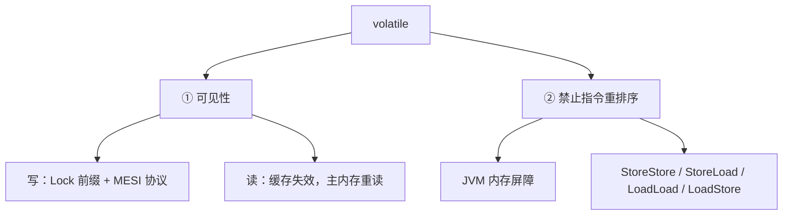
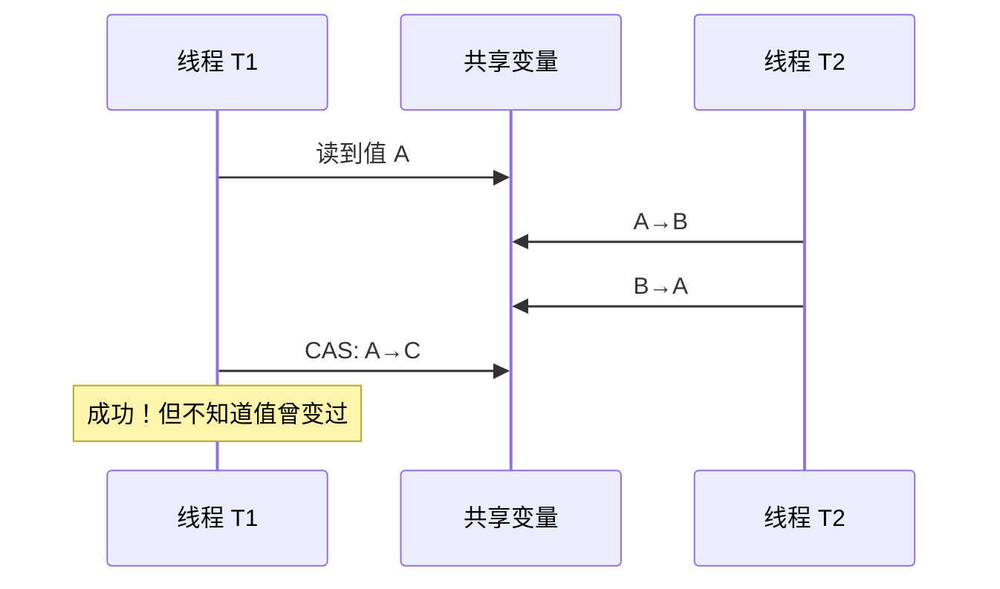
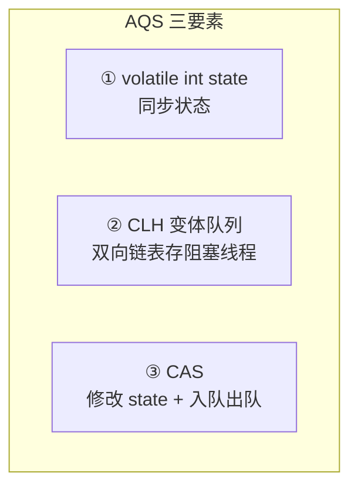
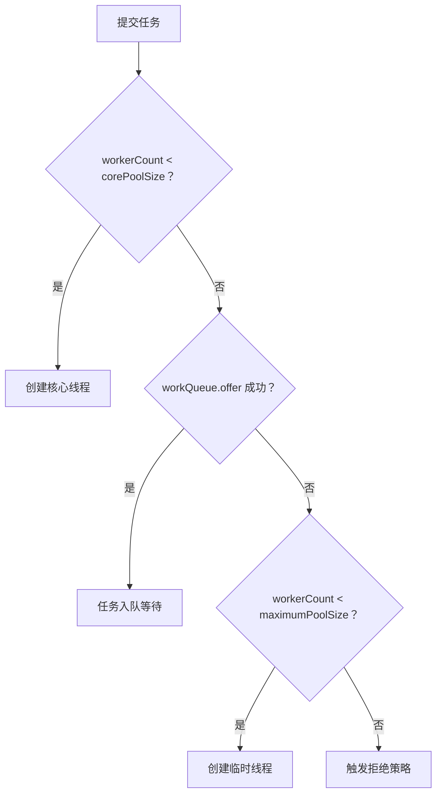

# 05 - 面试高频问题

## Q1：synchronized 锁升级过程？

**答案：** 无锁 → 偏向锁 → 轻量级锁 → 重量级锁，只能升级不能降级。


| 状态 | Mark Word 后 3 bit | 触发条件 |
|------|-------------------|----------|
| 无锁 | 001 | 初始 |
| 偏向锁 | 101 | 同一线程反复获取，CAS 记录 ThreadID |
| 轻量级锁 | 00 | 有竞争但无阻塞，CAS 自旋 |
| 重量级锁 | 10 | 自旋失败，膨胀为 ObjectMonitor |

**面试加分项：** JDK 15+ 默认延迟 4s 启动偏向锁，关闭用 `-XX:-UseBiasedLocking`。

---

## Q2：volatile 两大特性？底层怎么实现？

**答案：**



- **可见性**：volatile 写触发 Lock 前缀指令，通过 MESI 缓存一致性协议使其他 CPU 缓存行失效。volatile 读从主内存重新加载。
- **禁止重排序**：JVM 在 volatile 写前后插入 StoreStore/StoreLoad 屏障，在 volatile 读后插入 LoadLoad/LoadStore 屏障。

**DCL 为什么必须加 volatile？**

new 对象分三步：① 分配内存 → ② 初始化 → ③ 引用赋值。JIT 可能将 ②③ 重排序 → 其他线程拿到未初始化对象。volatile 通过 StoreStore 屏障保证 ② 在 ③ 前完成。

---

## Q3：volatile 能保证原子性吗？为什么？

**答案：不能。**

`count++` 是三个操作：读 → 加 1 → 写。volatile 只保证每次读/写的可见性，不保证复合操作的原子性。

```java
volatile int count = 0;
// 多线程执行 count++，结果 < 期望值
```

**解决：**
- `AtomicInteger.incrementAndGet()`（CAS）
- `synchronized`
- `ReentrantLock`

---

## Q4：CAS 的 ABA 问题？怎么解决？

**答案：**



**经典场景** — 链表栈出栈导致悬垂指针。

**解决：** `AtomicStampedReference` 添加版本号 stamp，CAS 同时比较值和版本号。

```java
AtomicStampedReference<Integer> ref = new AtomicStampedReference<>(100, 0);
ref.compareAndSet(expectedRef, newRef, expectedStamp, newStamp);
```

---

## Q5：synchronized vs Lock 区别？

**答案：**

| 维度 | synchronized | Lock |
|------|-------------|------|
| 层面 | JVM 关键字（C++） | JUC 接口（Java） |
| 锁释放 | 自动 | 手动 finally unlock |
| 中断响应 | 不支持 | lockInterruptibly |
| 超时获取 | 不支持 | tryLock(time, unit) |
| 公平锁 | 非公平 | 可选 |
| 多条件 | 一个 wait set | 多个 Condition |
| 底层 | ObjectMonitor | AQS + CAS + CLH |

**选择建议：** 简单场景用 synchronized，需要超时/可中断/多条件用 Lock。

---

## Q6：AQS 原理？三要素？

**答案：**



**模板方法模式：** AQS 定义 acquire/release 骨架，子类实现 tryAcquire/tryRelease。

**独占模式流程：**
1. `tryAcquire()` — 尝试 CAS state 0→1
2. 失败 → `addWaiter(EXCLUSIVE)` 创建 Node 入 CLH 队尾
3. `acquireQueued()` — 自旋，前驱是 head 则 tryAcquire，否则 park 阻塞
4. 前驱释放 → `unparkSuccessor` 唤醒后继

---

## Q7：公平锁 vs 非公平锁？

**答案：**

| 维度 | 公平锁 | 非公平锁（默认） |
|------|--------|-----------------|
| 获取顺序 | 严格 FIFO | 可能插队 |
| 实现 | hasQueuedPredecessors() 检查 | lock() 直接 CAS 抢 |
| 吞吐量 | 低（上下文切换多） | **高** |
| 饥饿 | 无 | 可能有 |

**非公平锁两处插队点：**
1. `lock()` 方法里直接 CAS 抢一次
2. `tryAcquire()` → `nonfairTryAcquire()` 不检查队列

---

## Q8：线程池 7 参数？执行流程？

**答案：**

7 参数：`corePoolSize, maximumPoolSize, keepAliveTime, unit, workQueue, threadFactory, handler`



---

## Q9：四种拒绝策略？

**答案：**

| 策略 | 行为 | 场景 |
|------|------|------|
| **AbortPolicy**（默认） | 抛 `RejectedExecutionException` | 必须感知失败 |
| **CallerRunsPolicy** | 调用者线程直接执行 | 不能丢，降速 |
| **DiscardPolicy** | 静默丢弃新任务 | 允许丢失 |
| **DiscardOldestPolicy** | 丢弃队列最旧任务 | 优先新任务 |

---

## Q10：为什么不推荐 Executors 创建线程池？

**答案：** 阿里规范禁止。

1. **newFixedThreadPool / newSingleThreadExecutor**：`LinkedBlockingQueue(Integer.MAX_VALUE)` → 队列无限堆积 → **OOM**
2. **newCachedThreadPool**：`maximumPoolSize = Integer.MAX_VALUE` → 无限创建线程 → **OOM**
3. **newScheduledThreadPool**：同上

**正确姿势：** `new ThreadPoolExecutor(...)` 手动指定全部参数，使用有界队列。

---

## Q11：线程池大小怎么估算？

**答案：**

| 类型 | 公式 |
|------|------|
| CPU 密集型 | `CPU 核数 + 1` |
| I/O 密集型 | `CPU 核数 * 2` |
| 精确公式 | `N_cpu * U_cpu * (1 + W/C)` |

其中 W = 平均等待时间，C = 平均计算时间。

---

## Q12：ReentrantLock 如何实现可重入？

**答案：** state 记录重入次数。

```java
// 加锁
if (currentThread == getExclusiveOwnerThread()) {
    setState(state + 1);  // 重入：state++
    return true;
}

// 解锁
int c = getState() - 1;  // state--
if (c == 0) {            // state == 0 才真正释放
    setExclusiveOwnerThread(null);
}
setState(c);
```

---

## Q13：线程的生命周期有哪些？

**答案：**

| 状态 | 进入条件 |
|------|----------|
| NEW | new Thread() |
| RUNNABLE | start() |
| BLOCKED | 等待进入 synchronized |
| WAITING | wait() / join() / park() |
| TIMED_WAITING | sleep(time) / wait(time) / join(time) |
| TERMINATED | run() 结束 |

---

## Q14：sleep vs wait 区别？

**答案：**

| 维度 | sleep | wait |
|------|-------|------|
| 定义类 | Thread | Object |
| 释放锁 | **不释放** | **释放** |
| 唤醒 | 自动超时 | notify/notifyAll |
| 使用条件 | 任意地方 | 必须在 synchronized 内 |
| 线程状态 | TIMED_WAITING | WAITING / TIMED_WAITING |

---

## Q15：手写一个基于 AQS 的 ReentrantLock

**答案：** 见 [MyLock.java](file:///e:/3-PROJECT/Project%20Java/MySelf/custom-collection/custom-backend/custom-study/study-base/src/main/java/base/concurrent/MyLock.java)

核心要点：
1. 内部 Sync 类继承 `AbstractQueuedSynchronizer`
2. 实现 `tryAcquire(int)`：state=0 → CAS 抢；state>0 且当前线程 → 重入
3. 实现 `tryRelease(int)`：state--，state=0 时释放
4. `lock()` → `sync.acquire(1)`，`unlock()` → `sync.release(1)`