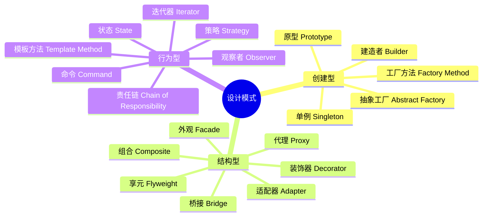
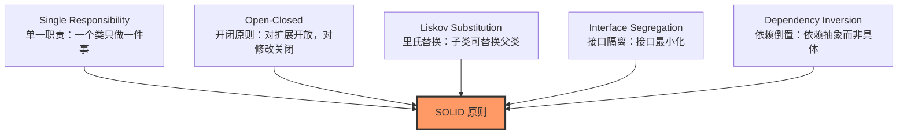
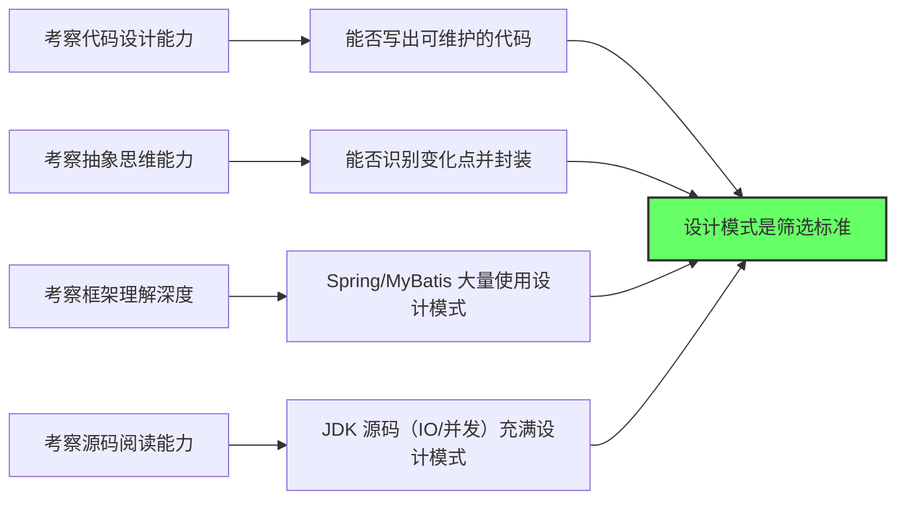

# 01 - 设计模式概述

## 什么是设计模式

设计模式（Design Pattern）是软件开发过程中**反复出现的、经过验证的解决方案**。它不是具体的代码，而是一种**解决问题的思路和模板**。

> "Each pattern describes a problem which occurs over and over again in our environment,
> and then describes the core of the solution to that problem."
> — Christopher Alexander

## 六大设计原则（SOLID）

| 原则 | 英文 | 核心要点 |
|------|------|---------|
| SRP | Single Responsibility | 一个类只负责一项职责 |
| OCP | Open-Closed | 对扩展开放，对修改关闭 |
| LSP | Liskov Substitution | 子类必须能完全替换父类 |
| ISP | Interface Segregation | 接口应小而专，不强迫实现不需要的方法 |
| DIP | Dependency Inversion | 依赖抽象（接口）而非具体实现 |

## 本模块覆盖的 6 种核心模式

| 模式 | 分类 | 核心思想 | 面试频率 |
|------|------|---------|---------|
| **单例** | 创建型 | 全局唯一实例 | ⭐⭐⭐⭐⭐ |
| **工厂方法** | 创建型 | 子类决定实例化类型 | ⭐⭐⭐⭐ |
| **代理** | 结构型 | 控制目标对象访问 | ⭐⭐⭐⭐⭐ |
| **策略** | 行为型 | 算法族可替换 | ⭐⭐⭐⭐ |
| **模板方法** | 行为型 | 父类定义骨架，子类实现步骤 | ⭐⭐⭐ |
| **装饰器** | 结构型 | 动态增强对象功能 | ⭐⭐⭐ |

## 为什么面试必考设计模式

## JDK 中随处可见的设计模式

| 模式 | JDK 中的体现 |
|------|-------------|
| 单例 | `java.lang.Runtime`、`java.awt.Desktop` |
| 工厂方法 | `Calendar.getInstance()`、`NumberFormat.getInstance()` |
| 代理 | `java.lang.reflect.Proxy`、`java.rmi.*` |
| 策略 | `Comparator`、`ThreadPoolExecutor.RejectedExecutionHandler` |
| 模板方法 | `InputStream.read()`、`AbstractQueuedSynchronizer` |
| 装饰器 | `BufferedInputStream`、`DataInputStream` |
| 观察者 | `java.util.Observer`、事件监听模型 |
| 适配器 | `InputStreamReader(InputStream)` → `Reader` |
| 责任链 | `FilterChain`（Servlet） |
| 迭代器 | `Iterator` |

## Spring 框架中的设计模式

| 模式 | Spring 中的体现 |
|------|----------------|
| 单例 | Bean 默认 scope = singleton |
| 工厂方法 | `BeanFactory`、`FactoryBean` |
| 代理 | AOP 核心机制（JDK/CGLIB 动态代理） |
| 策略 | `Resource` 接口的不同实现 |
| 模板方法 | `JdbcTemplate`、`RestTemplate`、`TransactionTemplate` |
| 装饰器 | `BeanDefinitionDecorator` |
| 观察者 | `ApplicationListener`、`ApplicationEvent` |
| 适配器 | `HandlerAdapter`（Spring MVC） |

## 联系代码演示

| 知识点 | 演示文件 |
|--------|---------|
| 单例 6 种实现 + DCL | [SingletonDemo.java](../../../../java/base/design_patterns/SingletonDemo.java) |
| 工厂方法 | [FactoryMethodDemo.java](../../../../java/base/design_patterns/FactoryMethodDemo.java) |
| 动态代理 | [ProxyDemo.java](../../../../java/base/design_patterns/ProxyDemo.java) |
| 策略模式 | [StrategyDemo.java](../../../../java/base/design_patterns/StrategyDemo.java) |
| 模板方法 | [TemplateMethodDemo.java](../../../../java/base/design_patterns/TemplateMethodDemo.java) |
| DCL volatile 详解 | [Q01_Singleton_DCL.java](../../../../java/base/design_patterns/interview/Q01_Singleton_DCL.java) |
| 代理 vs 装饰器 | [Q02_ProxyVsDecorator.java](../../../../java/base/design_patterns/interview/Q02_ProxyVsDecorator.java) |