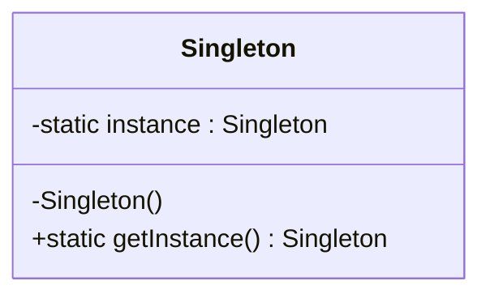
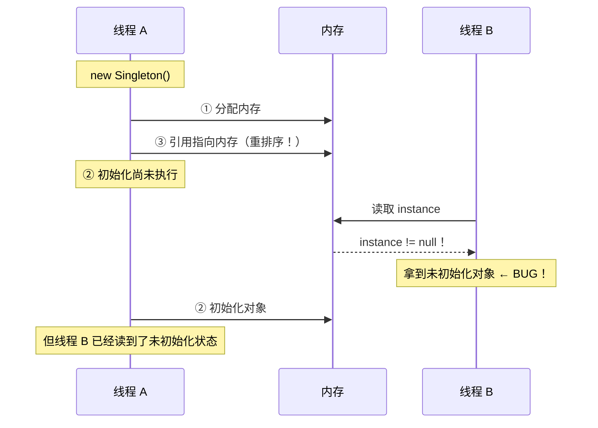
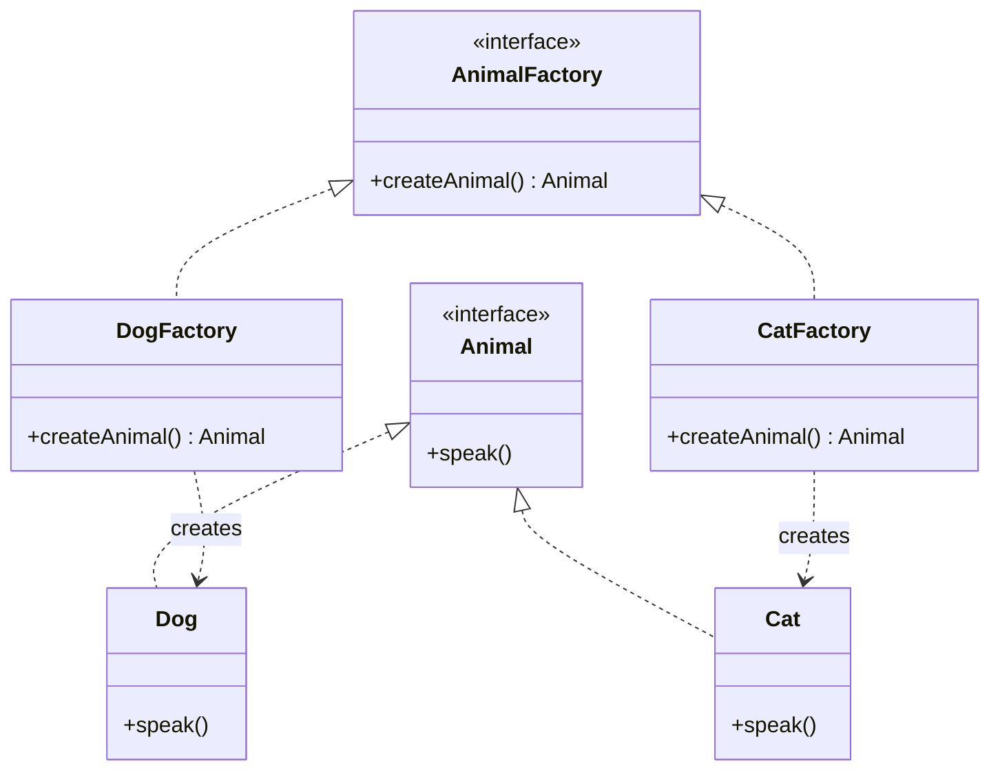
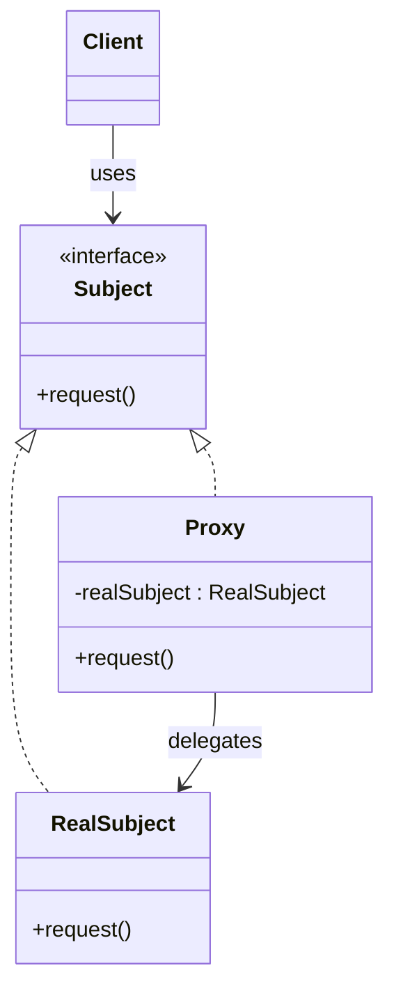
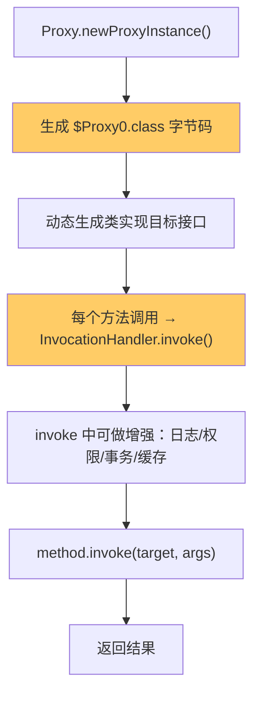
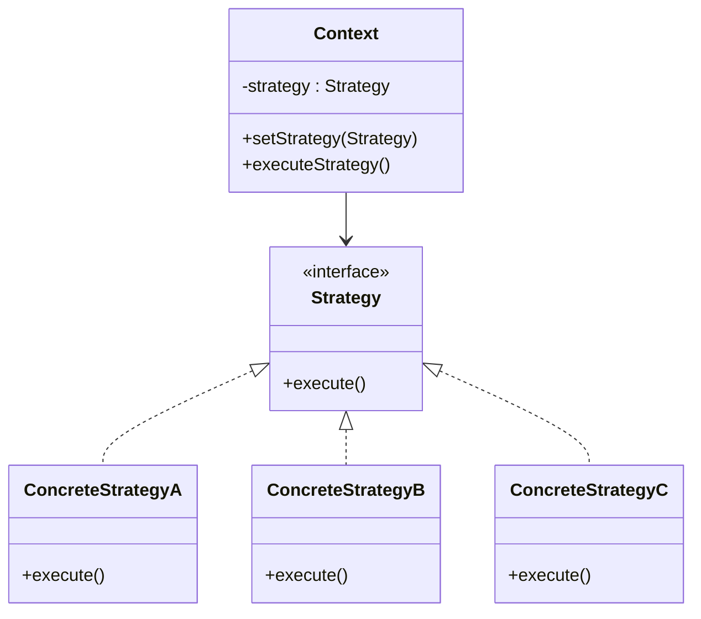
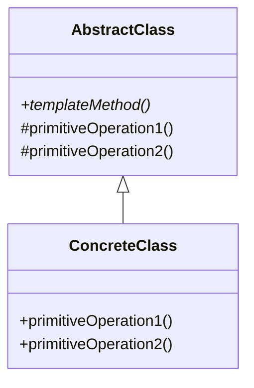
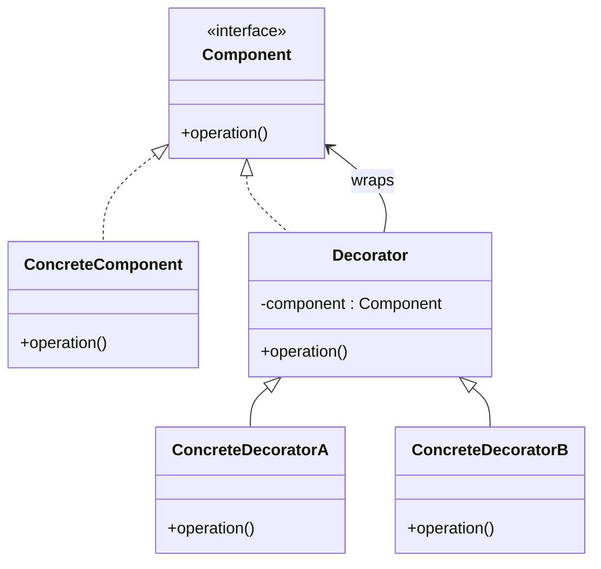

# 02 - 六种核心模式详解

## 1. 单例模式（Singleton）

**意图：** 确保一个类只有一个实例，并提供全局访问点。



### 六种实现方式对比

| 实现方式 | 线程安全 | 延迟加载 | 防反射 | 防序列化 | 推荐度 |
|---------|---------|---------|--------|---------|-------|
| **饿汉式** | ✅ (JVM 保证) | ❌ | ❌ | ❌ | ⭐⭐ |
| 懒汉式（无锁） | ❌ | ✅ | ❌ | ❌ | ❌ 禁用 |
| 懒汉式（synchronized） | ✅ | ✅ | ❌ | ❌ | ⭐ |
| **DCL** | ✅ (volatile) | ✅ | ⚠️ 构造器拦截 | ❌ | ⭐⭐⭐⭐ |
| **静态内部类** | ✅ (类加载) | ✅ | ❌ | ❌ | ⭐⭐⭐⭐⭐ |
| **枚举** | ✅ (JVM 保证) | ❌ | ✅ | ✅ | ⭐⭐⭐⭐⭐ |

### DCL 为什么必须加 volatile？



`instance = new Singleton()` 在 JVM 层面分三步：

```
memory = allocate();    // ① 分配内存
ctorInstance(memory);   // ② 执行构造方法
instance = memory;      // ③ 引用指向内存
```

②③ 可能被 JIT 重排序为 ①③②。线程 B 在 ③ 后看到 `instance != null`，但对象尚未初始化。

**volatile 通过内存屏障禁止此重排序**，保证初始化先于引用赋值。

### 反射攻击的防范

```java
// DCL 构造器加防御
private DCLSingleton() {
    if (instance != null) {
        throw new RuntimeException("反射攻击被阻止");
    }
}
```

枚举天然防反射：`Constructor.newInstance()` 源码中对 enum 做了硬编码拦截。

---

## 2. 工厂方法模式（Factory Method）

**意图：** 定义创建对象的接口，让子类决定实例化哪个类。



### 简单工厂 vs 工厂方法 vs 抽象工厂

| 模式 | 工厂数量 | 产品数量 | 开闭原则 | 复杂度 |
|------|---------|---------|---------|-------|
| 简单工厂 | 1 个 | N 个 | ❌ | 低 |
| **工厂方法** | N 个 | N 个 | ✅ | 中 |
| 抽象工厂 | 1 个工厂族 | 1 个产品族 | ✅ | 高 |

```java
// 简单工厂：新增产品需要修改 switch
class SimpleFactory {
    static Animal create(String type) {
        switch (type) {
            case "dog": return new Dog();   // 每次加新产品要改这里
            case "cat": return new Cat();
            default: throw new IllegalArgumentException();
        }
    }
}

// 工厂方法：新增产品只需新增工厂（不修改已有代码）
interface AnimalFactory { Animal createAnimal(); }
class DogFactory implements AnimalFactory { ... }  // 独立狗工厂
class CatFactory implements AnimalFactory { ... }  // 独立猫工厂
class BirdFactory implements AnimalFactory { ... } // 新增鸟工厂，无需改代码
```

---

## 3. 代理模式（Proxy）

**意图：** 为其他对象提供一种代理，以**控制**对这个对象的访问。



### JDK 动态代理原理



关键点：
- 目标类**必须有接口**（JDK 代理基于接口）
- 生成的代理类名格式：`$Proxy0`, `$Proxy1` ...
- 代理类继承 `java.lang.reflect.Proxy`，实现目标接口
- 没有接口时使用 **CGLIB**（基于继承，生成目标类的子类）

### JDK 代理 vs CGLIB 代理

| 维度 | JDK 动态代理 | CGLIB |
|------|------------|-------|
| 实现方式 | 基于接口 | 基于继承 |
| 要求 | 目标类必须有接口 | 目标类不能是 final |
| 性能 | 生成快，调用慢（反射） | 生成慢（ASM），调用快 |
| Spring 默认 | 有接口时使用 | 无接口时使用 |
| 生成类名 | `$Proxy0` | `Target$$EnhancerByCGLIB` |

---

## 4. 策略模式（Strategy）

**意图：** 定义一系列算法，把它们封装起来，使它们可以互相替换。



### 策略模式消除 if-else

```java
// ❌ 传统方式：大量 if-else
if ("alipay".equals(method)) {
    alipay();
} else if ("wechat".equals(method)) {
    wechat();
} else if ("creditCard".equals(method)) {
    creditCard();
}

// ✅ 策略模式：用 Map 映射替代分支
Map<PaymentMethod, PaymentStrategy> map = new HashMap<>();
map.put(ALIPAY, new AlipayStrategy());
map.put(WECHAT, new WechatStrategy());
map.put(CREDIT_CARD, new CreditCardStrategy());

// 调用时直接：
map.get(method).pay(amount);
```

### 策略模式 vs 状态模式

| 维度 | 策略模式 | 状态模式 |
|------|---------|---------|
| 关注点 | **算法可替换** | **状态可流转** |
| 切换方式 | 客户端主动选择 | 状态自动流转 |
| 策略间关系 | 互不知晓 | 可能相互引用 |
| 典型场景 | 支付策略、排序算法 | 订单状态、审批流 |

---

## 5. 模板方法模式（Template Method）

**意图：** 定义算法骨架，将某些步骤延迟到子类实现。



### 好莱坞原则

> "Don't call us, we'll call you." （别打电话给我们，我们会打给你。）

父类调用子类的方法，子类不需要主动调用父类。这是一种**控制反转**（IoC）。

### JDK 中的模板方法

```java
// InputStream.read(byte[], int, int) 内部循环调用 read()
public int read(byte b[], int off, int len) throws IOException {
    // ... 模板方法骨架 ...
    for (; i < len; i++) {
        int c = read();  // 调用子类实现的 read()
        if (c == -1) break;
        b[off + i] = (byte) c;
    }
    // ...
}

// 子类只需实现 read() 方法
public class FileInputStream extends InputStream {
    public int read() throws IOException { ... }
}
```

### 模板方法 vs 策略模式

| 维度 | 模板方法 | 策略模式 |
|------|---------|---------|
| 复用方式 | **继承** | **组合** |
| 确定时机 | 编译期 | 运行时 |
| 粒度 | 算法骨架固定，步骤可变 | 整个算法可替换 |
| 典型场景 | AQS、JdbcTemplate | Comparator、支付策略 |
| 原则体现 | 好莱坞原则 | 开闭原则 |

---

## 6. 装饰器模式（Decorator）

**意图：** 动态地给对象添加额外职责，比继承更灵活。



### Java IO 中的装饰器

```java
// 层层嵌套，动态组合功能
InputStream raw = new FileInputStream("data.txt");       // 原始流
InputStream buffered = new BufferedInputStream(raw);      // +缓冲
InputStream data = new DataInputStream(buffered);         // +数据类型读取
// 等同于：
DataInputStream dis = new DataInputStream(
    new BufferedInputStream(
        new FileInputStream("data.txt")
    )
);
```

### 代理 vs 装饰器（面试高频）

| 维度 | 代理模式 | 装饰器模式 |
|------|---------|-----------|
| 意图 | **控制访问** | **增强功能** |
| 关注点 | 权限、延迟加载、远程调用 | 功能叠加、组合 |
| 创建方式 | 代理内部创建/隐藏目标 | 外部传入目标 |
| 嵌套 | 通常单层 | 可多层嵌套 |
| 典型应用 | Spring AOP、MyBatis Mapper | Java IO、Collections |

---

## 联系代码演示

| 模式 | 代码文件 |
|------|---------|
| 单例 6 种实现 | [SingletonDemo.java](../../../../java/base/design_patterns/SingletonDemo.java) |
| 工厂方法 | [FactoryMethodDemo.java](../../../../java/base/design_patterns/FactoryMethodDemo.java) |
| 动态代理 | [ProxyDemo.java](../../../../java/base/design_patterns/ProxyDemo.java) |
| 策略模式 | [StrategyDemo.java](../../../../java/base/design_patterns/StrategyDemo.java) |
| 模板方法 | [TemplateMethodDemo.java](../../../../java/base/design_patterns/TemplateMethodDemo.java) |
| DCL 面试题 | [Q01_Singleton_DCL.java](../../../../java/base/design_patterns/interview/Q01_Singleton_DCL.java) |
| 代理 vs 装饰器 | [Q02_ProxyVsDecorator.java](../../../../java/base/design_patterns/interview/Q02_ProxyVsDecorator.java) |