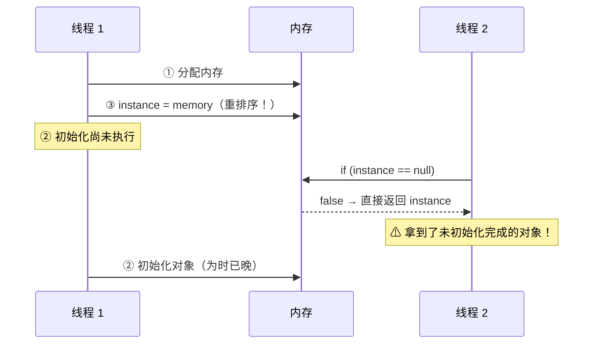
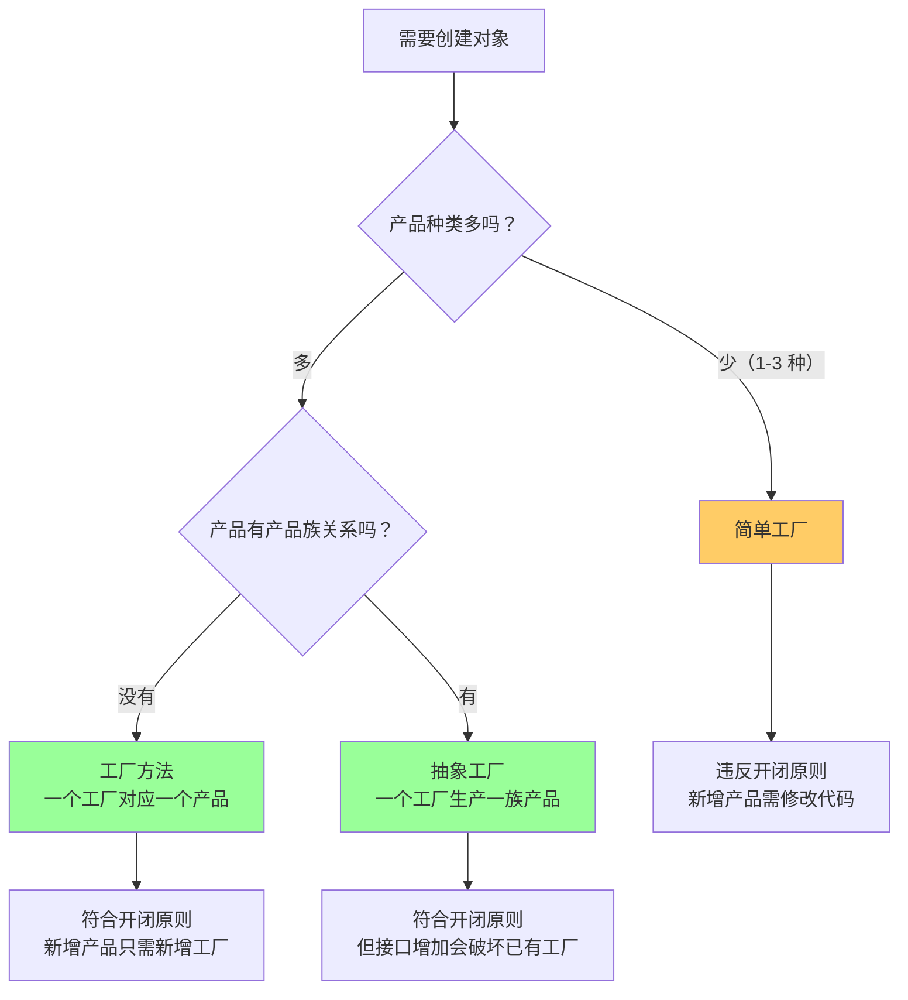

# 03 - 面试高频问题

## Q1：DCL 单例为什么要加 volatile？

### 问题本质

`instance = new Singleton()` 在 JVM 层面不是原子操作：

```
① memory = allocate();    // 分配内存
② ctorInstance(memory);   // 初始化对象
③ instance = memory;      // 引用指向内存
```

JIT 编译器可能重排序为 **①→③→②**。

### 危害场景



### volatile 的解决方案

volatile 通过两个**内存屏障**禁止重排序：

```
② ctorInstance(memory)   // 初始化对象
--------- StoreStore 屏障 ---------
③ instance = memory;     // 引用赋值（volatile 写）
--------- StoreLoad 屏障 ---------
```

- **StoreStore 屏障**：保证 volatile 写之前的所有普通写（② 初始化）已完成
- **StoreLoad 屏障**：保证 volatile 写之后不会重排序到读操作之前

### JDK 5 之后的修复

JDK 5 增强了 volatile 的语义（JSR-133），使得 DCL 可以通过 volatile 安全实现。在此之前 volatile 只保证可见性，不保证有序性。

---

## Q2：代理模式 vs 装饰器模式，怎么区分？

### 一句话总结

> 代理控制**能不能**访问，装饰器增强**好不好**用。

### 代码结构相同，意图不同

| 维度 | 代理（Proxy） | 装饰器（Decorator） |
|------|-------------|-------------------|
| 意图 | 控制对对象的访问 | 增强对象的功能 |
| 关注点 | 权限检查、延迟加载、远程调用 | 功能组合、职责叠加 |
| 创建方式 | 代理内部隐藏/创建真实对象 | 外部传入被装饰对象 |
| 嵌套 | 通常单层 | 可以多层嵌套 |
| 典型例子 | AOP 切面、RPC 存根、MyBatis MapperProxy | BufferedInputStream、Collections.synchronizedList |

### 面试回答模板

```
// 代理模式：控制访问权限
class AccessProxy implements Service {
    private RealService target; // 代理内部持有/创建
    void execute() {
        if (hasPermission()) {
            target.execute(); // 有权限才调用
        }
    }
}

// 装饰器模式：增强功能
class LoggingDecorator implements Service {
    private Service delegate; // 外部传入
    LoggingDecorator(Service s) { this.delegate = s; } // 构造器注入
    void execute() {
        log("before");        // 前置增强
        delegate.execute();   // 委托
        log("after");         // 后置增强
    }
}
```

### 动态代理中，代理和装饰器可能共存

```java
// JDK 动态代理本身是"代理"机制，但可以在 InvocationHandler 中实现"装饰器"行为
InvocationHandler handler = (proxy, method, args) -> {
    log("before");                // ← 装饰器行为
    Object result = method.invoke(target, args);
    log("after");                 // ← 装饰器行为
    return result;
};
```

---

## Q3：静态内部类单例 vs DCL 单例，选哪个？

### 对比

| 维度 | 静态内部类 | DCL |
|------|----------|-----|
| 线程安全 | ✅ 类加载机制保证 | ✅ volatile + synchronized |
| 延迟加载 | ✅ | ✅ |
| 实现复杂度 | 低 | 中 |
| 可传参构造 | ❌ 只能无参 | ✅ |
| 防反射 | ❌ | ⚠️ 需构造器加防御 |
| JDK 版本 | 任何版本 | JSR-133 (JDK 5+) |

### 结论

- **日常开发推荐静态内部类**：代码简洁，JVM 内置保证线程安全
- **需要传参构造时用 DCL**：静态内部类的 Holder 只能用无参构造
- **防反射/防序列化首选枚举**

---

## Q4：工厂方法 vs 简单工厂 vs 抽象工厂



---

## Q5：JDK/Spring 中常见的设计模式

### 单例模式
- `java.lang.Runtime.getRuntime()` — 饿汉式
- `java.awt.Desktop.getDesktop()` — DCL
- Spring Bean 默认 scope — 单例注册表

### 工厂方法模式
- `Calendar.getInstance()`
- `NumberFormat.getInstance()`
- Spring `BeanFactory.getBean()`

### 代理模式
- `java.lang.reflect.Proxy`
- Spring AOP (JDK/CGLIB)
- MyBatis MapperProxy

### 策略模式
- `Comparator<T>`
- `ThreadPoolExecutor.RejectedExecutionHandler`
- Spring `Resource` 接口

### 模板方法模式
- `InputStream.read(byte[], int, int)` → 调用子类 `read()`
- `AbstractQueuedSynchronizer` (AQS) — 整个 JUC 基础
- `HttpServlet.service()` → `doGet()` / `doPost()`
- Spring `JdbcTemplate`、`RestTemplate`

### 装饰器模式
- `BufferedInputStream(InputStream)`
- `DataInputStream(InputStream)`
- `Collections.synchronizedList(List)`

### 观察者模式
- `java.util.Observer` / `Observable`
- Spring `ApplicationListener`、`@EventListener`
- 发布-订阅模型

### 适配器模式
- `InputStreamReader(InputStream)` → 字节流转字符流
- Spring MVC `HandlerAdapter`

### 责任链模式
- Servlet `FilterChain`
- Spring Security `SecurityFilterChain`
- Netty `ChannelPipeline`

---

## Q6：策略模式如何消除 if-else？

```java
// ❌ 原始代码：大量条件分支
public void pay(String method, double amount) {
    if ("alipay".equals(method)) {
        System.out.println("支付宝支付: " + amount);
    } else if ("wechat".equals(method)) {
        System.out.println("微信支付: " + amount);
    } else if ("credit".equals(method)) {
        System.out.println("信用卡支付: " + amount);
    }
    // 每次新增支付方式都要修改这个方法 → 违反开闭原则
}

// ✅ 策略模式：Map + 策略接口
Map<String, PayStrategy> strategies = new HashMap<>();
strategies.put("alipay", new AlipayStrategy());
strategies.put("wechat", new WechatStrategy());
strategies.put("credit", new CreditStrategy());

public void pay(String method, double amount) {
    PayStrategy strategy = strategies.get(method);
    if (strategy == null) throw new IllegalArgumentException();
    strategy.pay(amount);
}
// 新增支付方式：只需新增一个策略类 + 注册到 Map
```

**核心思想：** 用**多态**替代**条件分支**，用**数据配置**（Map）替代**硬编码逻辑**。

---

## 联系代码演示

| 面试题 | 代码文件 |
|--------|---------|
| DCL volatile 详解 | [Q01_Singleton_DCL.java](../../../../java/base/design_patterns/interview/Q01_Singleton_DCL.java) |
| 代理 vs 装饰器 | [Q02_ProxyVsDecorator.java](../../../../java/base/design_patterns/interview/Q02_ProxyVsDecorator.java) |
| 单例 6 种实现 | [SingletonDemo.java](../../../../java/base/design_patterns/SingletonDemo.java) |
| 工厂方法 | [FactoryMethodDemo.java](../../../../java/base/design_patterns/FactoryMethodDemo.java) |
| 动态代理 | [ProxyDemo.java](../../../../java/base/design_patterns/ProxyDemo.java) |
| 策略模式 | [StrategyDemo.java](../../../../java/base/design_patterns/StrategyDemo.java) |
| 模板方法 | [TemplateMethodDemo.java](../../../../java/base/design_patterns/TemplateMethodDemo.java) |