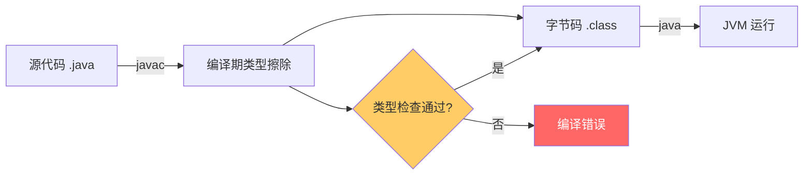

# 01 - 泛型基础原理

## 为什么需要泛型

在没有泛型的时代（Java 5 之前），集合类（如 `ArrayList`）只能存储 `Object` 类型：

```java
List list = new ArrayList();
list.add("hello");
list.add(123);        // 编译通过，没人拦你
String s = (String) list.get(1); // 运行时 ClassCastException！
```

这带来了两个核心问题：

1. **缺乏编译期类型检查**：类型错误只能在运行时暴露，增加了调试成本
2. **强制类型转换繁琐**：每次从集合取出元素都需要手动强制转型

泛型将类型检查从**运行时提前到编译期**，实现了"一次编写，类型安全"。



---

## 泛型的三种使用形式

### 1. 泛型类（Generic Class）

在类名后定义类型参数，类内部可以使用该类型：

```java
public class Box<T> {
    private T value;
    public void set(T value) { this.value = value; }
    public T get() { return value; }
}

Box<String> stringBox = new Box<>();
Box<Integer> intBox = new Box<>();
```

### 2. 泛型方法（Generic Method）

在方法的返回值前声明类型参数，独立于类级别的类型参数：

```java
public static <T> T identity(T input) {
    return input;
}

// 调用时可以显式指定，也可以让编译器推断
String result = MyClass.<String>identity("hello"); // 显式
Integer num = identity(42);                        // 类型推断
```

### 3. 泛型接口（Generic Interface）

定义接口契约时使用类型参数，实现类可以指定具体类型：

```java
public interface Comparable<T> {
    int compareTo(T o);
}

public class Person implements Comparable<Person> {
    @Override
    public int compareTo(Person other) { ... }
}
```

---

## 类型参数的命名惯例

| 字母 | 含义 | 典型场景 |
|------|------|---------|
| `E` | Element | 集合元素（`List<E>`、`Set<E>`） |
| `K` | Key | 映射的键（`Map<K, V>`） |
| `V` | Value | 映射的值 |
| `T` | Type | 通用类型 |
| `S, U, V` | 第二、三、四个类型 | 多参数方法 |
| `?` | 通配符 | 未知类型 |

---

## 泛型的局限性概览

| 限制 | 说明 | 替代方案 |
|------|------|---------|
| 不能使用基本类型 | `List<int>` 非法 | 使用包装类 `List<Integer>` |
| 不能用 instanceof | `x instanceof List<String>` 非法 | 只能检查原始类型 `x instanceof List` |
| 不能创建泛型数组 | `new T[10]` 非法 | 使用 ArrayList 或反射 |
| 不能在静态字段使用 | `static T value` 非法 | 用泛型方法替代 |
| 不能捕获泛型异常 | `catch(T e)` 非法 | 类型参数不能继承 Throwable |
| 不能重载擦除后签名相同的方法 | `void foo(List<String>)` 和 `void foo(List<Integer>)` 冲突 | 改方法名 |

---

## 自测问题

1. `List<Object>` 和 `List<String>` 是什么关系？（提示：不是父子关系）
2. 泛型方法中的 `<T>` 和泛型类中的 `<T>` 会冲突吗？
3. 为什么 `ArrayList<String>.class` 不存在？