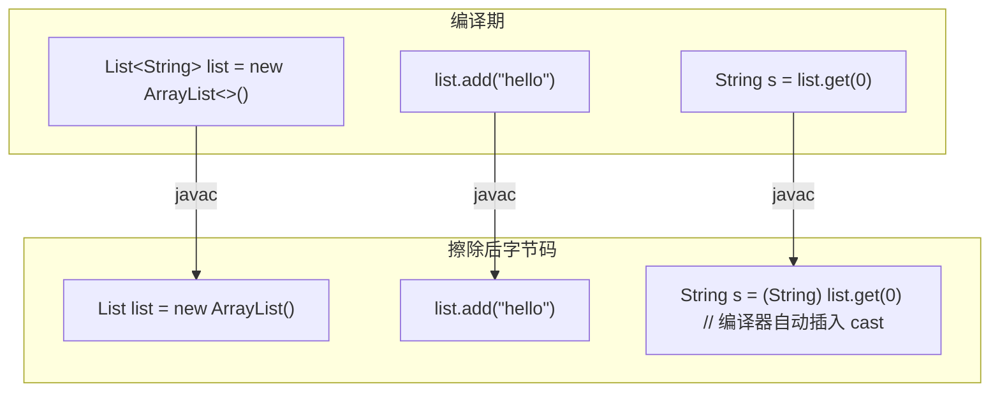
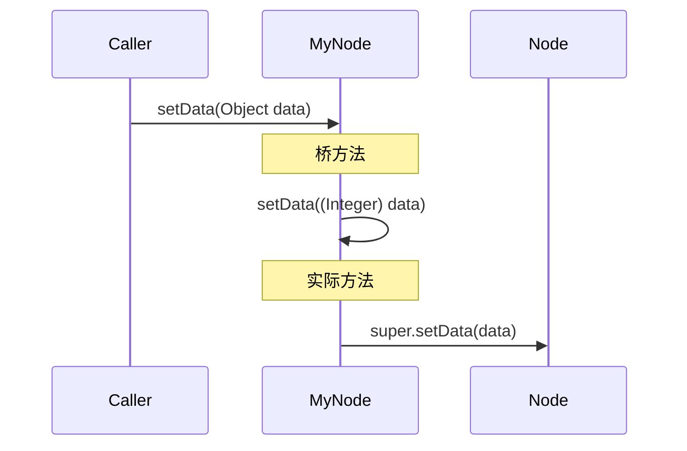

# 02 - 类型擦除源码分析

## 类型擦除的定义

Java 泛型通过**类型擦除**（Type Erasure）实现：编译器在编译时移除所有泛型类型参数，替换为原始类型（Raw Type）。运行时 JVM 不知道泛型的存在。



---

## 擦除规则

| 声明 | 擦除后 |
|------|--------|
| `T` (无界) | `Object` |
| `T extends Number` | `Number` |
| `T extends Comparable<T>` | `Comparable` |
| `T super Number` | `Object` |

Java 选择擦除而非具现化（如 C#）是为了**向后兼容**：Java 5 之前的原始类型代码可以直接使用泛型类库。

---

## 桥方法（Bridge Method）

当子类指定了父类泛型参数的具体类型时，编译器会生成桥方法来维持多态：

**源码：**
```java
class Node<T> {
    public void setData(T data) { ... }
}
class MyNode extends Node<Integer> {
    @Override
    public void setData(Integer data) { super.setData(data); }
}
```

**擦除后的实际字节码：**
```java
class Node {
    public void setData(Object data) { ... }
}
class MyNode extends Node {
    // 程序员写的方法 — 参数类型是 Integer
    public void setData(Integer data) { super.setData(data); }

    // 编译器自动生成的桥方法 — 参数类型是 Object，维持多态
    public void setData(Object data) {
        this.setData((Integer) data); // 调用上面的 setData(Integer)
    }
}
```



### 用反射验证桥方法

```java
Method[] methods = MyNode.class.getDeclaredMethods();
for (Method m : methods) {
    if (m.getName().equals("setData")) {
        System.out.println(m.getName() + "(" +
            m.getParameterTypes()[0].getSimpleName() + ")" +
            (m.isBridge() ? " [桥方法]" : "")
        );
    }
}
// 输出:
// setData(Integer)     ← 程序员编写的
// setData(Object) [桥方法] ← 编译器生成的
```

---

## 擦除后泛型信息存在哪里

虽然字节码中的**方法体**已经擦除了泛型，但泛型声明信息仍然保留在 class 文件的**常量池**中，具体存储在：

- **Signature 属性**：记录类、字段、方法的泛型声明
- **LocalVariableTypeTable 属性**：记录局部变量的泛型类型

这些信息可供 `java.lang.reflect` API 在运行时读取：

```java
// 可以获取到泛型信息
class MyList extends ArrayList<String> {}
Type superType = MyList.class.getGenericSuperclass();
// 输出: java.util.ArrayList<java.lang.String>
```

> **关键区别**：运行时可以通过反射读取**声明处的泛型签名**，但无法获取**实例的泛型类型参数**。
> `new ArrayList<String>().getClass()` 和 `new ArrayList<Integer>().getClass()` 返回相同的 Class 对象。

---

## 类型擦除导致的限制

### 1. 不能使用 instanceof 检查泛型类型

```java
if (list instanceof ArrayList<String>) { ... } // 编译错误
if (list instanceof ArrayList) { ... }         // 只能检查原始类型
```

### 2. 不能创建泛型数组

```java
T[] array = new T[10];               // 编译错误
List<String>[] arr = new List<String>[10]; // 编译错误

// 唯一例外：无界通配符
List<?>[] arr = new List<?>[10];    // 合法
```

### 3. 不能重载擦除后签名相同的方法

```java
// 这两个方法的擦除后签名都是 void foo(List)
void foo(List<String> list) { ... }
void foo(List<Integer> list) { ... } // 编译错误
```

### 4. 异常限制

```java
class MyException<T> extends Exception { ... } // 编译错误

// 不能 catch 泛型异常
try { ... } catch (T e) { ... } // 编译错误
```

---

## 擦除 vs 具现化（Reification）

| 维度 | Java（擦除） | C#（具现化） |
|------|-------------|-------------|
| 运行时泛型信息 | 无 | 有 |
| 基本类型参数 | 不支持 | 支持（`List<int>`） |
| 内存开销 | 低 | 高（每种泛型实例地生成新类） |
| 向后兼容 | 完美兼容 Java 1.4 代码 | 不兼容旧版 |
| 反射能力 | 有限 | 完整访问泛型信息 |

---

## 自测问题

1. `List<String>[]` 不能创建，但 `List<?>[]` 可以，为什么？
2. 桥方法的参数类型为什么是 `Object`？
3. 泛型的 Signature 属性在 class 文件的什么位置？（提示：常量池）