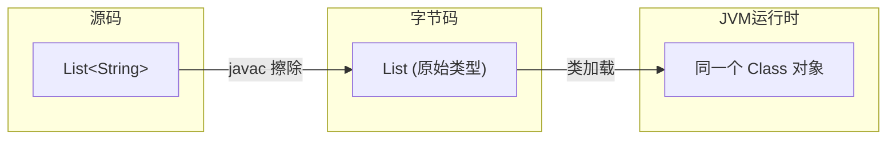
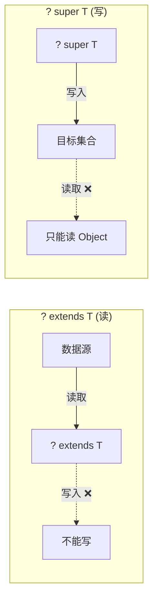

# 03 - 面试高频问题

## 目录

1. [什么是类型擦除？运行时泛型信息还存在吗？](#q1)
2. [为什么不能创建泛型数组？](#q2)
3. [PECS 原则是什么？](#q3)
4. [List&lt;Object&gt; 和 List&lt;String&gt; 是什么关系？](#q4)
5. [泛型擦除后方法重载冲突怎么办？](#q5)
6. [什么是桥方法？](#q6)
7. [通配符 ? extends 和 ? super 的区别？](#q7)
8. [如何获取运行时的泛型类型？](#q8)

---

## <a id="q1"></a>Q1：什么是类型擦除？运行时泛型信息还存在吗？

**一句话答案**：Java 泛型通过编译期类型擦除实现，`ArrayList<String>` 和 `ArrayList<Integer>` 在运行时是同一个 Class 对象。泛型声明签名保存在 class 文件的 Signature 属性中，但实例的泛型类型参数在运行时丢失。

**延伸要点**：
- 编译器擦除 `<T>` → `Object`，`<T extends Number>` → `Number`
- 编译器会在需要的地方自动插入强制类型转换（checkcast 指令）
- 反射 API 可以读取 Signature 属性获取声明的泛型信息

**现场演示代码**：见 [Q01_TypeErasure.java](../../java/base/generics/interview/Q01_TypeErasure.java)



---

## <a id="q2"></a>Q2：为什么不能创建泛型数组？

**一句话答案**：数组在运行时记住组件类型（协变），但泛型在运行时被擦除——这个矛盾会导致类型安全被绕过。

**具体原因**：

```java
// 假设 Java 允许 new ArrayList<String>[10]
ArrayList<String>[] stringLists = new ArrayList<String>[10]; // 假设通过编译
Object[] objects = stringLists;            // 数组协变：String[] 是 Object[] 的子类型
objects[0] = new ArrayList<Integer>();     // 运行时无法检测 ArrayList<Integer> 不是 ArrayList<String>
String s = stringLists[0].get(0);          // ClassCastException！
```

**三种绕过方案**：

| 方案 | 代码 | 推荐度 |
|------|------|--------|
| 使用集合替代 | `List<List<String>>` | ★★★★★ |
| 反射创建 | `(T[]) Array.newInstance(clazz, size)` | ★★★ |
| 通配符数组 | `new ArrayList<?>[10]` | ★★ |

**现场演示代码**：见 [Q02_GenericArray.java](../../java/base/generics/interview/Q02_GenericArray.java)

---

## <a id="q3"></a>Q3：PECS 原则是什么？

**一句话答案**：Producer Extends, Consumer Super。从集合**读取**数据时用 `? extends T`（生产者），向集合**写入**数据时用 `? super T`（消费者）。

**记忆口诀**：PECS — **P**roducer **E**xtends, **C**onsumer **S**uper



**实际应用**：

```java
// JDK 源码：Collections.copy
public static <T> void copy(List<? super T> dest, List<? extends T> src) {
    // src 是生产者（? extends T）→ 只能读
    // dest 是消费者（? super T）  → 只能写
    for (int i = 0; i < srcSize; i++)
        dest.set(i, src.get(i));
}

// JDK 源码：Stream.reduce
T reduce(T identity, BinaryOperator<T> accumulator);
```

**速查表**：

| 通配符 | 读取 | 写入 | 使用场景 |
|--------|------|------|---------|
| `? extends T` | ✅ 读为 T | ❌ 不能写 | 只读数据源 |
| `? super T` | ⚠️ 只能读为 Object | ✅ 可写入 T | 只写目的地 |
| `?` | ✅ 读为 Object | ❌ 不能写 | 不关心类型 |

---

## <a id="q4"></a>Q4：`List<Object>` 和 `List<String>` 是什么关系？

**一句话答案**：没有关系。泛型是**不协变**的，`String` 是 `Object` 的子类型不代表 `List<String>` 是 `List<Object>` 的子类型。

**为什么？** 如果泛型协变，类型安全将被破坏：

```java
// 假设 List<String> 是 List<Object> 的子类型
void addOne(List<Object> list) { list.add(1); }
List<String> strings = new ArrayList<>();
addOne(strings);      // 向 List<String> 中加入 Integer，但编译通过！
String s = strings.get(0); // 运行时崩溃
```

**解决方案**：使用通配符 `? extends Object` 实现协变语义（但有只读限制）。

---

## <a id="q5"></a>Q5：泛型擦除后方法重载冲突怎么办？

**问题**：以下代码编译失败

```java
void foo(List<String> list) { ... }
void foo(List<Integer> list) { ... } // 和上面的擦除后签名相同
```

**解决方案**：
- 改方法名，如 `fooString` / `fooInteger`
- 使用 `List<?>` 通过运行时判断类型（不推荐，失去编译期安全）
- 对参数进行包装：传入额外的 `Class<T>` 对象区分

---

## <a id="q6"></a>Q6：什么是桥方法？

**一句话答案**：当子类指定父类泛型参数的具体类型时，编译器自动生成的 `Object` 参数版本方法，用于维持多态的正确性。

详见 [02-类型擦除源码分析.md](./02-类型擦除源码分析.md) 中的桥方法章节。

---

## <a id="q7"></a>Q7：通配符 `? extends` 和 `? super` 的区别？

| 维度 | `? extends T` | `? super T` |
|------|---------------|-------------|
| 别名 | 上界通配符 | 下界通配符 |
| 接受类型 | T 及其子类 | T 及其父类 |
| 读取 | ✅ 可以，类型为 T | ⚠️ 只能读为 Object |
| 写入 | ❌ 不可写 | ✅ 可以，类型为 T |
| 典型场景 | `List<? extends Number>` 按 Number 读取任意数字类型 | `Consumer<? super Integer>` 可消费 Integer 的任何父类消费者 |

---

## <a id="q8"></a>Q8：如何获取运行时的泛型类型？

**三种方式**：

### 方式 1：匿名子类（Gson/Jackson 常用）

```java
Type type = new TypeToken<List<String>>(){}.getType();
// 原理：匿名子类在 class 文件的 Signature 属性中保留了 List<String>
```

### 方式 2：通过 Field/Method 反射

```java
Field field = MyClass.class.getDeclaredField("stringList");
ParameterizedType pType = (ParameterizedType) field.getGenericType();
Type[] actualTypes = pType.getActualTypeArguments(); // [String.class]
```

### 方式 3：继承时保留（Spring 常用）

```java
class StringRepository extends JpaRepository<String, Long> {}
// 通过 (ParameterizedType) getClass().getGenericSuperclass() 获取泛型参数
```

---

## 面试速查清单

- [ ] 类型擦除的定义和原理
- [ ] 桥方法的产生原因
- [ ] PECS 原则及应用场景
- [ ] 泛型数组不能创建的原因
- [ ] `List<Object>` vs `List<String>` 关系
- [ ] `? extends` vs `? super` 区别
- [ ] 运行时获取泛型信息的三种方式
- [ ] 泛型不会协变的原因
- [ ] Java 泛型和 C# 泛型的主要差异