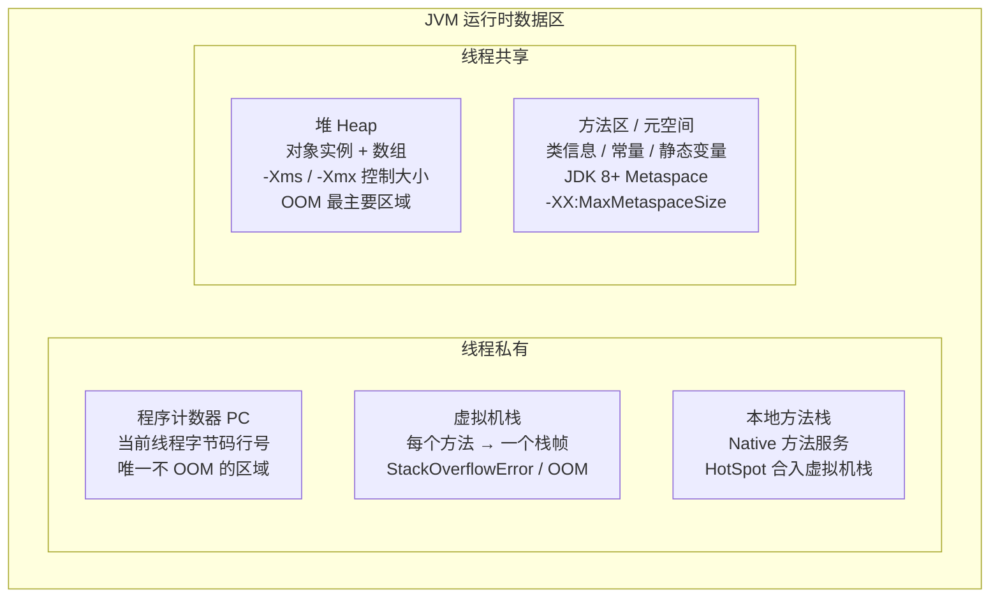
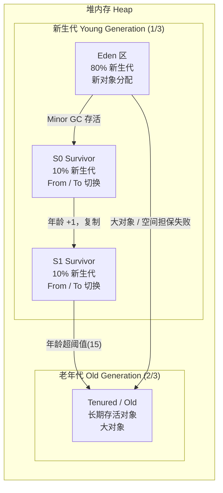
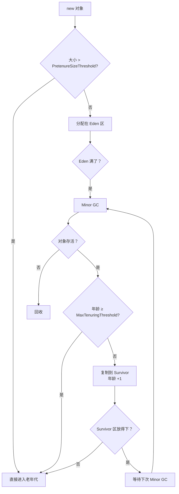
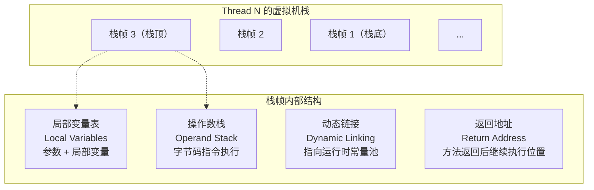
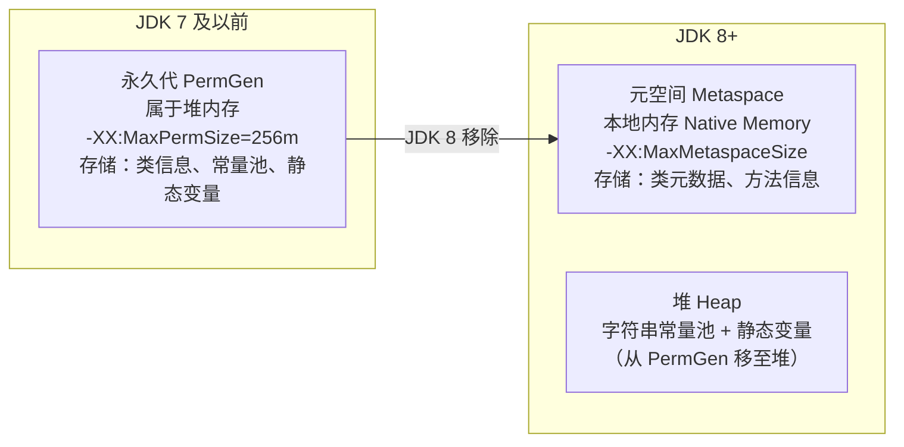

# 01 - JVM 内存模型

## 1. JVM 运行时数据区

---

## 2. 堆内存分代结构

### 2.1 对象流转

| 参数 | 说明 | 默认值 |
|------|------|--------|
| `-Xms` | 初始堆大小 | 物理内存 1/64 |
| `-Xmx` | 最大堆大小 | 物理内存 1/4 |
| `-Xmn` | 新生代大小 | 堆的 1/3 |
| `-XX:NewRatio` | 老年代:新生代 比例 | 2（老年代 2/3） |
| `-XX:SurvivorRatio` | Eden:S0 比例 | 8（Eden 80%，S0/S1 各 10%） |
| `-XX:MaxTenuringThreshold` | 晋升老年代年龄阈值 | 15（CMS 默认 6，G1 默认 15） |
| `-XX:PretenureSizeThreshold` | 大对象直接进入老年代阈值 | 0（不生效，需配合 UseSerialGC/ParNew） |

---

## 3. 虚拟机栈 & 栈帧

| 参数 | 说明 | 默认值 |
|------|------|--------|
| `-Xss` | 线程栈大小 | 1M（Linux x64） |

栈帧大小在编译期确定，不受运行时数据影响。

---

## 4. 方法区 → 元空间演变

| 参数 | 说明 |
|------|------|
| `-XX:MetaspaceSize` | 触发 Metaspace GC 的初始阈值 |
| `-XX:MaxMetaspaceSize` | 元空间最大大小（默认无上限） |
| `-XX:MinMetaspaceFreeRatio` | GC 后 Metaspace 最小空闲比例 |

---

## 5. 面试要点

- JVM 运行时数据区 5 大块及线程归属（私有 vs 共享）
- 堆分代结构（Eden:S0:S1 = 8:1:1）
- 对象晋升老年代的条件（年龄/大对象/空间担保）
- JDK 7 → JDK 8 方法区变化（PermGen → Metaspace + 字符串常量池转移）
- 栈帧四部分（局部变量表/操作数栈/动态链接/返回地址）
- StackOverflowError vs OOM 的区别