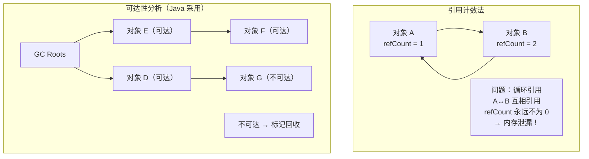
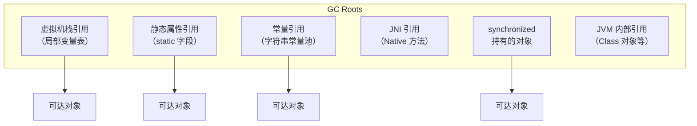
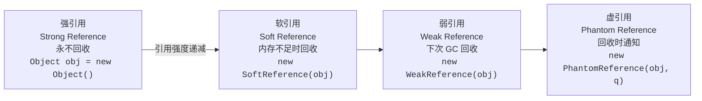
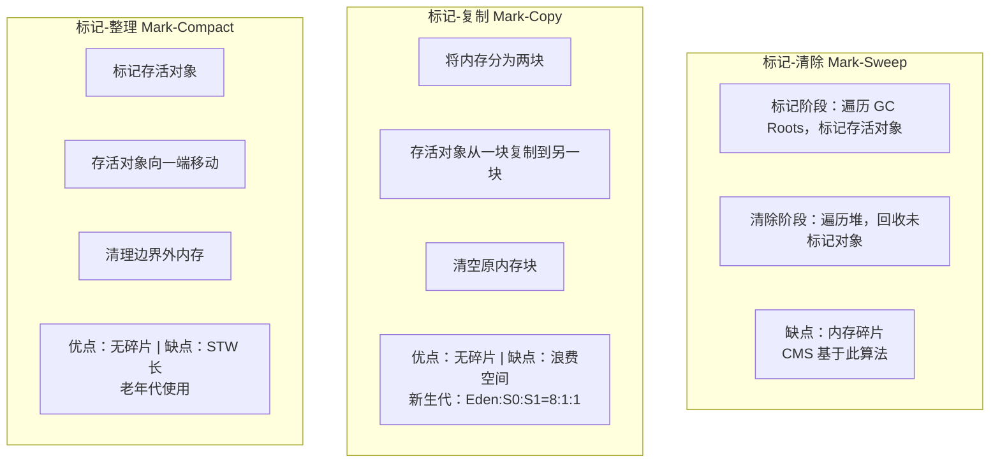
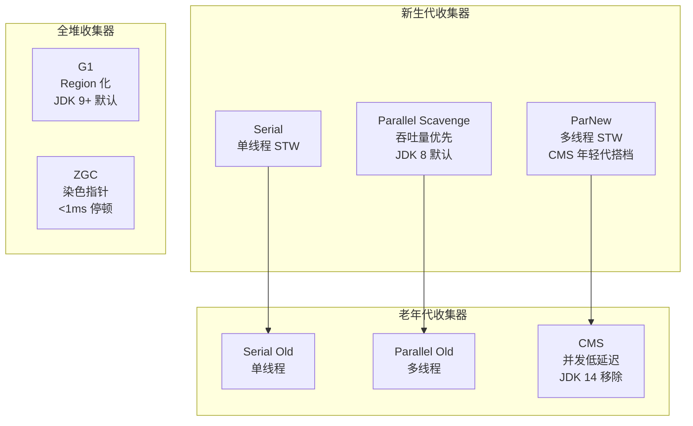
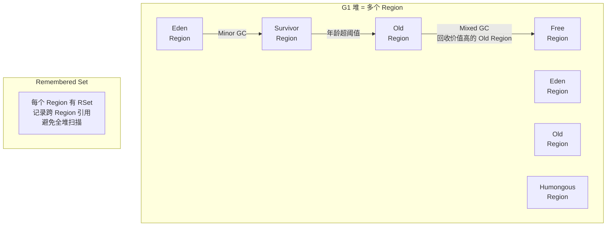
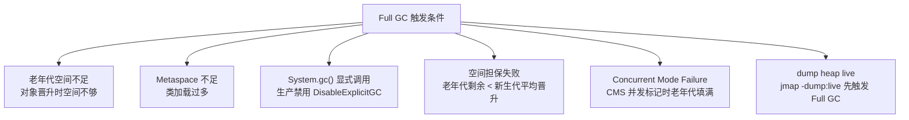

# 02 - GC 算法与调优

## 1. 对象存活判断

---

## 2. GC Roots 枚举

---

## 3. 四种引用

| 引用类型 | 回收时机 | get() 行为 | 典型场景 |
|----------|----------|-----------|----------|
| 强引用 | 永不回收 | 正常返回 | 99% 的对象 |
| 软引用 | 内存不足（即将 OOM） | GC 前返回对象 | 缓存（图片、页面） |
| 弱引用 | 下一次 GC | GC 后返回 null | WeakHashMap、ThreadLocal |
| 虚引用 | 对象回收时入 ReferenceQueue | 永远返回 null | 堆外内存（DirectByteBuffer） |

---

## 4. 垃圾收集算法对比

---

## 5. 经典 GC 收集器

| 收集器 | 算法 | 目标 | 适用场景 |
|--------|------|------|----------|
| Serial | 复制 | 单线程 | Client / 小堆 |
| Parallel | 复制 | 吞吐量 | 批处理 / 科学计算 |
| CMS | 标记-清除 | 低延迟 | JDK 8 Web 应用 |
| G1 | 区域化 | 可预测停顿 | JDK 9+ 通用 |
| ZGC | 染色指针 | 超低延迟 | TB 级堆 |

---

## 6. G1 原理

G1 GC 周期：
1. **Young GC** — 回收所有 Eden Region
2. **并发标记** — 与用户线程并发确定存活对象
3. **Mixed GC** — 回收部分 Old Region（按回收价值排序）
4. **Full GC** — Mixed GC 跟不上时触发（最差情况，单线程）

---

## 7. Full GC 触发条件

---

## 8. JVM 调优参数速查

| 参数 | 说明 | 示例值 |
|------|------|--------|
| `-Xms` / `-Xmx` | 堆初始/最大大小 | `-Xms4g -Xmx4g` |
| `-Xss` | 线程栈大小 | `-Xss256k` |
| `-XX:MetaspaceSize` | 元空间初始大小 | `256m` |
| `-XX:MaxMetaspaceSize` | 元空间最大大小 | `512m` |
| `-XX:+UseG1GC` | 使用 G1 收集器 | - |
| `-XX:MaxGCPauseMillis` | 期望最大停顿 | `200` |
| `-XX:+UseZGC` | 使用 ZGC | - |
| `-XX:+HeapDumpOnOutOfMemoryError` | OOM 自动 dump | - |
| `-XX:HeapDumpPath` | dump 文件路径 | `/data/logs/` |
| `-XX:+DisableExplicitGC` | 禁用显式 GC | - |

---

## 9. 面试要点

- 对象存活判断：引用计数 vs 可达性分析
- GC Roots 有哪些（至少说出 4 种）
- 四种引用及使用场景（强/软/弱/虚）
- 标记-清除/标记-复制/标记-整理各自优缺点和适用区域
- CMS vs G1 vs ZGC 的区别
- Full GC 触发条件（至少说出 3 种）
- G1 Region 概念和 Mixed GC