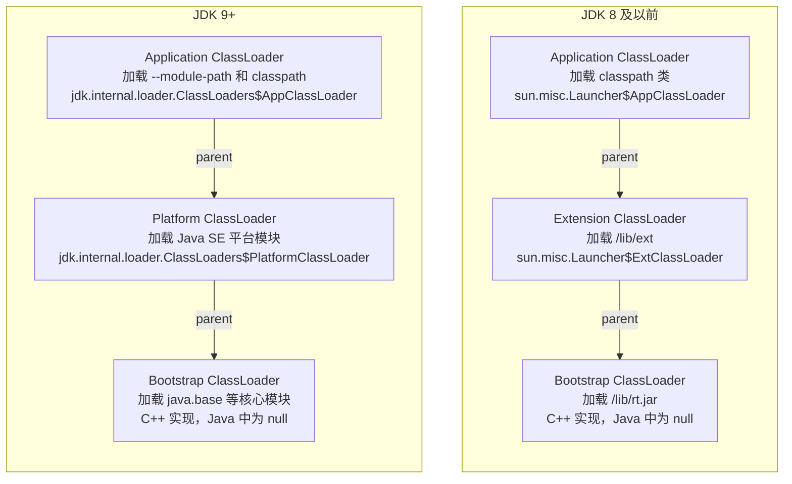
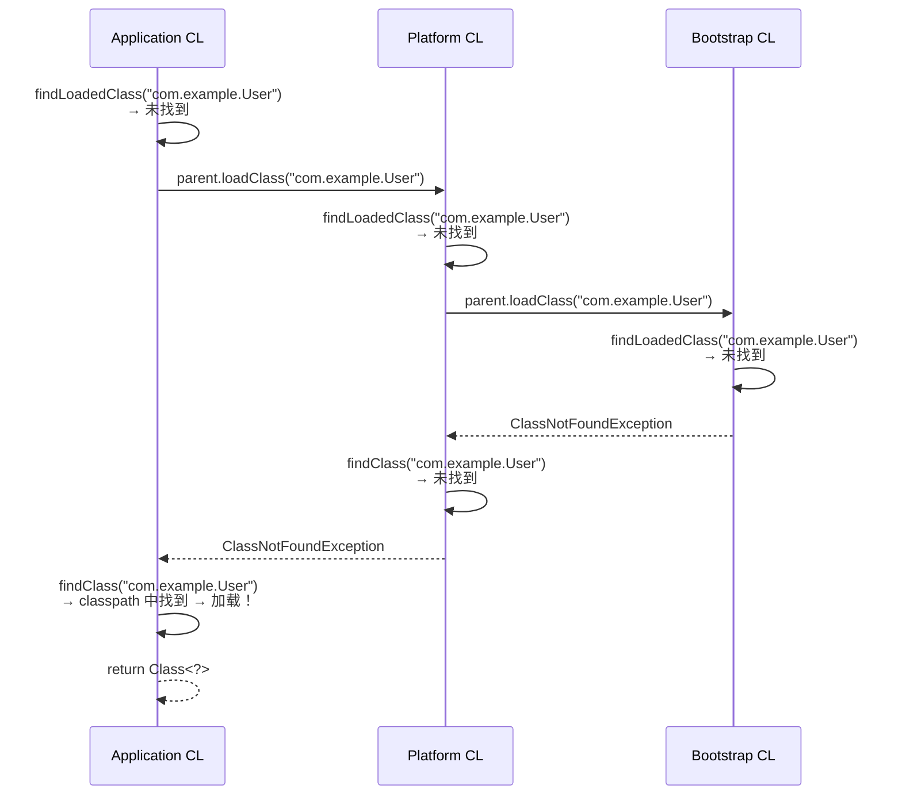
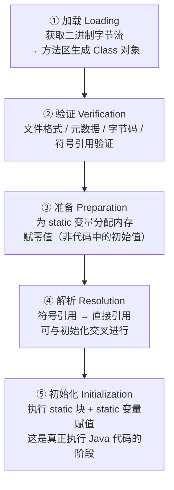
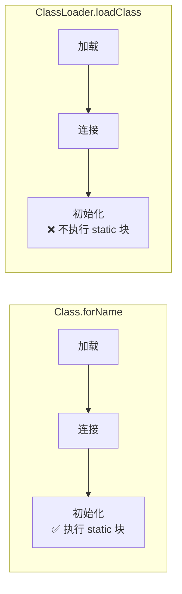
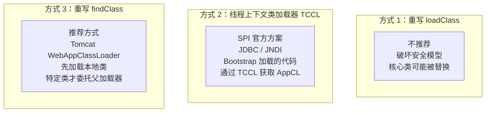
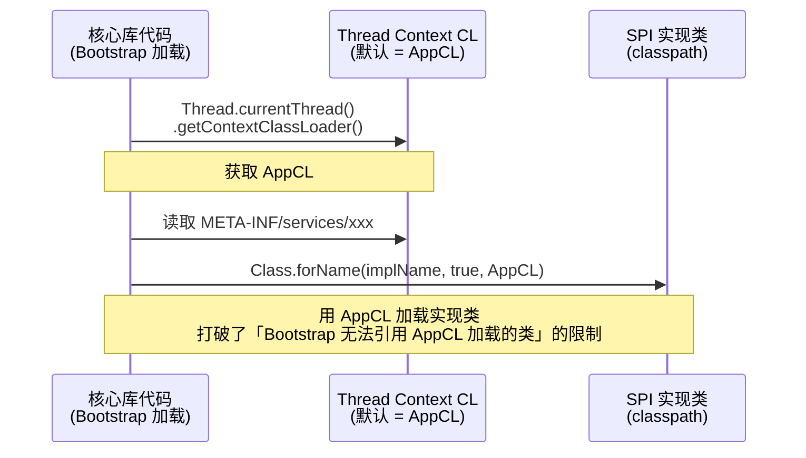

# 03 - 类加载机制

## 1. 类加载器三层架构



| 类加载器 | JDK 8 | JDK 9+ | 加载内容 |
|----------|-------|--------|----------|
| Bootstrap | 同 | 同 | 核心类库（C++ 实现，Java 端为 null） |
| Extension / Platform | ExtClassLoader | PlatformClassLoader | JDK 8: ext 目录 / JDK 9+: Java SE 模块 |
| Application | AppClassLoader | AppClassLoader | classpath / --module-path |

---

## 2. 双亲委派机制



**委托顺序**：Application → Platform → Bootstrap（自底向上）
**加载顺序**：Bootstrap → Platform → Application（自顶向下）

### loadClass 核心源码逻辑

```java
protected Class<?> loadClass(String name, boolean resolve) {
    synchronized (getClassLoadingLock(name)) {
        // ① 检查是否已经加载（全盘负责制）
        Class<?> c = findLoadedClass(name);
        if (c == null) {
            try {
                // ② 委托父加载器
                if (parent != null)
                    c = parent.loadClass(name, false);
                else
                    c = findBootstrapClassOrNull(name);
            } catch (ClassNotFoundException e) {
                // ③ 父加载器失败 → 自己加载
                c = findClass(name);
            }
        }
        if (resolve) resolveClass(c);
        return c;
    }
}
```

---

## 3. 类加载过程（5 阶段）



**触发初始化的 6 种主动引用**：
1. new / getstatic / putstatic / invokestatic 指令
2. 反射调用（Class.forName）
3. 初始化子类前先初始化父类
4. 虚拟机启动时 main 方法所在类
5. MethodHandle 解析结果
6. default 接口方法实现类初始化

---

## 4. Class.forName vs loadClass



| 对比维度 | Class.forName | ClassLoader.loadClass |
|----------|---------------|----------------------|
| 初始化 | **执行** static 块 | **不执行** static 块 |
| 类加载器 | 默认用调用者的类加载器 | 必须手动指定 |
| 典型场景 | JDBC 驱动注册 | Spring IOC 懒加载 |
| 底层调用 | forName0(className, true, classLoader) | loadClass(name, false) |

---

## 5. 打破双亲委派



### SPI 打破双亲委派流程



### Tomcat WebAppClassLoader 加载顺序

```
① checkLoaded      → 已加载？返回
② isSystemClass    → J2SE 核心类？→ 委托 Bootstrap（不能打破）
③ WEB-INF/classes  → 自己加载
④ WEB-INF/lib      → 自己加载
⑤ 都没找到          → 委托父加载器 (Common → App → Bootstrap)
```

---

## 6. 面试要点

- 三层类加载器 + 双亲委派源码流程（loadClass 三步走）
- 为什么要双亲委派（安全性 + 避免重复加载）
- Class.forName vs loadClass 区别（初始化与否）
- SPI 如何打破双亲委派（线程上下文类加载器）
- Tomcat 类加载器打破双亲委派的原因（应用隔离）
- 类加载过程 5 阶段 + 触发初始化的 6 种主动引用