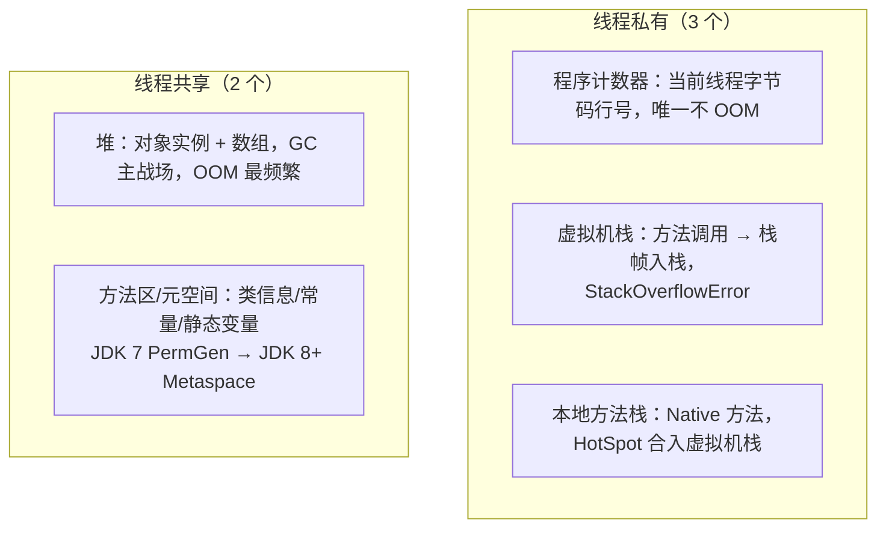
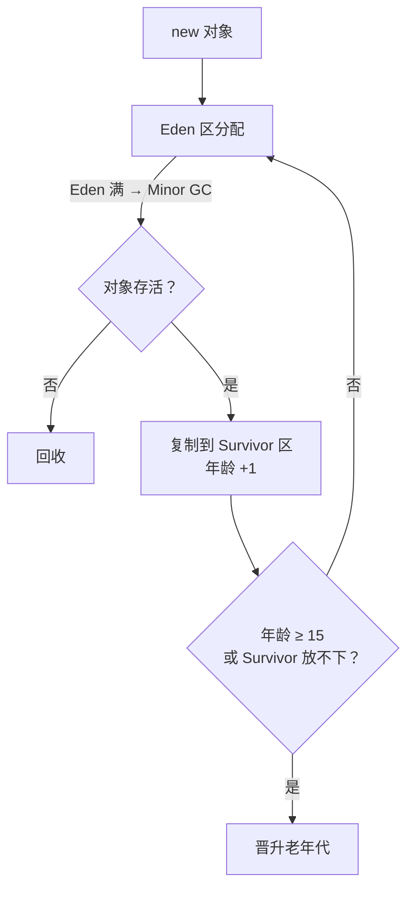
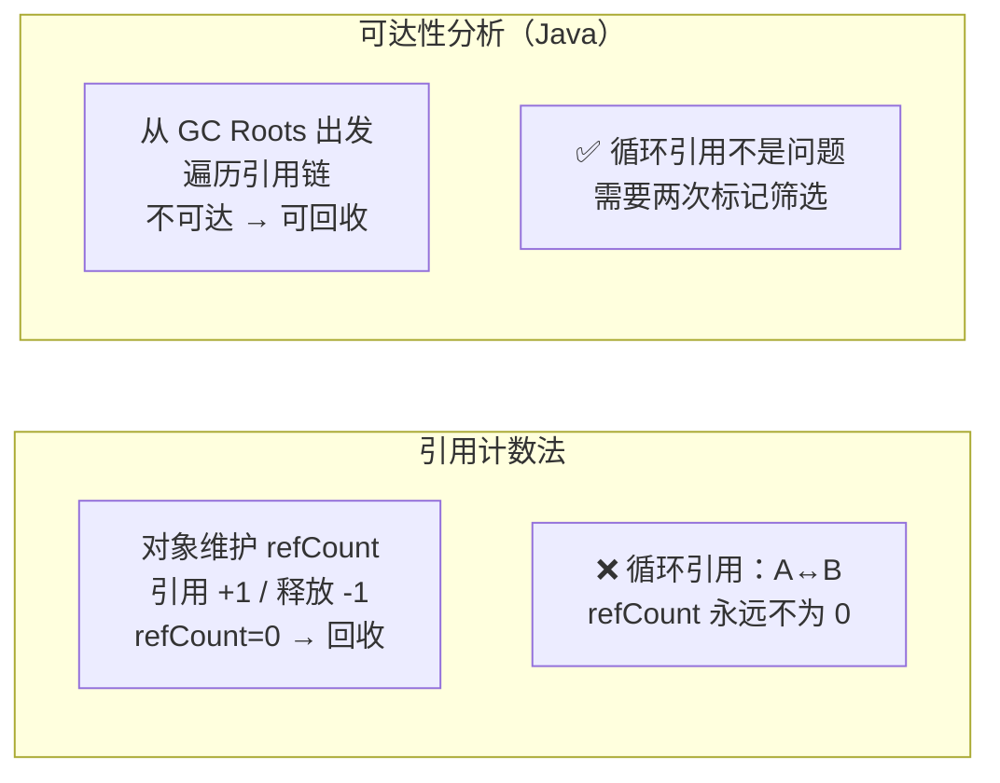
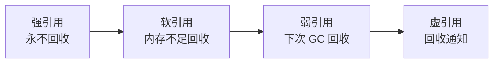
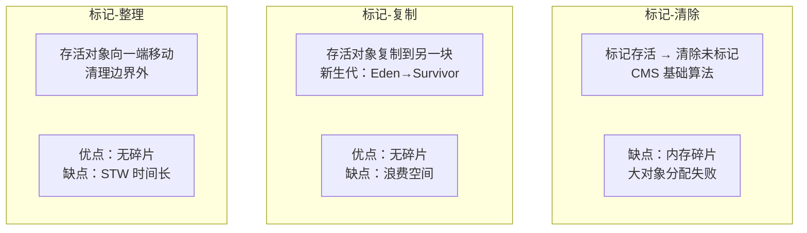
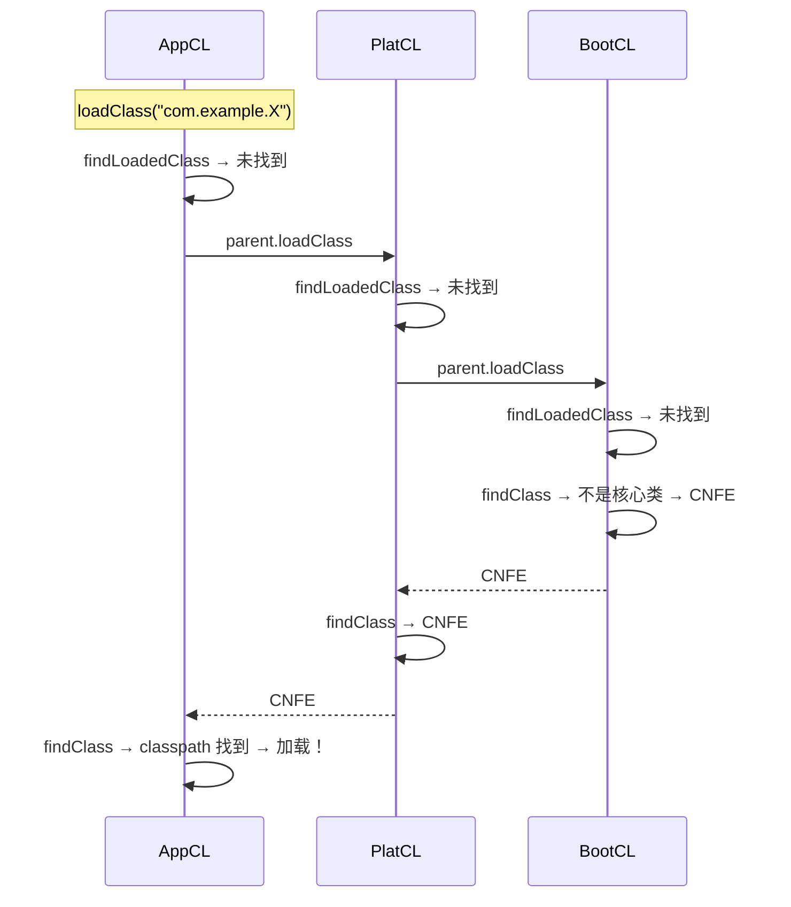

# 04 - 面试高频问题

## Q1：JVM 内存模型（运行时数据区）包含哪些部分？

**答案：** 5 大块，分线程私有和线程共享。



**面试加分项：**
- 堆分代：新生代（Eden:S0:S1=8:1:1）+ 老年代（2/3 堆）
- JDK 8+ 变化：PermGen 移除 → Metaspace（本地内存），字符串常量池移入堆

---

## Q2：堆内存分代结构是怎样的？对象如何流转？

**答案：**



- 大对象（超过 PretenureSizeThreshold）→ 直接老年代
- 动态年龄判断：Survivor 中相同年龄对象总大小 > Survivor 一半 → 该年龄及以上都晋升

---

## Q3：Minor GC / Major GC / Full GC 区别？

| GC 类型 | 回收区域 | 触发条件 | STW？ |
|---------|---------|----------|-------|
| Minor GC（Young GC） | 仅新生代 | Eden 满 | ✅ 是（短暂） |
| Major GC（Old GC） | 仅老年代 | 老年代空间不足 | ✅ 是（CMS 并发时有例外） |
| Full GC | 整个堆 + 方法区 | 多种条件触发 | ✅ 是（较长） |

**注意**：业界术语不统一，面试时先确认面试官的定义。通常 Full GC = 回收整个 Java 堆。

---

## Q4：对象存活判断有哪两种方式？Java 用哪种？

**答案：**



**标记流程**：① 从 GC Roots 遍历 → 标记可达对象 → ② 不可达对象筛选是否需要 finalize() → ③ finalize() 自救失败 → 彻底回收（JDK 9+ finalize() 废弃）

---

## Q5：GC Roots 有哪些？

**答案（至少 4 种）：**

1. 虚拟机栈（局部变量表）引用的对象 ← 最常见
2. 静态属性（static 字段）引用的对象
3. 常量引用的对象（字符串常量池）
4. JNI（Native 方法）引用的对象
5. JVM 内部引用（Class 对象、常驻异常）
6. synchronized 持有的对象

---

## Q6：四种引用类型及使用场景？



| 引用 | 回收时机 | 使用场景 |
|------|----------|----------|
| 强引用 | 永不回收 | 99% 对象 |
| 软引用 | OOM 前 | 缓存（MyBatis、图片） |
| 弱引用 | 下次 GC | WeakHashMap、ThreadLocal |
| 虚引用 | 对象回收时通知 | DirectByteBuffer 堆外内存 |

---

## Q7：垃圾收集算法有哪些？各有什么优缺点？



---

## Q8：CMS 为什么被废弃？G1 有什么优势？

**CMS 三大问题：**
1. **内存碎片** — 标记-清除算法导致碎片，碎片严重时退化为 Serial Old（单线程）
2. **Concurrent Mode Failure** — 并发标记时老年代被填满，触发 Full GC
3. **浮动垃圾** — 并发清除期间新产生的垃圾只能下次回收

**G1 优势：**
- Region 化：堆等分为多个 Region，角色动态分配（Eden/Survivor/Old/Humongous）
- 可预测停顿：`-XX:MaxGCPauseMillis` 设定目标
- Mixed GC：选择性回收垃圾多的 Old Region
- 无物理分代碎片问题

---

## Q9：双亲委派机制的原理？为什么要这样设计？

**答案：**



**设计目的：**
1. **安全性** — 防止核心 API 被篡改（用户自定义 String 不会生效）
2. **避免重复加载** — 全盘负责制，一个类只被加载一次

---

## Q10：如何打破双亲委派？Tomcat 为什么这么做？

**三种打破方式：**

| 方式 | 实现 | 适用场景 |
|------|------|----------|
| 重写 loadClass | 先自己加载，失败再委托 | ❌ 不推荐 |
| 线程上下文类加载器 TCCL | Thread.getContextClassLoader() | SPI（JDBC / JNDI） |
| 重写 findClass | 部分委托，本地优先 | Tomcat WebAppClassLoader |

**Tomcat 为什么要打破？**
- **应用隔离**：不同 Web 应用可能依赖同一个库的不同版本
- 传统双亲委派 → 父加载器加载的版本对所有子加载器可见 → 版本冲突
- Tomcat 的 WebAppClassLoader → 先加载 WEB-INF 下的本地版本 → 实现隔离

---

## Q11：Class.forName vs ClassLoader.loadClass 区别？

- `Class.forName`：加载 + 连接 + **初始化**（执行 static 块）— JDBC 驱动注册
- `ClassLoader.loadClass`：加载 + 连接 + **不初始化** — Spring IOC 懒加载

---

## Q12：OOM 有哪些类型？怎么排查？

| OOM 类型 | 原因 |
|----------|------|
| Java heap space | 堆满了 |
| GC overhead limit exceeded | GC 耗时 > 98% 但回收 < 2% |
| Metaspace | 元空间满了（类加载过多） |
| unable to create native thread | 线程数超 OS 限制 |
| Direct buffer memory | 堆外内存溢出 |

**排查四步走：**
1. 配置 `-XX:+HeapDumpOnOutOfMemoryError` 自动 dump
2. `jmap -dump:live,file=heap.hprof <pid>` 手动 dump
3. MAT 分析：Leak Suspects → Dominator Tree → Path to GC Roots
4. 定位代码 → 修复（ThreadLocal remove / 集合清理 / 连接关闭）

---

## Q13：JVM 调优常用参数和诊断工具？

**常用参数：**
```
-Xms4g -Xmx4g -Xss256k
-XX:MetaspaceSize=256m -XX:MaxMetaspaceSize=512m
-XX:+UseG1GC -XX:MaxGCPauseMillis=200
-XX:+HeapDumpOnOutOfMemoryError
-XX:HeapDumpPath=/data/logs/dump/
```

**诊断工具：**
| 工具 | 用途 |
|------|------|
| jps | 查看 Java 进程 PID |
| jstat -gcutil | 实时 GC 监控 |
| jstack | 线程堆栈 / 死锁检测 |
| jmap -histo:live | 存活对象统计 |
| jmap -dump | 导出堆 dump |
| MAT | 堆 dump 分析 |
| Arthas | 在线诊断（watch / trace / thread） |