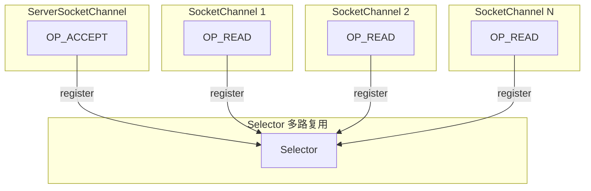
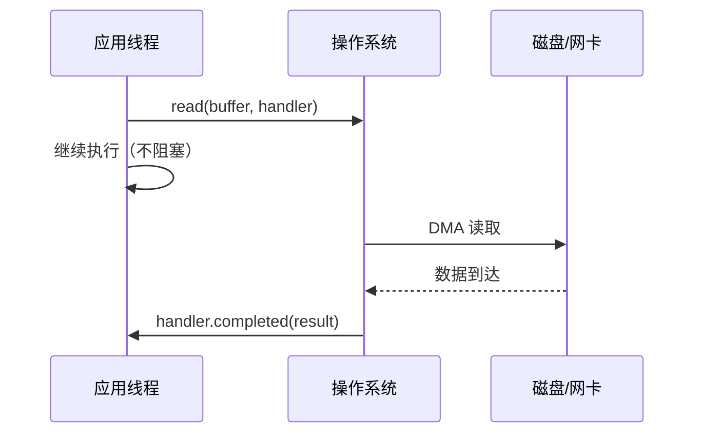
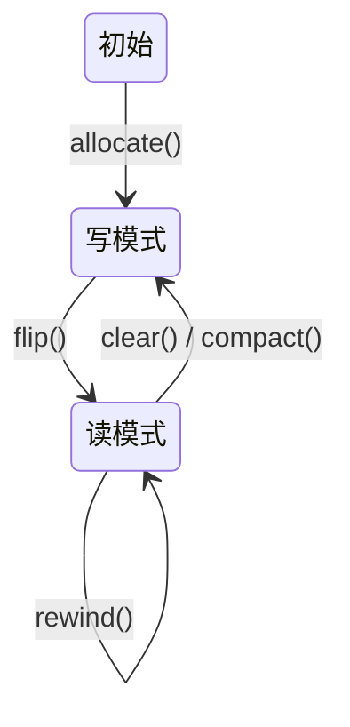
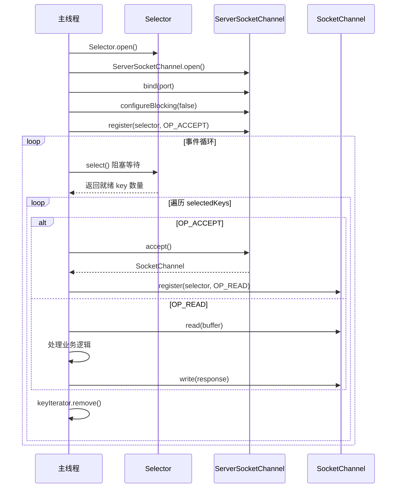
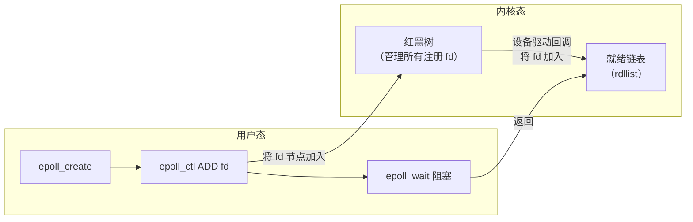

# 01 - NIO 核心原理：Buffer / Channel / Selector

## 1. BIO → NIO → AIO 演进

### 1.1 BIO（Blocking IO）

```
┌──────────┐    accept() 阻塞    ┌──────────┐
│  Server  │ ◄────────────────── │  Client  │
└──────────┘                     └──────────┘
     │ 新连接到达
     ▼
┌──────────┐    read() 阻塞    ┌──────────┐
│  Thread  │ ◄──────────────── │  Client  │
└──────────┘                   └──────────┘
```

- 一个连接 = 一个线程
- accept / read / write 全部阻塞
- C10K 场景下线程爆炸

### 1.2 NIO（Non-blocking IO）



- 单线程管理 N 个连接（Selector 多路复用）
- Channel 非阻塞模式
- 只处理就绪的 Channel

### 1.3 AIO（Asynchronous IO）



## 2. NIO 三大核心组件

### 2.1 Buffer — 数据容器



**ByteBuffer 核心属性：**

| 属性 | 含义 |
|------|------|
| capacity | 总容量（不变） |
| position | 当前读写位置 |
| limit | 可读/写边界 |

**核心方法执行效果：**

```
初始状态（新建 8 字节 buffer）：
  [  _  _  _  _  _  _  _  _  ]
  pos=0  lim=8  cap=8

写入 5 字节 "HELLO"：
  [ H  E  L  L  O  _  _  _  ]
  pos=5  lim=8  cap=8

flip() 切换为读模式：
  [ H  E  L  L  O  _  _  _  ]
  pos=0  lim=5  cap=8

clear() 切换回写模式（不清理数据）：
  [ H  E  L  L  O  _  _  _  ]
  pos=0  lim=8  cap=8

compact() 压缩（保留未读数据到头部）：
  假设只读了 2 字节，还有 "LLO" 未读：
  [ L  L  O  L  O  _  _  _  ]
  pos=3  lim=8  cap=8
```

### 2.2 Channel — 双向管道

| 实现类 | 作用 |
|--------|------|
| FileChannel | 文件读写（transferTo/transferFrom 零拷贝） |
| DatagramChannel | UDP 通信 |
| SocketChannel | TCP 客户端 |
| ServerSocketChannel | TCP 服务端（监听 + accept） |

与传统 IO Stream 对比：
- Stream 单向（InputStream / OutputStream）
- Channel 双向（read + write）
- Channel 必须通过 Buffer 读写

### 2.3 Selector — 多路复用器



## 3. SelectionKey 四大事件

| 事件 | 值 | 触发条件 |
|------|-----|----------|
| OP_ACCEPT | 1 << 4 (16) | 有新连接可以 accept |
| OP_CONNECT | 1 << 3 (8) | 连接已建立 |
| OP_READ | 1 << 0 (1) | 通道有数据可读 |
| OP_WRITE | 1 << 2 (4) | 通道可写入数据 |

## 4. 底层多路复用系统调用

```mermaid
flowchart TD
    subgraph "Java NIO Selector"
        S[Selector.open()]
    end

    subgraph "Linux"
        EP[EPollSelectorProvider<br/>epoll]
    end

    subgraph "MacOS"
        KQ[KQueueSelectorProvider<br/>kqueue]
    end

    subgraph "Windows"
        WS[WindowsSelectorProvider<br/>select]
    end

    S --> EP
    S --> KQ
    S --> WS
```

### select / poll / epoll 对比

| 系统调用 | fd 存储 | 获取就绪事件 | 时间复杂度 | fd 上限 |
|----------|---------|-------------|------------|---------|
| select | 数组（bitmap） | 遍历所有 fd | O(n) | 1024 |
| poll | 链表 | 遍历所有 fd | O(n) | 无上限 |
| epoll | 红黑树 + 就绪链表 | 直接取就绪链表 | O(1) | 无上限 |

### epoll 工作原理



1. **epoll_create**：创建 eventpoll 对象（红黑树 + 就绪链表）
2. **epoll_ctl**：向红黑树添加/删除/修改 fd，并向内核设备驱动注册回调
3. **epoll_wait**：检查就绪链表是否为空，非空则返回，为空则阻塞
4. **事件触发**：设备驱动数据到达 → 回调 → fd 加入就绪链表 → 唤醒 epoll_wait

最关键的优势：**epoll_wait 直接返回就绪 fd 列表，不需要 O(n) 遍历所有 fd**。

## 5. NIO 编程关键点

- **select() 后必须 remove key**：Selector 不会自动移除 selectedKeys 中的 key，必须手动 iterator.remove()
- **OP_WRITE 注意**：大部分时间通道可写，避免一直注册 OP_WRITE 导致 CPU 空转；仅在需要写时注册
- **ByteBuffer 非线程安全**：多线程访问需同步
- **DirectBuffer vs HeapBuffer**：DirectByteBuffer 堆外内存，减少一次拷贝但分配/回收成本高