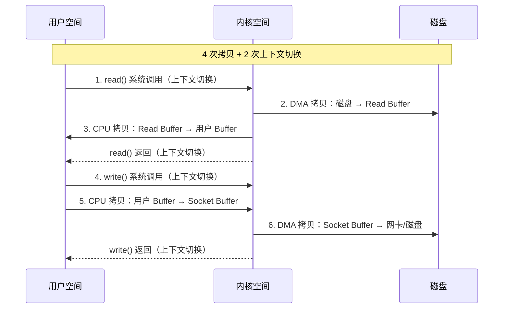
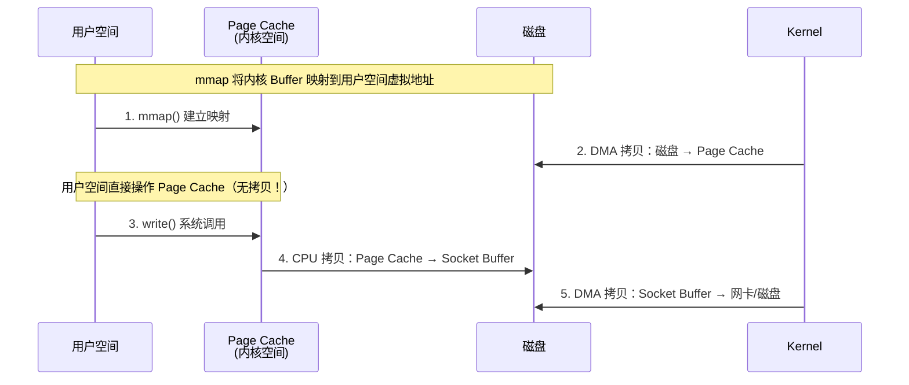
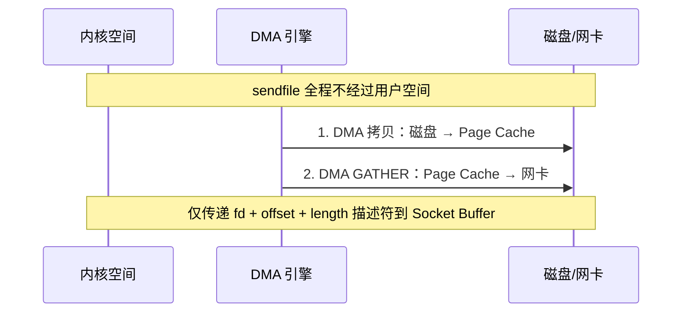
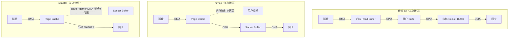

# 02 - 零拷贝详解：mmap / sendfile

## 1. 传统 IO 数据传输路径

### 1.1 传统 read() + write() — 4 次拷贝



```
┌─────────┐  ┌──────────────┐  ┌──────────────┐  ┌─────────┐
│  磁盘    │  │  Read Buffer  │  │  用户 Buffer  │  │  Socket  │
│         │→→│  (内核空间)    │→→│  (用户空间)   │→→│  Buffer  │
│         │  │               │  │               │  │ (内核)   │
└─────────┘  └──────────────┘  └──────────────┘  └─────────┘
   DMA ↑         CPU ↑             CPU ↑             DMA ↑
   拷贝 1         拷贝 2            拷贝 3             拷贝 4
```

**总计：4 次拷贝（2 CPU + 2 DMA）+ 4 次上下文切换（优化后为 2 次）**

## 2. mmap + write — 3 次拷贝



```
┌─────────┐  ┌──────────────┐  ┌──────────────┐  ┌─────────┐
│  磁盘    │  │  Page Cache   │  │  Socket       │  │  网卡/  │
│         │→→│  (用户空间     │→→│  Buffer       │→→│  磁盘   │
│         │  │   直接映射)    │  │  (内核空间)    │  │         │
└─────────┘  └──────────────┘  └──────────────┘  └─────────┘
   DMA ↑      节省 1 次拷贝        CPU ↑            DMA ↑
   拷贝 1                         拷贝 2           拷贝 3
```

**总计：3 次拷贝（1 CPU + 2 DMA）+ 4 次上下文切换（优化后为 2 次）**

**优点：** 省去了一次从内核缓冲区到用户缓冲区的 CPU 拷贝。
**缺点：** 仍需一次从 Page Cache 到 Socket Buffer 的 CPU 拷贝。

## 3. sendfile（Linux 2.4+ scatter-gather）— 2 次拷贝



```
┌─────────┐  ┌──────────────┐      ┌──────────────┐  ┌─────────┐
│  磁盘    │  │  Page Cache   │      │  Socket       │  │  网卡/  │
│         │→→│  (内核空间)    │─ ─ → │  Buffer       │→→│  磁盘   │
│         │  │               │ 描述符 │  (仅存描述符)  │  │         │
└─────────┘  └──────────────┘      └──────────────┘  └─────────┘
   DMA ↑                                 DMA GATHER ↑
   拷贝 1                                  拷贝 2
```

**总计：2 次拷贝（0 CPU + 2 DMA）+ 2 次上下文切换**

**关键机制：** scatter-gather DMA
- Page Cache 中的数据不需要拷贝到 Socket Buffer
- 仅将「文件描述符 + 偏移量 + 长度」传递给 Socket Buffer
- DMA 引擎根据描述符直接从 Page Cache 聚集数据发送到网卡

## 4. 三种方案对比 Mermaid 图



## 5. Java 零拷贝 API

### 5.1 FileChannel.map() — mmap

```java
try (RandomAccessFile file = new RandomAccessFile("data.txt", "r");
     FileChannel channel = file.getChannel()) {

    MappedByteBuffer buffer = channel.map(
            FileChannel.MapMode.READ_ONLY, 0, channel.size());
    // 直接操作 buffer，数据在 Page Cache 中
    byte[] data = new byte[1024];
    buffer.get(data);
}
```

**注意：**
- MappedByteBuffer 不占用 JVM 堆内存（Direct Memory）
- 需要 Sun 的 Cleaner 显式释放（或等 GC）
- 大文件建议分块映射，避免一次映射整个文件

### 5.2 FileChannel.transferTo() — sendfile

```java
try (FileChannel source = FileChannel.open(sourcePath, StandardOpenOption.READ);
     FileChannel target = FileChannel.open(targetPath,
             StandardOpenOption.WRITE, StandardOpenOption.CREATE)) {

    long position = 0;
    long size = source.size();
    while (position < size) {
        position += source.transferTo(position, size - position, target);
    }
}
```

**注意：**
- Linux 2.6.33+ 支持 FileChannel → FileChannel
- 单次最大 2GB（Integer.MAX_VALUE），大文件需循环
- Windows 单次最大 8MB

## 6. 实际应用场景

### 6.1 Kafka

```
Producer → Broker 磁盘 → Consumer
              ↑
         mmap 写入日志段
              ↑
    transferTo 发送给 Consumer（零拷贝）
```

- 日志段写入：mmap（顺序写性能极高）
- 消费消息：transferTo（sendfile 从 Page Cache 直接到网卡）
- 结果：CPU 几乎不参与数据传输，百万 QPS 级别

### 6.2 Netty

```java
// DefaultFileRegion 封装了 FileChannel.transferTo
DefaultFileRegion region = new DefaultFileRegion(fileChannel, 0, fileLength);
ctx.write(region);
// → 底层调用 FileChannel.transferTo → sendfile64
```

Netty 中的「零拷贝」还包括：
- **CompositeByteBuf**：合并多个 ByteBuf，只传引用不复制
- **Unpooled.wrappedBuffer()**：包装字节数组，不复制
- **ByteBuf.slice()**：切分共享同一块内存

## 7. 零拷贝限制

| 限制 | 说明 |
|------|------|
| 数据不可修改 | sendfile 不经过用户空间，无法在传输过程中修改数据 |
| 不支持加密/压缩 | 需要用户空间 CPU 参与的场景不可用 |
| mmap 内存释放 | MappedByteBuffer 手动管理，可能 OOM |
| transferTo 大小限制 | Windows 8MB，Linux 2GB，需分次调用 |

## 8. 总结

| 方案 | CPU 拷贝 | DMA 拷贝 | 上下文切换 | 总拷贝 |
|------|---------|---------|-----------|--------|
| 传统 read/write | 2 | 2 | 2 | 4 |
| mmap + write | 1 | 2 | 2 | 3 |
| sendfile | 0 | 2 | 2 | 2 |

**选择建议：**
- 需要修改数据 → 传统 IO（或 mmap）
- 文件传输（不修改）→ transferTo（sendfile）
- 小文件随机访问 → mmap