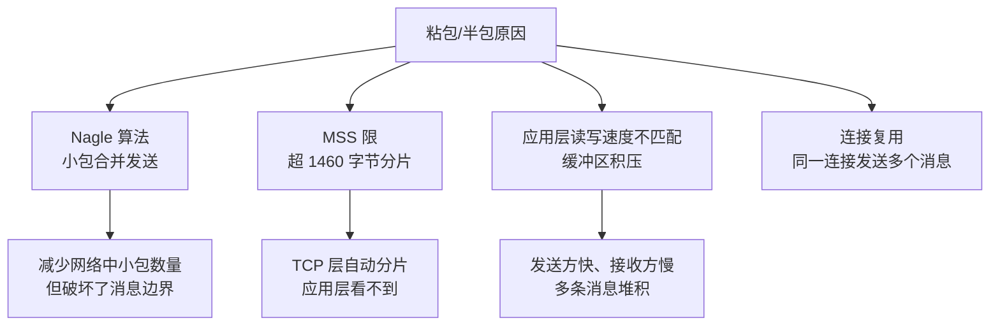
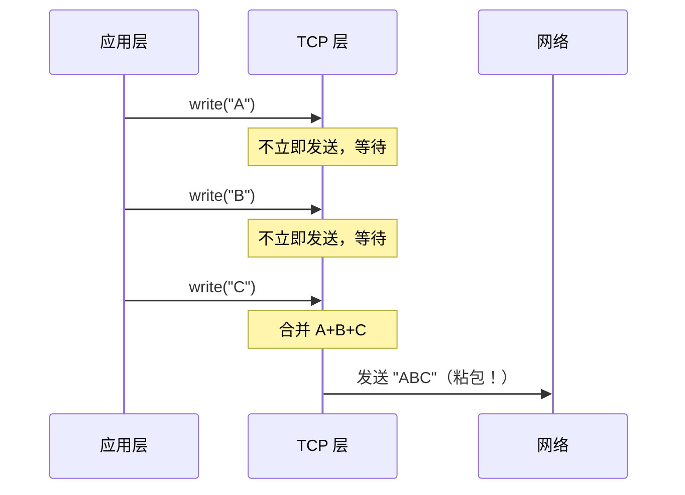
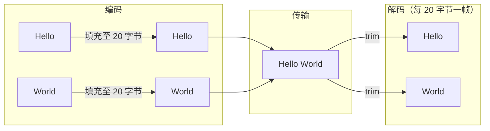
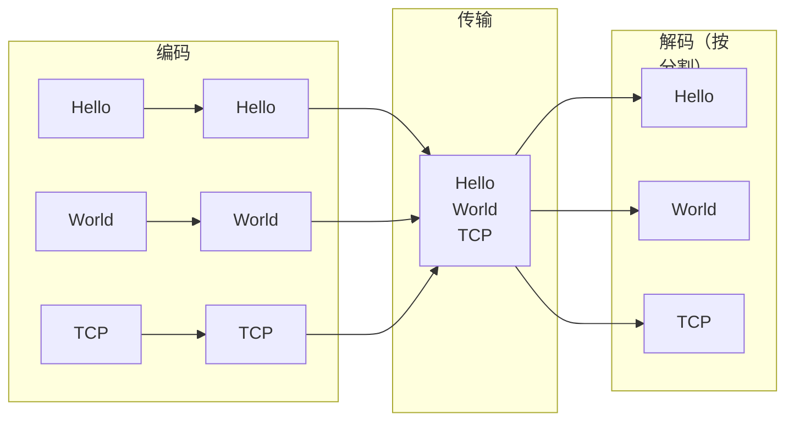
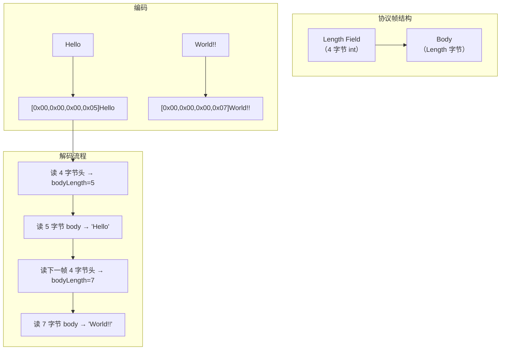
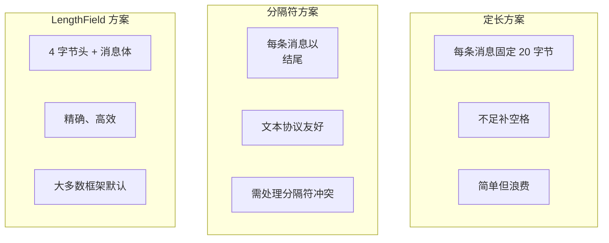

# 03 - 粘包半包：原因 + 三种解决方案

## 1. TCP 是流式协议

TCP 是面向流的协议（Stream Protocol），消息之间没有明确的边界。

```
应用层视角：  消息1: "Hello"    消息2: "World"    消息3: "TCP"

TCP 层视角：  [H][e][l][l][o][W][o][r][l][d][T][C][P]  → 一个字节流

接收方可能收到：
  情况 1（正常）：  "Hello"    |    "World"    |    "TCP"
  情况 2（粘包）：  "HelloWorldTCP"  ← 三条消息粘在一起
  情况 3（半包）：  "Hel" | "loWorldTC" | "P"   ← 消息被拆得支离破碎
```

## 2. 粘包/半包产生原因



### 2.1 Nagle 算法



- 默认开启（TCP_NODELAY=false）
- 可通过 `socket.setTcpNoDelay(true)` 关闭

### 2.2 MSS 分段

- MSS（Maximum Segment Size）通常为 1460 字节（MTU 1500 - IP 头 20 - TCP 头 20）
- 发送 3000 字节 → TCP 拆分为 1460 + 1460 + 80 三个包
- 接收方可能分多次收到

### 2.3 应用层不匹配

```
发送方（快）                    接收方（慢）
write("A")                             ↓
write("B")                             read() → 可能一次收到 "ABC"
write("C")                             ↑
                         发送缓冲区内 "ABC" 堆积
```

## 3. 三大解决方案

### 3.1 方案 1：定长解码（FixedLengthFrameDecoder）



**实现：**

```java
int FIXED_LENGTH = 20;

// 编码：固定长度帧
byte[] frame = new byte[FIXED_LENGTH];
byte[] raw = message.getBytes(UTF_8);
System.arraycopy(raw, 0, frame, 0, Math.min(raw.length, FIXED_LENGTH));
// 写入 frame...

// 解码：按固定长度切分
ByteBuffer buffer = ...;
while (buffer.remaining() >= FIXED_LENGTH) {
    byte[] frame = new byte[FIXED_LENGTH];
    buffer.get(frame);
    String message = new String(frame, UTF_8).trim();
}
```

| 优点 | 缺点 |
|------|------|
| 实现极其简单 | 浪费带宽（大量填充字节） |
| 解码效率高，无状态 | 消息长度不灵活 |
| 适合固定长度指令协议 | 长消息需要截断 |

### 3.2 方案 2：分隔符解码（DelimiterBasedFrameDecoder）



**实现：**

```java
String DELIMITER = "\n";

// 编码：每条消息后附加分隔符
String encoded = message + DELIMITER;

// 解码：按分隔符切分
String[] frames = encodedStr.split(DELIMITER, -1);
// 处理最后一个空帧
```

**分隔符选择：**
- `\n`（LF）：简单文本协议（Redis）
- `\r\n`（CRLF）：HTTP 头
- 自定义分隔符：`|END|` 等

| 优点 | 缺点 |
|------|------|
| 可读性好，调试方便 | 消息体不能包含分隔符 |
| 适合文本协议 | 需转义处理 |
| 可变长度消息 | 解码需遍历扫描分隔符 |

### 3.3 方案 3：LengthField 解码（LengthFieldBasedFrameDecoder）



**实现：**

```java
// 编码：4 字节长度头 + 消息体
ByteBuffer buffer = ByteBuffer.allocate(1024);
byte[] body = message.getBytes(UTF_8);
buffer.putInt(body.length);   // 4 字节头：消息体长度
buffer.put(body);             // 消息体

// 解码：先读 4 字节长度头，再读对应字节的消息体
while (buffer.remaining() >= 4) {
    int bodyLength = buffer.getInt();     // 读长度头
    if (buffer.remaining() < bodyLength) {
        break;  // 半包：数据不足以构成完整帧
    }
    byte[] body = new byte[bodyLength];
    buffer.get(body);                     // 读消息体
    String message = new String(body, UTF_8);
}
```

**Netty LengthFieldBasedFrameDecoder 参数：**

| 参数 | 含义 | 示例值 |
|------|------|--------|
| lengthFieldOffset | 长度域起始偏移 | 0 |
| lengthFieldLength | 长度域占多少字节 | 4 |
| lengthAdjustment | 长度域值 + 调整 = body 长度 | 0 |
| initialBytesToStrip | 解码后跳过前几个字节 | 4（去掉长度头） |

| 优点 | 缺点 |
|------|------|
| 精确、高效、无歧义 | 需要预知消息结构 |
| 支持任意二进制数据 | 实现复杂度最高 |
| 绝大多数二进制协议首选 | 长度头损坏导致解析错乱 |

## 4. 三种方案对比



| 维度 | 定长 | 分隔符 | LengthField |
|------|------|--------|-------------|
| 实现复杂度 | ⭐ | ⭐⭐ | ⭐⭐⭐ |
| 带宽利用率 | ❌ 差 | ✅ 好 | ✅ 好 |
| 解码效率 | ✅ 最高 | ⚠️ 需扫描 | ✅ 高 |
| 二进制支持 | ✅ | ❌（需转义） | ✅ |
| 可变长度 | ❌ | ✅ | ✅ |
| 典型应用 | Modbus | Redis、HTTP 头 | Dubbo、gRPC、MQTT |