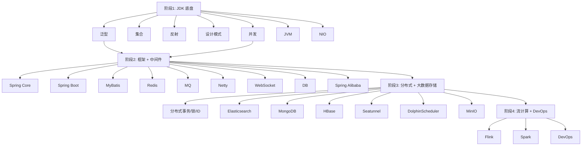

# custom-study — 学习路线总览

## 项目结构

```
custom-study/
├── study-base/          # 阶段1 — JDK 源码底盘（7 模块）
│   ├── generics         # 泛型原理 + 类型擦除 + PECS
│   ├── collection       # HashMap 源码 + 调优 + 死循环
│   ├── design_patterns  # 单例/工厂/策略/模板/代理
│   ├── reflect          # 反射 API + 注解 + 动态代理
│   ├── concurrent       # CAS/AQS/synchronized/volatile/线程池
│   ├── jvm              # 内存模型 + 类加载 + GC 算法
│   └── nio              # Selector/Buffer/Channel + 零拷贝
│
└── study-tuling/        # 阶段2-4 — 框架 + 中间件 + 大数据（17 模块）
    ├── spring/core      # IoC + AOP + Bean 生命周期 + 循环依赖
    ├── spring/boot      # 自动配置 + Starter + @Conditional
    ├── spring/alibaba   # Nacos + Sentinel + Seata + Feign
    ├── mybatis          # 核心流程 + Plus 分页 + 动态 SQL
    ├── redis            # 数据结构底层 + 持久化 + 集群 + 缓存穿透
    ├── mq               # RocketMQ(事务/顺序) + Kafka(ISR/幂等)
    ├── netty            # EventLoop + Pipeline + 零拷贝 + 粘包
    ├── websocket        # 协议帧 + 心跳 + 断线重连
    ├── db               # B+Tree + SQL 优化 + 分库分表 + PG/Oracle
    ├── elasticsearch    # 倒排索引 + DSL + 聚合 + 分片
    ├── mongodb          # BSON + Pipeline + 副本集 + 分片
    ├── distributed      # 事务/锁/ID + CAP/BASE
    ├── hbase            # RowKey + Region Split + LSM-Tree
    ├── seatunnel        # 插件模型 + 多源采集 + 转换链
    ├── dolphinscheduler # DAG 编排 + Cron + 容错重试
    ├── minio            # S3 API + EC 纠删码 + Policy
    ├── flink            # 窗口/水位线 + Checkpoint + State
    ├── spark            # RDD + DAG/Shuffle + Catalyst
    └── devops           # Maven/Git/Docker/K8s/Linux
```

## 学习路线（推荐顺序）



## 每个模块的标准结构

| 文件类型 | 命名规则 | 作用 |
|----------|---------|------|
| Demo | `XxxDemo.java` | 手写代码证明原理，含 main 可直接运行 |
| 源码分析 | `XxxSourceAnalysis.java` | 深入核心数据结构和关键路径 |
| 调优 | `XxxTuning.java` | 参数调优 + 性能对比 |
| 面试 | `interview/Q01_Xxx.java` | 标准 5 问 + 代码实证 |
| 笔记 | `01-xxx.md` ~ `0N-xxx.md` | Markdown + Mermaid 图表 |

## 运行方式

```bash
# 1. 查看全项目总览
java study.StudyOverview

# 2. 交互式启动器
java study.StudyRunner
study> list
study> find HashMap
study> run base.collection.HashMapDemo

# 3. IDE 中直接右键运行任一 Demo 类的 main 方法
```

## 微服务实战

study 模块专注于原理 + 代码，生产级微服务框架见 `custom-services/` 下的四个服务：
- **custom-system** (8887)：用户/角色/权限
- **custom-resources** (8888)：文件标签/扫描任务
- **custom-logger** (8889)：日志查询/审计存储
- **custom-gateway**：认证 + 路由

服务间通信采用 Kafka 异步 + HTTP 同步最小化耦合方案，详见项目根目录 `问题设计.md`。