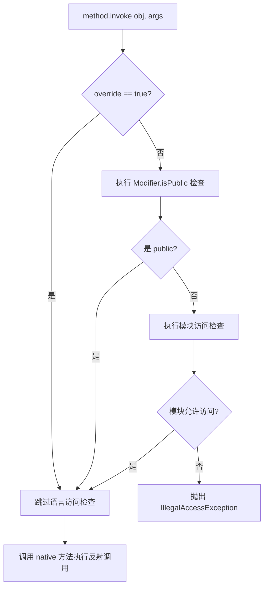

# 01 - 反射原理与 API

## 反射是什么

反射（Reflection）是 JVM 在**运行时**动态获取类信息、创建对象、调用方法、操作字段的机制。它是 Java 从静态语言向动态语言扩展的关键能力。

```mermaid
sequenceDiagram
    participant Code as 业务代码
    participant ClassLoader as ClassLoader
    participant JVM as JVM 方法区
    participant Meta as java.lang.reflect

    Code->>ClassLoader: Class.forName("java.util.ArrayList")
    ClassLoader->>JVM: loadClass("java.util.ArrayList")
    JVM-->>ClassLoader: ArrayList.class 字节码
    ClassLoader->>JVM: defineClass() 放入方法区
    ClassLoader-->>Code: Class&lt;ArrayList&gt; 对象

    Code->>Meta: clazz.getDeclaredConstructor()
    Meta->>JVM: 读取方法区中的构造器元数据
    Meta-->>Code: Constructor 对象

    Code->>Meta: constructor.setAccessible(true)
    Meta-->>Code: 关闭访问检查标记

    Code->>Meta: constructor.newInstance(args)
    Meta->>JVM: 在堆中分配内存并初始化对象
    JVM-->>Meta: 对象引用
    Meta-->>Code: 新实例
```

---

## 获取 Class 对象的三种方式

| 方式 | 代码 | 时机 | 适用场景 |
|------|------|------|---------|
| `Class.forName()` | `Class.forName("java.lang.String")` | 运行时动态加载 | 配置文件反射、SPI |
| `.class` | `String.class` | 编译期确定 | 方法参数传递 |
| `getClass()` | `obj.getClass()` | 已有实例 | 未知具体类型时 |

**三者返回同一个 Class 对象**：JVM 中每个类只有一个 Class 对象，三者获取的是同一个引用。

```java
Class<?> c1 = Class.forName("java.lang.String");
Class<String> c2 = String.class;
Class<? extends String> c3 = "hello".getClass();
// c1 == c2 == c3 → true
```

---

## 反射核心 API 速查

### 类结构信息

| API | 返回值 | 说明 |
|-----|--------|------|
| `getName()` | `String` | 全限定类名 |
| `getSimpleName()` | `String` | 简单类名 |
| `getSuperclass()` | `Class<?>` | 父类 |
| `getInterfaces()` | `Class<?>[]` | 实现的接口 |
| `getModifiers()` | `int` | 修饰符（`Modifier.isPublic()` 解析） |
| `isInterface()` | `boolean` | 是接口？ |
| `isArray()` | `boolean` | 是数组？ |

### 构造器相关

| API | 返回值 | 说明 |
|-----|--------|------|
| `getDeclaredConstructor(Class<?>...)` | `Constructor<T>` | 获取指定参数类型的构造器（含私有） |
| `getDeclaredConstructors()` | `Constructor<?>[]` | 获取所有构造器 |
| `constructor.setAccessible(true)` | — | 关闭访问检查（私有构造器调用前提） |
| `constructor.newInstance(Object...)` | `T` | 反射创建实例 |

### 字段相关

| API | 返回值 | 说明 |
|-----|--------|------|
| `getDeclaredField(String)` | `Field` | 获取指定名称字段（含私有） |
| `getDeclaredFields()` | `Field[]` | 获取所有字段 |
| `field.setAccessible(true)` | — | 关闭访问检查 |
| `field.get(Object)` | `Object` | 读取实例字段值 |
| `field.set(Object, Object)` | — | 修改实例字段值 |
| `field.set(Object, int)` | — | 修改 int 类型字段（避免装箱） |

### 方法相关

| API | 返回值 | 说明 |
|-----|--------|------|
| `getDeclaredMethod(String, Class<?>...)` | `Method` | 获取指定名称+参数类型的方法 |
| `getDeclaredMethods()` | `Method[]` | 获取所有方法 |
| `method.setAccessible(true)` | — | 关闭访问检查 |
| `method.invoke(Object, Object...)` | `Object` | 调用方法 |
| `method.getReturnType()` | `Class<?>` | 返回值类型 |
| `method.getParameterTypes()` | `Class<?>[]` | 参数类型列表 |

---

## `setAccessible(true)` 的底层原理

`setAccessible(true)` **不是修改方法的修饰符**，而是操作 `Field`/`Method`/`Constructor` 对象内部的一个 boolean 标记 `override`：



关键点：
- `override` 标记存储在 `AccessibleObject` 基类中（`Field`/`Method`/`Constructor` 的公共父类）
- 设置 `setAccessible(true)` 后，反射调用**不再检查**访问修饰符
- JDK 9+ 模块系统增加了额外检查，`addOpens` 可以打开模块访问

---

## 反射破坏单例

```java
// 任意单例都可以通过反射创建第二个实例
Constructor<Singleton> constructor = Singleton.class.getDeclaredConstructor();
constructor.setAccessible(true);
Singleton instance2 = constructor.newInstance(); // 单例被破坏！
```

### 防御方案 1：私有构造器中抛异常

```java
private static volatile boolean created = false;

private Singleton() {
    if (created) {
        throw new RuntimeException("单例已被创建");
    }
    created = true;
}
```

但此方案依然有**漏洞**：攻击者可以通过反射先修改 `created` 字段为 `false`，再调用构造器。

### 防御方案 2：枚举单例（推荐，JVM 级别保护）

```java
public enum Singleton {
    INSTANCE;
}
```

枚举的构造器在 JVM 层面受到保护，**`Constructor.newInstance()` 会直接抛出
`IllegalArgumentException: Cannot reflectively create enum objects`**。

---

## 反射的实际应用场景

| 场景 | 代表框架 | 原理 |
|------|---------|------|
| ORM 映射 | Hibernate, MyBatis | 反射读取注解 → 生成 SQL |
| DI 注入 | Spring | 反射扫描 `@Autowired` → set 注入 |
| AOP 代理 | Spring AOP | 反射创建 JDK/CGLIB 代理 |
| JSON 序列化 | Jackson, Gson | 反射读取/写入字段 |
| JDBC 驱动加载 | `Class.forName("com.mysql.cj.jdbc.Driver")` | 反射注册驱动 |

---

## 自测问题

1. `Class.forName()` 和 `ClassLoader.loadClass()` 有什么区别？
2. `getDeclaredMethod()` 和 `getMethod()` 的区别是什么？
3. 反射调用 setAccessible(true) 会改变方法的访问修饰符吗？
4. JDK 17 如何用 MethodHandle 替代反射？
5. 枚举为什么能天然防止反射破坏单例？