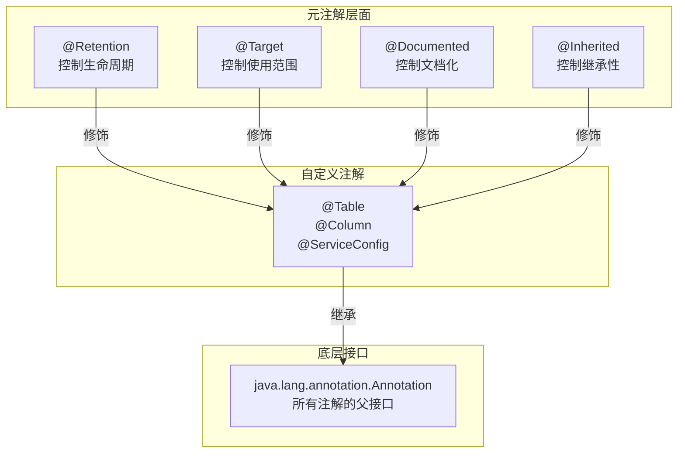
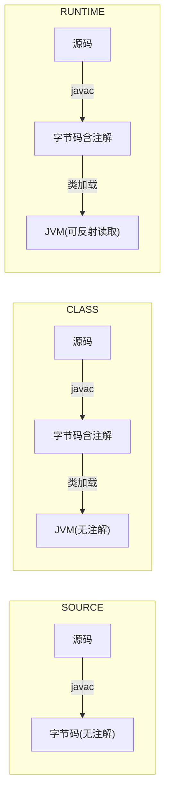

# 02 - 注解原理

## 注解的元模型

Java 注解本质上是**特殊的接口**，所有注解默认继承 `java.lang.annotation.Annotation` 接口。编译后，每个自定义注解都会被编译为 `interface` 并继承 `Annotation`。



---

## 四个元注解详解

### @Retention — 注解保留策略

| 值 | 存活到 | 典型用途 |
|----|--------|---------|
| `SOURCE` | 源码期，编译时丢弃 | `@Override`, `@SuppressWarnings` |
| `CLASS` | class 文件，JVM 不加载 | Lombok, ButterKnife 等编译期处理器 |
| `RUNTIME` | 运行时，反射可读取 | Spring, JPA, Jackson 等框架注解 |

```java
// SOURCE: 编译后消失 — 纯编译提示
@Override
public String toString() { ... }

// CLASS: 保留到 .class 文件，JVM 不加载 — 字节码增强
@Lombok.Data  // Lombok 在编译期读取并生成 getter/setter

// RUNTIME: 运行时反射读取 — 框架核心
@Table(name = "t_user")  // JPA 运行时反射读取
```



### @Target — 注解适用目标

| ElementType 值 | 可标注位置 |
|----------------|-----------|
| `TYPE` | 类、接口、枚举、注解 |
| `FIELD` | 字段（含枚举常量） |
| `METHOD` | 方法 |
| `PARAMETER` | 方法参数 |
| `CONSTRUCTOR` | 构造器 |
| `LOCAL_VARIABLE` | 局部变量 |
| `ANNOTATION_TYPE` | 注解类型 |
| `PACKAGE` | 包 |
| `TYPE_PARAMETER` | 类型参数 `class Box<@NonNull T>` |
| `TYPE_USE` | 任何类型使用处 |

### @Documented

标注后，注解会出现在 Javadoc 中。

### @Inherited

标注后，子类**继承**父类的该注解。仅对类继承有效，接口继承无效。

```java
@Inherited
@Retention(RUNTIME)
@interface MyAnnotation {}

@MyAnnotation
class Parent {}

class Child extends Parent {}
// Child.class.isAnnotationPresent(MyAnnotation.class) → true
```

---

## 注解的底层实现

```mermaid
classDiagram
    class Annotation {
        <<interface>>
        +annotationType()
        +equals()
        +hashCode()
        +toString()
    }

    class Table {
        <<annotation>>
        +name() String
    }

    class "$Proxy" {
        -Method method
        +invoke()
    }

    Annotation <|.. Table
    Annotation <|.. "$Proxy"

    note for "$Proxy" "运行时 JDK 动态生成<br/>实现了注解接口"
```

当通过反射 `clazz.getAnnotation(Table.class)` 获取注解时：

1. JVM 内部调用 `AnnotationParser` 解析 class 文件中的注解字节码
2. 通过 `Proxy.newProxyInstance()` 创建一个实现注解接口的动态代理对象
3. 注解的 `name = "t_user"` 被封装在代理对象的 `InvocationHandler` 中

**注解本质 = 接口 + 动态代理**。这也是为什么 `@Retention(RUNTIME)` 是反射读取的前提。

---

## 编译期注解处理器（APT）

对于 `@Retention(SOURCE)` 和 `@Retention(CLASS)` 注解，运行时无法读取，需要在**编译期**处理：

```java
// 编译时注解处理器
@SupportedAnnotationTypes("com.example.MyAnnotation")
@SupportedSourceVersion(SourceVersion.RELEASE_17)
public class MyAnnotationProcessor extends AbstractProcessor {
    @Override
    public boolean process(Set<? extends TypeElement> annotations,
                           RoundEnvironment roundEnv) {
        for (Element element : roundEnv.getElementsAnnotatedWith(MyAnnotation.class)) {
            // 编译期处理逻辑
        }
        return true;
    }
}
```

知名案例：
- Lombok：`@Retention(SOURCE)`，编译期生成 getter/setter/构造器
- Dagger2：`@Retention(SOURCE)`，编译期生成依赖注入代码
- MapStruct：`@Retention(SOURCE)`，编译期生成 Bean 转换代码

---

## 自定义注解实战

```java
// 1. 定义注解
@Retention(RetentionPolicy.RUNTIME)
@Target({ElementType.TYPE, ElementType.FIELD})
public @interface Validate {
    int min() default 0;
    int max() default Integer.MAX_VALUE;
    String pattern() default "";
}

// 2. 使用注解
class Product {
    @Validate(min = 1, max = 100)
    private int quantity;

    @Validate(pattern = "^[A-Z]{3}-\\d{4}$")
    private String sku;
}

// 3. 运行时处理
static void validate(Object obj) {
    for (Field field : obj.getClass().getDeclaredFields()) {
        Validate v = field.getAnnotation(Validate.class);
        if (v == null) continue;
        field.setAccessible(true);
        Object value = field.get(obj);
        // 执行校验逻辑
    }
}
```

---

## 自测问题

1. `@Retention(RUNTIME)` 为什么是反射读取的前提？
2. 元注解 `@Inherited` 对接口继承有效吗？
3. 注解的本质是什么？它和动态代理有什么关系？
4. 编译期注解处理器的工作流程是怎样的？
5. 如何自定义一个参数校验注解？