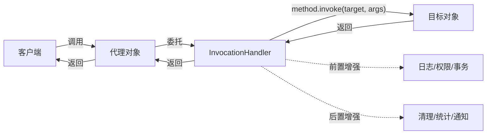
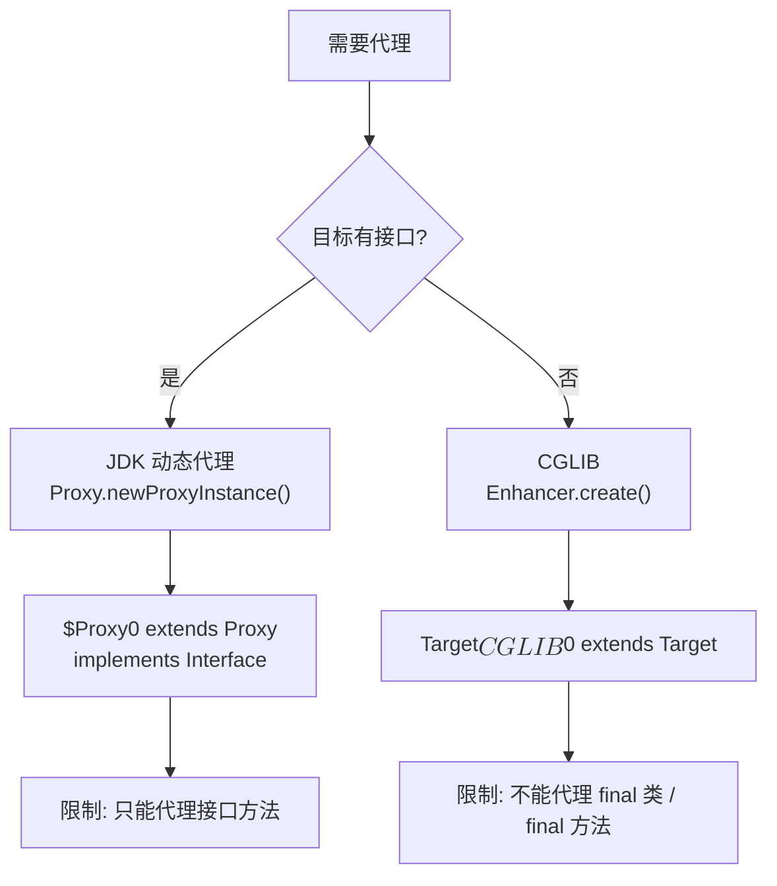

# 03 - 动态代理详解

## 代理模式回顾

代理模式的核心思想：**控制对目标对象的访问**，在不修改目标对象的前提下添加额外行为。



---

## JDK 动态代理：`Proxy.newProxyInstance()`

### 三个参数

```java
Object proxy = Proxy.newProxyInstance(
    classLoader,   // (1) 用于加载动态生成的代理 class
    interfaces,    // (2) 代理要实现的接口列表
    handler        // (3) 所有方法调用都转发到这里
);
```

### InvocationHandler 是核心

```java
public interface InvocationHandler {
    Object invoke(Object proxy, Method method, Object[] args) throws Throwable;
}
```

| 参数 | 含义 | 陷阱 |
|------|------|------|
| `proxy` | 代理对象自身 | 在 invoke 中调用 proxy 的方法会**死循环** |
| `method` | 被调用的 Method 对象 | 包含方法名、参数类型、返回值类型等元数据 |
| `args` | 方法参数 | `null` 表示无参方法 |

### 工作原理

```mermaid
sequenceDiagram
    participant App as 应用程序
    participant Proxy as Proxy 类
    participant GC as ProxyGenerator
    participant Loader as ClassLoader
    participant Handler as InvocationHandler
    participant Target as 目标对象

    App->>Proxy: newProxyInstance(loader, interfaces, handler)
    Proxy->>GC: generateProxyClass("$Proxy0", interfaces)
    GC-->>Proxy: byte[] 字节码
    Proxy->>Loader: defineClass("$Proxy0", bytes)
    Loader-->>Proxy: Class&lt;$Proxy0&gt;
    Proxy-->>App: $Proxy0 实例

    App->>App: proxy.add(1, 2)
    Note over App: $Proxy0 的 add 方法将调用转发给 Handler
    App->>Handler: invoke(proxy, method, args)
    Handler->>Handler: 前置增强（日志、计时等）
    Handler->>Target: method.invoke(target, args)
    Target-->>Handler: 返回结果
    Handler->>Handler: 后置增强
    Handler-->>App: 返回结果
```

---

## $Proxy0 类结构分析

运行时动态生成的代理类具有以下特征：

```java
// 生成的代理类伪代码（反编译 $Proxy0.class 得到）
public final class $Proxy0 extends Proxy implements Calculator {
    private static Method m0; // equals
    private static Method m1; // hashCode
    private static Method m2; // toString
    private static Method m3; // add
    private static Method m4; // subtract

    static {
        // 静态初始化块中通过反射获取所有 Method 对象
        m0 = Class.forName("java.lang.Object").getMethod("equals", Object.class);
        m3 = Class.forName("Calculator").getMethod("add", int.class, int.class);
    }

    public $Proxy0(InvocationHandler h) {
        super(h);  // 保存 handler 到 Proxy.h 字段
    }

    public int add(int a, int b) {
        return (int) h.invoke(this, m3, new Object[]{a, b});
    }
}
```

关键结构：
- `extends Proxy`：所有代理类都继承 `java.lang.reflect.Proxy`
- `implements Calculator`：实现传入的接口
- `final`：不可被继承
- 每个方法调用都被转发到 `h.invoke()`

---

## JDK 动态代理 vs CGLIB

| 维度 | JDK 动态代理 | CGLIB |
|------|-------------|-------|
| 原理 | 运行时生成实现接口的 `$Proxy` 类 | 运行时生成目标类的子类（ASM 字节码） |
| 限制 | 只能代理接口 | 可代理类（final 类除外） |
| 依赖 | JDK 内置，零依赖 | 需要第三方库 |
| 速度 | invoke 稍慢（反射调用 Method） | FastClass 机制，较快 |
| 创建成本 | 低 | 高（字节码生成更复杂） |
| Spring 选择 | 有接口时默认使用 | 无接口时使用 |



---

## InvocationHandler 常见模式

### 模式 1：日志代理

```java
class LogHandler implements InvocationHandler {
    Object target;
    public Object invoke(Object proxy, Method method, Object[] args) throws Throwable {
        System.out.println("调用前: " + method.getName());
        Object result = method.invoke(target, args);
        System.out.println("调用后: " + method.getName());
        return result;
    }
}
```

### 模式 2：缓存代理

```java
class CacheHandler implements InvocationHandler {
    Object target;
    Map<String, Object> cache = new ConcurrentHashMap<>();
    public Object invoke(Object proxy, Method method, Object[] args) throws Throwable {
        String key = method.getName() + Arrays.toString(args);
        return cache.computeIfAbsent(key, k -> {
            try { return method.invoke(target, args); }
            catch (Exception e) { throw new RuntimeException(e); }
        });
    }
}
```

### 模式 3：权限代理

```java
class AuthHandler implements InvocationHandler {
    Object target;
    Set<String> allowedRoles;
    String currentRole;
    public Object invoke(Object proxy, Method method, Object[] args) throws Throwable {
        RequiresRole annotation = method.getAnnotation(RequiresRole.class);
        if (annotation != null && !allowedRoles.contains(currentRole)) {
            throw new SecurityException("权限不足");
        }
        return method.invoke(target, args);
    }
}
```

### 模式 4：链式代理（多重增强）

```java
Object proxy = target;
proxy = Proxy.newProxyInstance(loader, interfaces, new LogHandler(proxy));
proxy = Proxy.newProxyInstance(loader, interfaces, new CacheHandler(proxy));
proxy = Proxy.newProxyInstance(loader, interfaces, new AuthHandler(proxy));
// 调用链：Auth → Cache → Log → Target
```

---

## 关键陷阱

### 陷阱 1：在 InvocationHandler 中调用 proxy 的方法

```java
// ❌ 错误：会导致无限递归
public Object invoke(Object proxy, Method method, Object[] args) throws Throwable {
    System.out.println(proxy.toString()); // proxy.toString() → invoke → proxy.toString() → ...
    return method.invoke(target, args);
}

// ✅ 正确：只调用 target
public Object invoke(Object proxy, Method method, Object[] args) throws Throwable {
    System.out.println("开始调用: " + method.getName());
    return method.invoke(target, args);
}
```

### 陷阱 2：toString/hashCode/equals 也会被代理

`$Proxy0` 覆写了 `Object` 的三个方法，它们也会被转发到 InvocationHandler。如果 Handler 中包含这些方法的处理逻辑却导致循环，问题非常隐蔽。

```java
// ✅ 过滤 Object 的方法
public Object invoke(Object proxy, Method method, Object[] args) throws Throwable {
    if (method.getDeclaringClass() == Object.class) {
        return method.invoke(this, args); // 在 handler 自身执行
    }
    return method.invoke(target, args);
}
```

---

## 自测问题

1. JDK 动态代理为什么只能代理接口？
2. `Proxy.newProxyInstance()` 每次调用都会生成新的 class 吗？
3. 如何在 InvocationHandler 中安全地使用 proxy 参数？
4. CGLIB 的 FastClass 机制比 JDK 代理快在哪里？
5. Spring AOP 什么时候用 JDK 代理，什么时候用 CGLIB？