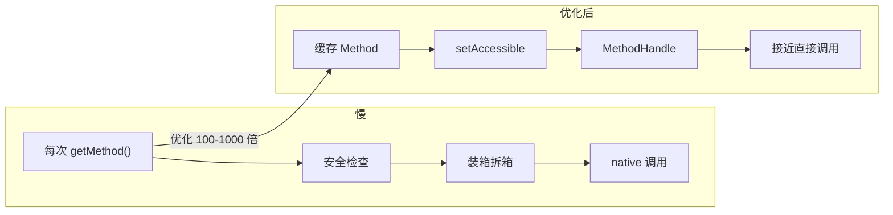
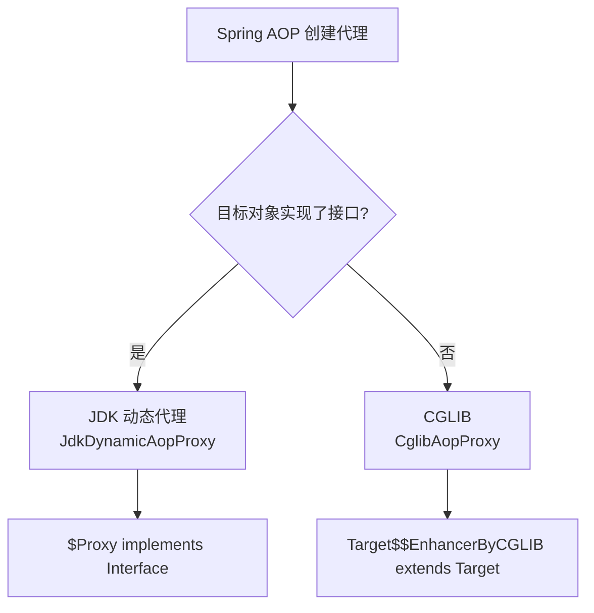
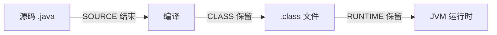

# 04 - 面试高频问题

## 目录

1. [反射的性能开销有多大？如何优化？](#q1)
2. [注解和 XML 配置各有什么优缺点？](#q2)
3. [JDK 动态代理和 CGLIB 的区别？Spring 如何选择？](#q3)
4. [getDeclaredMethod 和 getMethod 的区别？](#q4)
5. [反射如何破坏单例？如何防御？](#q5)
6. [setAccessible(true) 到底做了什么？](#q6)
7. [注解的 RetentionPolicy 三种策略有什么区别？](#q7)
8. [动态代理的 InvocationHandler 中调用 proxy 方法会怎样？](#q8)
9. [为什么注解不能继承？](#q9)
10. [反射在 Spring 框架中有哪些应用？](#q10)

---

## Q1：反射的性能开销有多大？如何优化？

**一句话答案**：反射比直接调用慢几十到几百倍，主要开销来自访问安全检查、参数装箱拆箱和 Method.invoke 的委派调用链。

**优化策略**：

| 策略 | 效果 | 代码示例 |
|------|------|---------|
| `setAccessible(true)` | 省去访问检查，快约 20 倍 | `method.setAccessible(true)` |
| 缓存 Method/Field 对象 | 免去重复查找，快约 1000 倍 | `static final Method M = ...` |
| MethodHandle | JDK 7+，比反射快 2-3 倍 | `MethodHandles.lookup().unreflect(method)` |
| VarHandle | JDK 9+，字段操作接近直接访问 | `MethodHandles.lookup().findVarHandle(...)` |
| LambdaMetafactory | 将反射调用转为 Lambda | 接近直接调用速度 |

**现场演示代码**：见 [Q01_ReflectPerformance.java](../../java/base/reflect/interview/Q01_ReflectPerformance.java)

---

## Q2：注解和 XML 配置各有什么优缺点？

**一句话答案**：注解类型安全、开发效率高、代码内聚；XML 零侵入、可热加载、支持复杂层级结构。现代框架以注解为主（90%），XML 为辅（10%）。

详见 [02-注解原理.md](./02-注解原理.md)。

**现场演示代码**：见 [Q02_AnnotationVsXML.java](../../java/base/reflect/interview/Q02_AnnotationVsXML.java)

---

## Q3：JDK 动态代理和 CGLIB 的区别？Spring 如何选择？

**一句话答案**：JDK 代理基于接口，运行时生成 `$Proxy` 实现类；CGLIB 基于继承，运行时生成目标类的子类。Spring AOP 优先 JDK 代理，目标无接口时回退到 CGLIB。

**深入对比**：

| 维度 | JDK Proxy | CGLIB |
|------|-----------|-------|
| 代理方式 | 实现接口 | 继承目标类 |
| 生成类名 | `$ProxyN` | `Target$$EnhancerByCGLIB$$xxxx` |
| 不能代理 | 无接口的类 | final 类、final 方法 |
| 方法调用 | 反射 Method.invoke | FastClass 索引直接调用 |
| 依赖 | JDK 内置 | cglib.jar + asm.jar |
| Spring Boot 2.x+ | 默认 | class-proxies（需配置） |

---

## Q4：`getDeclaredMethod` 和 `getMethod` 的区别？

| API | 获取范围 | 私有方法 | 继承方法 |
|-----|---------|---------|---------|
| `getDeclaredMethod()` | 当前类声明的所有方法 | ✅ | ❌ |
| `getMethod()` | 当前类 + 父类的所有 public 方法 | ❌ | ✅ |

同理，`getDeclaredField()` vs `getField()` 规则一致。

---

## Q5：反射如何破坏单例？如何防御？

**一句话答案**：通过 `getDeclaredConstructor()` + `setAccessible(true)` 调用私有构造器创建新实例。

**防御方案推荐度**：

| 方案 | 防御等级 | 说明 |
|------|---------|------|
| 构造器抛异常 | ★★★ | 检查标志位，但标志位也可被反射修改 |
| 枚举单例 | ★★★★★ | JVM 底层禁止反射创建枚举实例 |
| 容器管理单例 | ★★★★ | Spring 容器自行管理，不依赖语言特性 |

**推荐答案**：简单场景用枚举，Spring 项目用容器管理。

---

## Q6：`setAccessible(true)` 到底做了什么？

**一句话答案**：修改 `AccessibleObject` 的 `override` 标记为 `true`，使反射调用时跳过 Java 语言访问控制检查。**不修改**方法的访问修饰符。

---

## Q7：注解的 RetentionPolicy 三种策略有什么区别？

| 策略 | 存活时间 | 典型注解 |
|------|---------|---------|
| `SOURCE` | 源码期 → 编译后消失 | `@Override`, `@SuppressWarnings` |
| `CLASS` | 保留在 .class → JVM 不加载 | Lombok `@Data`, ButterKnife |
| `RUNTIME` | JVM 运行时 → 反射可读取 | `@Autowired`, `@Transactional`, `@Table` |

---

## Q8：动态代理的 InvocationHandler 中调用 proxy 方法会怎样？

**一句话答案**：**无限递归 → StackOverflowError**。因为 `proxy.toString()` 会再次被转发到 `invoke()`，形成 `invoke → proxy.method() → invoke → ...` 的死循环。

---

## Q9：为什么注解不能继承？

**简短答案**：Java 注解**本身就是接口的语法糖**，而接口不能被另一个接口 extends。虽然 `@Inherited` 元注解可以让子类继承父类的注解，但这只是**类继承层面的元数据拷贝**，不是注解类型的继承。

---

## Q10：反射在 Spring 框架中有哪些应用？

| Spring 模块 | 反射应用 |
|------------|---------|
| **IoC 容器** | 反射扫描 `@Component` → 反射调用构造器创建 Bean |
| **DI 依赖注入** | 反射读取 `@Autowired` 字段 → `field.set(bean, dependency)` |
| **AOP** | 反射获取接口 → 创建 JDK 动态代理 |
| **Spring MVC** | 反射解析 `@RequestMapping` → 反射调用 Controller 方法 |
| **Spring Data JPA** | 反射读取 `@Entity` `@Column` → 生成 SQL |
| **Bean Validation** | 反射读取 `@NotNull` `@Size` → 执行校验逻辑 |
| **Spring Boot AutoConfiguration** | `@ConditionalOnClass` → 反射检查类是否存在 |

---

## 面试速查清单

- [ ] 反射获取 Class 的三种方式
- [ ] `setAccessible()` 的作用和原理
- [ ] 反射性能优化策略（至少 3 种）
- [ ] 四个元注解的名称和作用
- [ ] `@Retention` 三种策略的区别
- [ ] JDK 动态代理的三个参数
- [ ] InvocationHandler.invoke() 三个参数的含义
- [ ] JDK 动态代理 vs CGLIB 区别
- [ ] `getDeclaredMethod` vs `getMethod` 区别
- [ ] 反射破坏单例的防御方案（枚举）
- [ ] `$Proxy0` 的类结构特征
- [ ] 注解本质 = 接口 + 动态代理