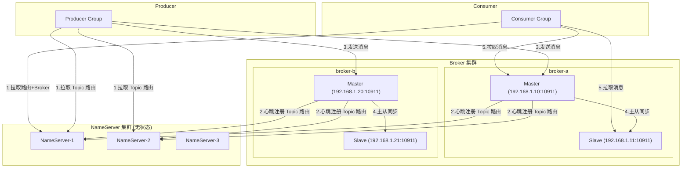
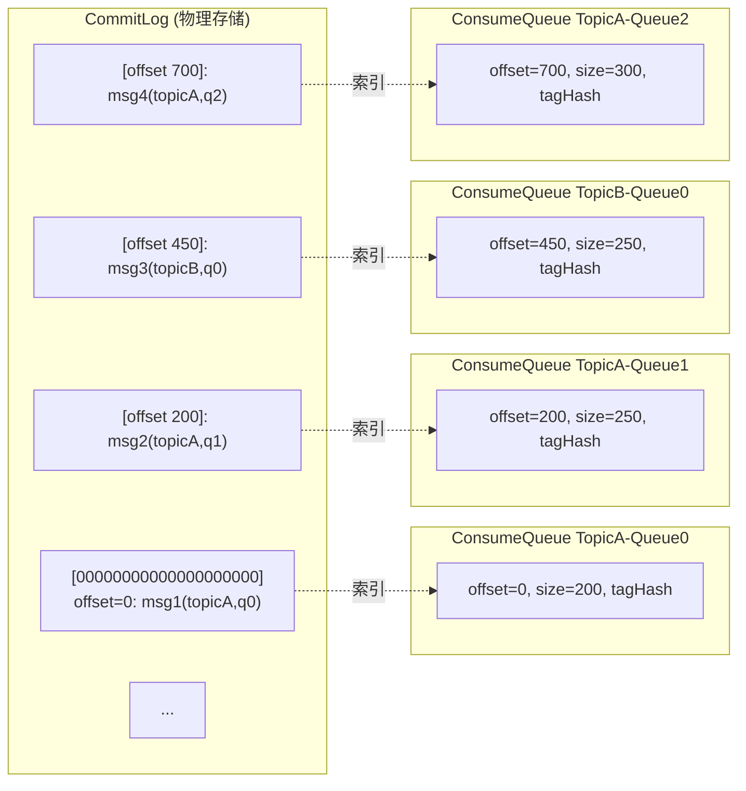

# 01-RocketMQ核心架构

## NameServer 路由架构

**交互时序：**
1. Broker 每 30s 向所有 NameServer 注册 Topic 路由信息
2. Producer 启动时从 NameServer 拉取 Topic 路由，每 30s 更新
3. Producer 根据路由选择 MessageQueue 发送消息
4. Broker Master 将消息同步到 Slave（同步/异步复制）
5. Consumer 从 Broker 拉取消息（Pull 模式）

## 存储模型

**CommitLog**: 所有 Topic 的消息混合存储，顺序追加写（1GB/文件）
**ConsumeQueue**: 每条 20 字节索引（commitLogOffset+size+tagCode），快速定位

## 核心组件关系

| 组件 | 职责 | 关键配置 |
|------|------|---------|
| NameServer | 路由注册中心，无状态 | 无持久化，靠 Broker 心跳上报 |
| Broker | 消息存储和中转 | flushDiskType(ASYNC/SYNC_FLUSH) |
| CommitLog | 物理消息存储 | 1GB/文件，顺序写，mmap |
| ConsumeQueue | 逻辑队列索引 | 20 字节/条，5亿条约 10GB |
| Producer | 消息生产者 | sendMsgTimeout, retryTimesWhenSendFailed |
| Consumer | 消息消费者（Pull） | pullBatchSize, consumeFromWhere |

## 刷盘与复制策略

| 策略 | 说明 | 可靠性 | 性能 |
|------|------|--------|------|
| ASYNC_FLUSH | 异步刷盘，写 PageCache 返回 | 低 | 高 |
| SYNC_FLUSH | 同步刷盘，fsync 后返回 | 高 | 低 |
| ASYNC_MASTER | 异步主从复制 | 低 | 高 |
| SYNC_MASTER | 同步主从复制 | 高 | 中 |

## 面试要点

1. **NameServer 为什么无状态？** 为了高可用和简化部署，各节点对等，没有选主问题。即使全部挂掉，也不影响已建立的连接。
2. **CommitLog 为什么所有 Topic 混存？** 减少磁盘随机写，物理上只有 CommitLog 一个文件顺序写，相比 Kafka 每个 Partition 一个文件，减少 IO 压力。
3. **ConsumeQueue 为什么是 20 字节？** 紧凑设计：offset(8)+size(4)+tagCode(8)，每个文件可存 30w 条索引（约 5.7MB），加载到内存快。