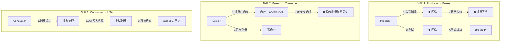
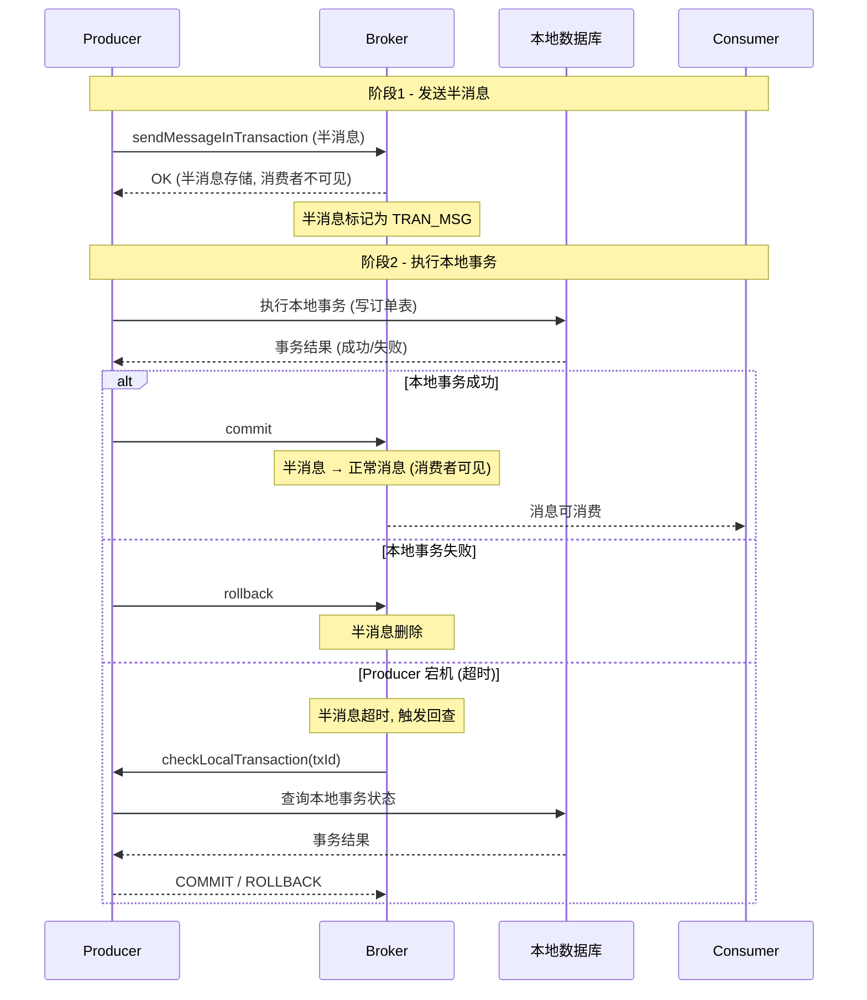
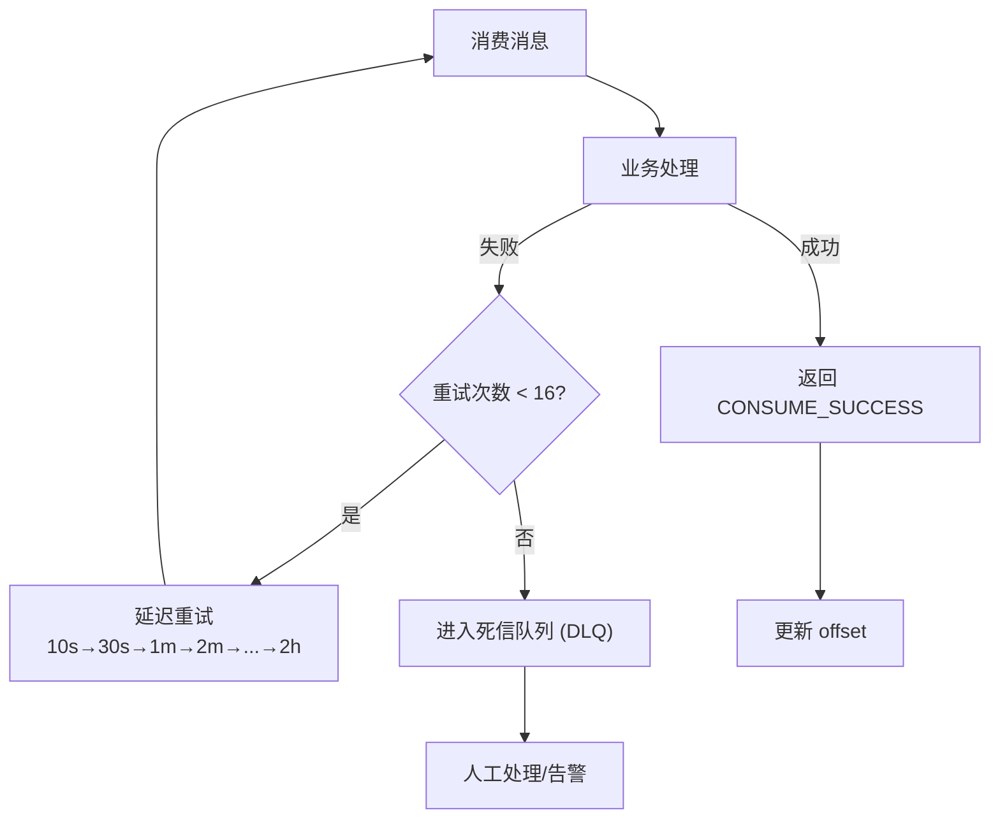

# 02-消息可靠性与事务

## 消息丢失三大场景



### 场景 1: Producer → Broker

**问题**: 网络抖动导致消息未到达 Broker
**方案**:
- 同步发送 + 重试机制 (retryTimesWhenSendFailed=3)
- 故障延迟机制 (sendLatencyFaultEnable=true)：记录 Broker 延迟，避开慢节点

### 场景 2: Broker → Consumer

**问题**: Broker 宕机，内存中未刷盘消息丢失
**方案**:
- 同步刷盘 (flushDiskType=SYNC_FLUSH)：每条消息 fsync 到磁盘
- 同步复制 (brokerRole=SYNC_MASTER)：Slave 确认后才返回成功
- DLedger (Raft) 自动主备切换

### 场景 3: Consumer → 业务

**问题**: 消费成功但业务处理失败
**方案**:
- 手动 ACK (CONSUME_SUCCESS / RECONSUME_LATER)
- 业务幂等：基于 msgId 或业务唯一键去重
- 死信队列：重试 16 次后进入 DLQ

## 事务消息两阶段提交



## ACK 重试流程



### 重试时间间隔（RocketMQ 默认）

| 重试次数 | 间隔 | 说明 |
|---------|------|------|
| 1-3 | 10s | 快速失败，可能是瞬时异常 |
| 4-6 | 30s | 中等等待 |
| 7-9 | 1min | 可能是服务压力 |
| 10-12 | 10min | 较长恢复时间 |
| 13-15 | 30min | 需要人工关注 |
| 16+ | 2h | 进入 DLQ |

## 消息可靠性保障层级

```
Level 1 (最低): ASYNC_FLUSH + ASYNC_MASTER
  → 适用: 日志采集, 可容忍少量丢失

Level 2: ASYNC_FLUSH + SYNC_MASTER
  → 适用: 普通业务消息, Slave 有备份

Level 3: SYNC_FLUSH + SYNC_MASTER
  → 适用: 金融/支付, 零丢失要求

Level 4 (最高): SYNC_FLUSH + SYNC_MASTER + DLedger
  → 适用: 银行核心交易, 自动故障切换
```

## 关键面试点

1. **消息可靠性的三个维度**: 生产端(重试) + Broker端(刷盘/复制) + 消费端(手动ACK+幂等)
2. **事务消息为什么不需要 XA/2PC**: 通过半消息+回查实现最终一致，比 XA 轻量且性能好
3. **幂等消费的三种实现**: 数据库唯一索引、Redis setnx、本地消息表
4. **同步刷盘 vs 同步复制哪个开销大**: 同步复制开销大（网络），因为磁盘顺序写远快于网络传输