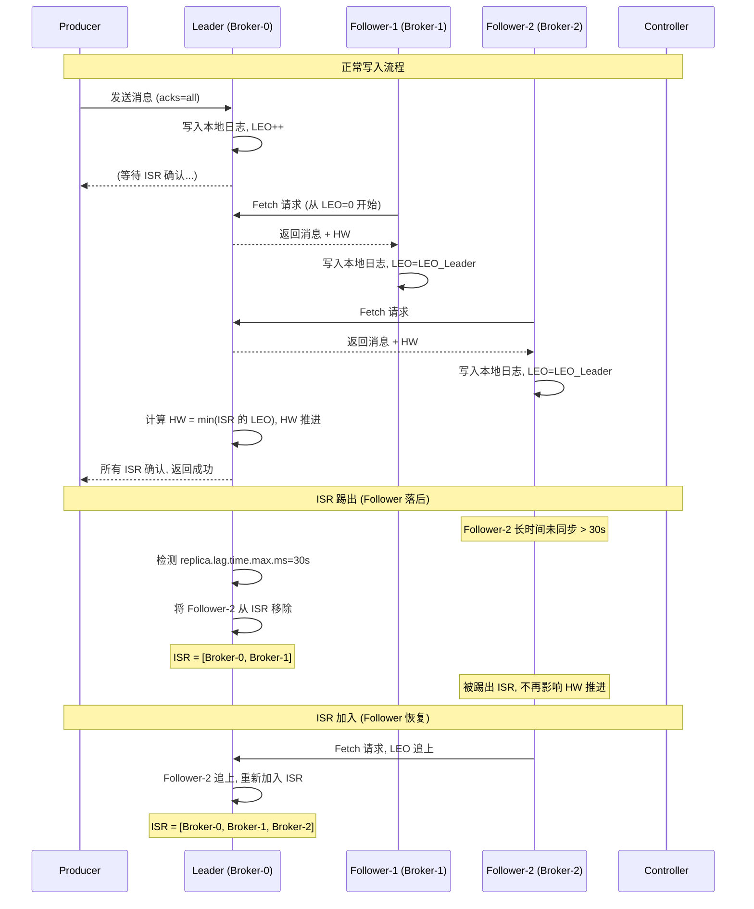
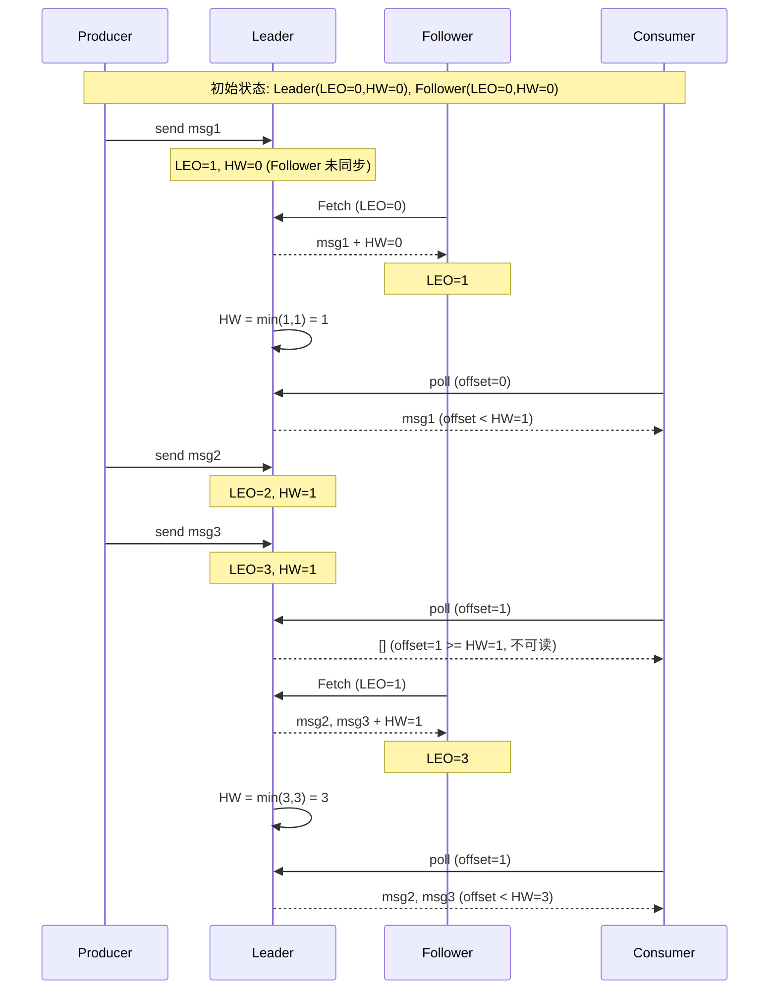

# 03-Kafka核心与ISR

## Partition Leader-Follower ISR 维护流程



## HW/LEO 推进时序



## ISR 核心配置

| 配置项 | 默认值 | 说明 |
|--------|--------|------|
| `replica.lag.time.max.ms` | 30000 | Follower 多长时间未同步踢出 ISR |
| `replica.lag.max.messages` | 已废弃 | Kafka 0.9+ 仅用时间维度判断 |
| `min.insync.replicas` | 1 | 最少 ISR 数量, 不满足拒绝写入(acks=all) |
| `unclean.leader.election.enable` | false | 是否允许非 ISR 副本选为 Leader |

## acks 配置

```
acks=0:
  Producer 不等待确认 → 最快, 可能丢消息
  流程: Producer send → 立即返回

acks=1:
  Leader 写入成功即返回 → Follower 未同步可能丢
  流程: Producer send → Leader写 → 返回

acks=all(-1):
  所有 ISR 确认后返回 → 最可靠, 最慢
  流程: Producer send → Leader写 → Follower同步 → HW推进 → 返回
  需要 min.insync.replicas >= 2 才安全
```

## Kafka vs RocketMQ 存储对比

| 维度 | Kafka | RocketMQ |
|------|-------|----------|
| 物理文件 | Partition 独立 .log | CommitLog 混合存储 |
| IO 模式 | 顺序写 + sendfile | 顺序写 + mmap |
| 索引 | .index (稀疏索引) | ConsumeQueue (密集索引 20B) |
| 文件管理 | 分段时间/大小删除 | 按过期时间删除 |
| 零拷贝 | sendfile (网络) | mmap (读写) |

## 面试要点

1. **ISR 为什么只用时间判断不用数量判断**: 消除消息数量波动带来的抖动，更准确反映 Follower 状态
2. **min.insync.replicas=1 的风险**: acks=all 但 ISR 只有 Leader，相当于 acks=1
3. **HW 的作用**: 确保 ISR 中所有副本都有消息，Leader 切换时不丢数据
4. **LEO 的作用**: 每个副本的下一个写入位置，用于 HW 计算和 Follower 追赶
5. **unclean.leader.election.enable=true 风险**: 允许非 ISR 副本选为 Leader → 消息丢失