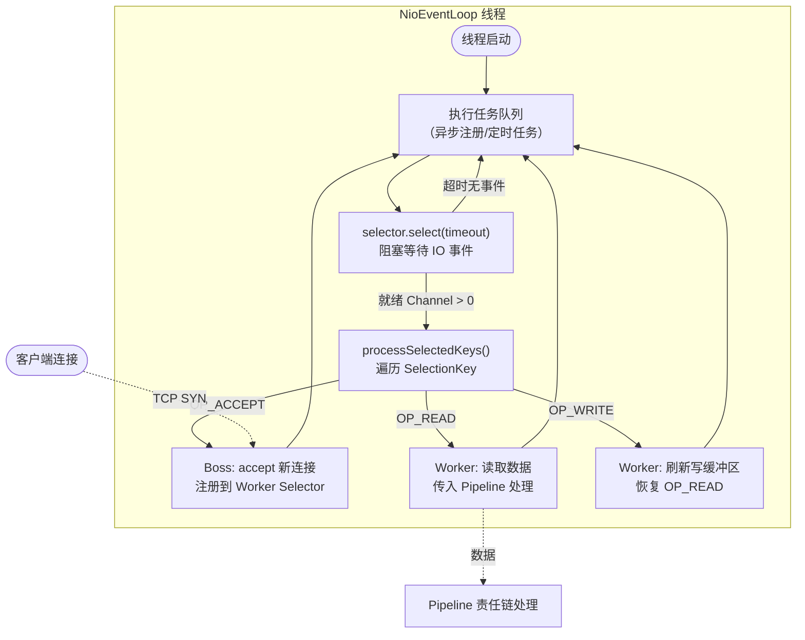
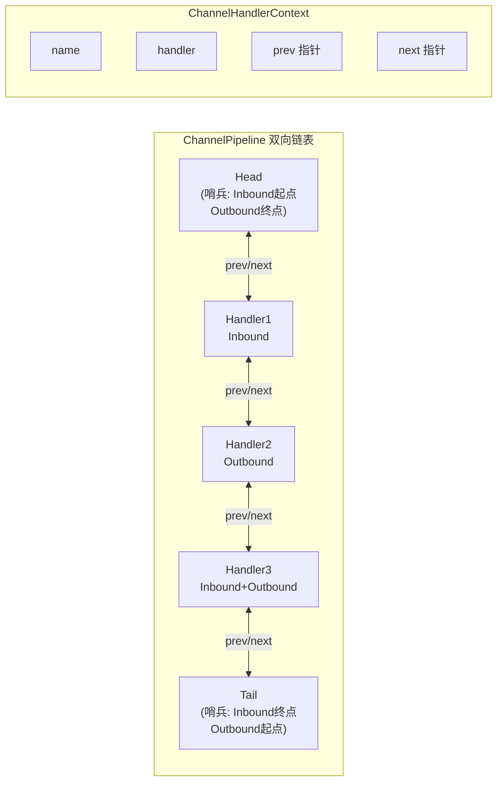
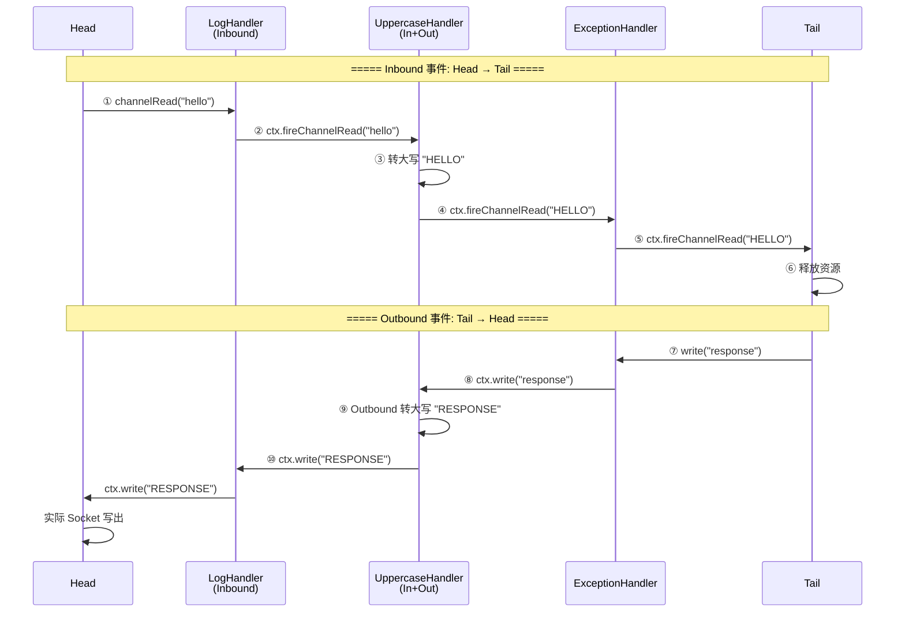

# EventLoop 与 Pipeline

> 基于 JDK NIO 模拟 Netty 核心机制，理解 EventLoop 事件循环和 Pipeline 责任链。

## 1. EventLoop Selector 事件循环

Netty EventLoop 本质是**单线程 + Selector + 死循环**的三位一体结构。每个 EventLoop 绑定一个 Selector，通过 `while(true)` 轮询 IO 事件，所有 Channel 操作都在同一线程内完成。

### 核心要点

| 组件 | 职责 | 线程数 |
|------|------|--------|
| Boss EventLoopGroup | 监听 ACCEPT 事件，接收连接 | 通常 1 个 |
| Worker EventLoopGroup | 处理 READ/WRITE 事件 | CPU 核数 x 2 |
| Channel-EventLoop 绑定 | 一个 Channel 从生到死绑定同一个 EventLoop | 无锁串行化 |

## 2. Pipeline 双向链表结构

ChannelPipeline 是一个**双向链表**，Head 和 Tail 是哨兵节点，用户自定义 Handler 插入在中间。

### Handler 类型

| 类型 | 传播方向 | 典型场景 |
|------|----------|----------|
| ChannelInboundHandler | Head -> Tail | 解码、业务处理 |
| ChannelOutboundHandler | Tail -> Head | 编码、写出 |
| ChannelDuplexHandler | 双向 | 日志、监控 |

## 3. Inbound / Outbound 事件传播

### 异常传播规则

- `exceptionCaught` 从当前节点向 Tail 方向查找
- 找到第一个重写了 `exceptionCaught` 且**不调用** `ctx.fireExceptionCaught()` 的 Handler
- 如果异常传到 Tail 仍未处理，打印 WARN 日志并释放资源

---

> **最佳实践**：Pipeline 尾部添加 ExceptionHandler 兜底，避免异常到达 Tail 导致连接关闭。