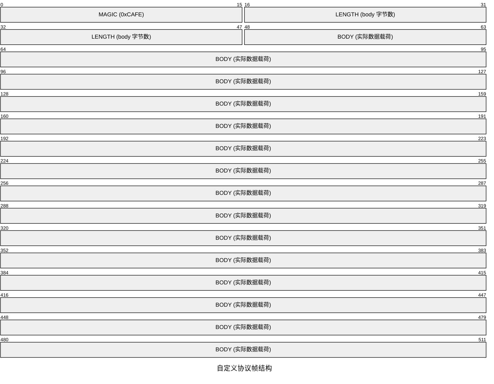
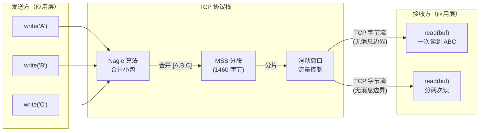

# 零拷贝与粘包半包

> 系统级零拷贝 + Netty 应用层零拷贝 + TCP 粘包半包解决方案。

## 1. 传统 IO vs sendfile 零拷贝对比

```mermaid
flowchart TB
    subgraph TRADITIONAL["传统 IO: 4 次拷贝 + 2 次上下文切换"]
        direction LR
        DISK1[("磁盘")] --> |"① DMA copy"| KERNEL1["内核缓冲区<br/>PageCache"]
        KERNEL1 --> |"② CPU copy<br/>用户态切换"| USER["用户缓冲区<br/>JVM Heap"]
        USER --> |"③ CPU copy<br/>内核态切换"| SOCKET1["Socket 缓冲区"]
        SOCKET1 --> |"④ DMA copy"| NIC1["网卡"]
    end

    subgraph SENDFILE["sendfile 零拷贝: 2 次 DMA 拷贝 + 0 次 CPU 拷贝"]
        direction LR
        DISK2[("磁盘")] --> |"① DMA copy"| KERNEL2["内核缓冲区<br/>PageCache"]
        KERNEL2 --> |"② DMA gather<br/>(带 offset/length)"| NIC2["网卡"]
    end

    subgraph MMAP["mmap + write (Kafka): 3 次拷贝 + 1 次上下文切换"]
        direction LR
        DISK3[("磁盘")] --> |"① DMA copy"| KERNEL3["内核缓冲区<br/>PageCache<br/>(用户态可访问)"]
        KERNEL3 --> |"② CPU copy"| SOCKET3["Socket 缓冲区"]
        SOCKET3 --> |"③ DMA copy"| NIC3["网卡"]
    end
```



### 三种方案对比

| 方案 | 拷贝次数 | CPU 拷贝 | 上下文切换 | 使用场景 |
|------|----------|----------|------------|----------|
| 传统 IO (read/write) | 4 | 2 | 2 | 通用，小文件 |
| sendfile (transferTo) | 2 | 0 | 0 | Nginx 静态文件、Netty FileRegion |
| mmap + write | 3 | 1 | 1 | Kafka 日志读写 |

### Netty 零拷贝的四层含义

1. **操作系统级**：`FileRegion` 封装 `transferTo()`，文件传输不经过用户态
2. **合并级**：`CompositeByteBuf` 合并多个 ByteBuf，只记录引用不拷贝数据
3. **切片级**：`ByteBuf.slice()` 共享同一块内存，调整 readerIndex/writerIndex
4. **内存级**：`DirectBuffer` 堆外内存，IO 时无需堆内到堆外的拷贝

## 2. 自定义协议 LengthField 帧结构



### LengthFieldBasedFrameDecoder 参数

| 参数 | 示例值 | 含义 |
|------|--------|------|
| lengthFieldOffset | 2 | 长度字段在帧中的偏移（magic 占 2 字节） |
| lengthFieldLength | 4 | 长度字段自身的字节数 |
| lengthAdjustment | 0 | 长度值需要调整的量（0 = 长度值就是 body 长度） |
| initialBytesToStrip | 6 | 解码后剥离的前导字节数（magic 2 + length 4） |

### 常见协议格式

```
① 简单格式:                [LENGTH(4B)][BODY(NB)]
   参数: offset=0, fieldLen=4, adjust=0, strip=4

② 带头部格式:              [HEADER(8B)][LENGTH(4B)][BODY(NB)]
   参数: offset=8, fieldLen=4, adjust=0, strip=12

③ 长度含头部格式:           [LENGTH(4B)][HEADER(4B)][BODY(NB)]
   参数: offset=0, fieldLen=4, adjust=-4, strip=4
   （LENGTH 含 HEADER，adjust=-4 表示 bodyLen = LENGTH - 4）

④ 魔数 + 长度（推荐）:      [MAGIC(2B)][LENGTH(4B)][BODY(NB)]
   参数: offset=2, fieldLen=4, adjust=0, strip=6
```

## 3. 粘包原因 —— TCP 流图



### 五种解码器对比

| 解码器 | 原理 | 适用场景 | 缺点 |
|--------|------|----------|------|
| LineBasedFrameDecoder | 按 \n 或 \r\n 分隔 | 文本协议（Redis） | 消息体不能含换行符 |
| DelimiterBasedFrameDecoder | 按自定义分隔符分隔 | 自定义文本协议 | 需确保分隔符不冲突 |
| FixedLengthFrameDecoder | 按固定字节数截取 | 定长协议（IoT 传感器） | 灵活性差 |
| LengthFieldBasedFrameDecoder | 先读长度再读数据 | 通用二进制协议 | 实现复杂，最推荐 |
| 自定义 ByteToMessageDecoder | 完全自定义逻辑 | 复杂协议 | 开发工作量大 |

### Netty 编解码器继承体系

```
ChannelHandler
├── ChannelInboundHandlerAdapter
│   └── ByteToMessageDecoder          ← 解码器积累字节 → 输出完整帧
│       ├── LineBasedFrameDecoder
│       ├── DelimiterBasedFrameDecoder
│       ├── FixedLengthFrameDecoder
│       └── LengthFieldBasedFrameDecoder
│   └── MessageToMessageDecoder       ← 对象 → 对象转换
└── ChannelOutboundHandlerAdapter
    └── MessageToByteEncoder          ← 对象 → 字节编码
    └── MessageToMessageEncoder       ← 对象 → 对象转换

推荐组合：LengthFieldBasedFrameDecoder + MessageToMessageDecoder + MessageToByteEncoder
```

---

> **最佳实践**：生产环境首选 `LengthFieldBasedFrameDecoder`，配合魔数校验防篡改，Encoder/Decoder 成对使用。