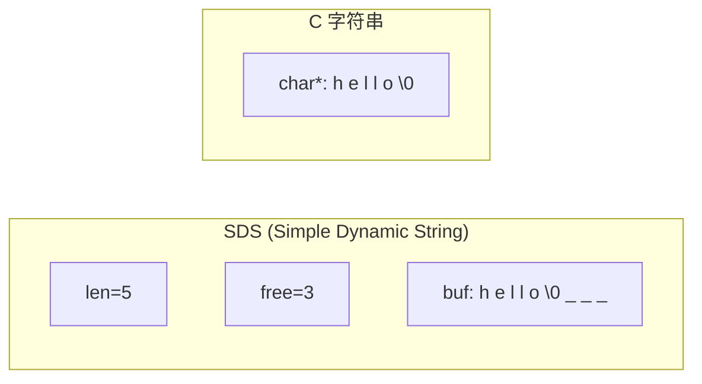
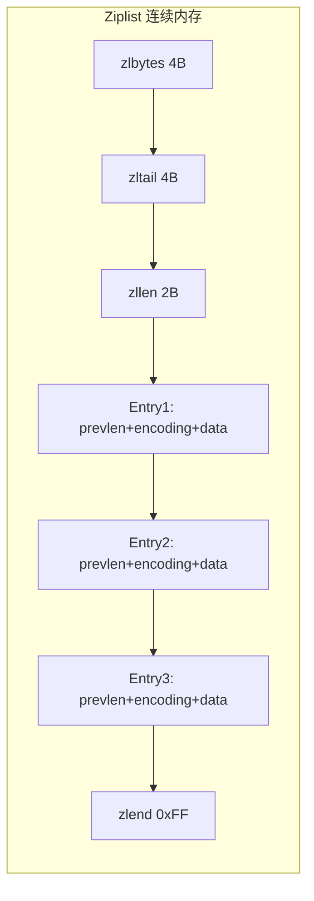
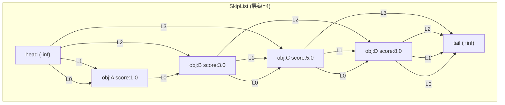
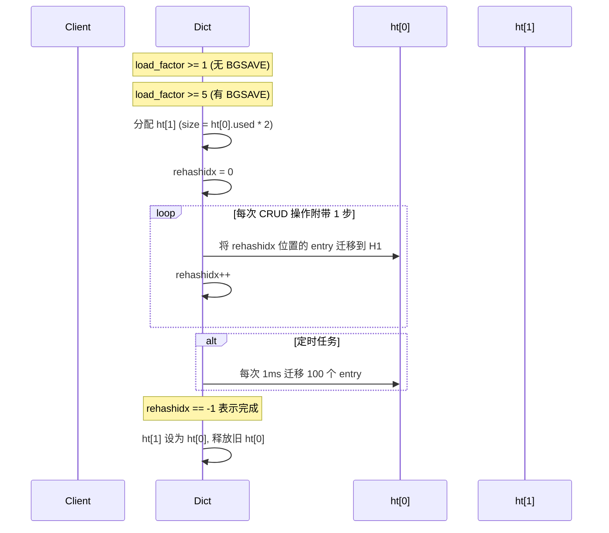

# Redis 数据结构底层原理

## 1. SDS (Simple Dynamic String)

Redis 自实现的字符串结构，替代 C 原生 `char*`。

### SDS 结构



### SDS vs C 字符串

| 特性 | C 字符串 | SDS |
|------|----------|-----|
| 获取长度 | O(N) 遍历 | O(1) 读取 len |
| 缓冲区溢出 | 可能溢出 | 自动扩容 |
| 内存分配 | N 次修改 = N 次分配 | 预分配 + 惰性释放 |
| 二进制安全 | 遇到 `\0` 截断 | 支持任意二进制 |
| 兼容性 | -- | 兼容 C 字符串函数 |

### 预分配策略
- 修改后 len < 1MB：分配 `len + len + 1` (2倍)
- 修改后 len >= 1MB：分配 `len + 1MB + 1`

## 2. Ziplist (压缩列表)

List、Hash、ZSet 在小数据量时的底层编码。

### Ziplist 内存布局



### Entry 结构
- `prevlen`：前一个 entry 长度 (1B 或 5B)
- `encoding`：编码类型 (string/int/长度)
- `entry-data`：实际数据

### 级联更新问题
当某个 entry 修改导致 prevlen 从 1B 变 5B，后续 entry 可能需要连锁更新，极端情况 O(N^2)。

### 结构转换阈值 (可在 redis.conf 配置)
- Hash: `hash-max-ziplist-entries 512` / `hash-max-ziplist-value 64`
- List: `list-max-ziplist-size -2` (8KB)
- ZSet: `zset-max-ziplist-entries 128` / `zset-max-ziplist-value 64`

## 3. Skiplist (跳跃表)

ZSet 在大数据量时的底层编码 (配合 dict 做 member->score 映射)。

### Skiplist 结构



### 层级随机生成
```
level = 0
while random() < p:  // p=0.25
    level++
// 期望: 50% L1, 25% L2, 12.5% L3, 6.25% L4 ...
```

### 复杂度
- 查找/插入/删除: O(logN) 平均
- 范围查询: O(logN + M) (M为范围元素数)
- 空间: O(N) 平均 (节点平均 1/(1-p) 层指针)

### 为什么不用红黑树
- 跳跃表实现简单，范围查询更直观
- 支持区间查找 (ZRANGE/ZRANK)
- 无再平衡开销，并发友好

## 4. Hash 字典

### Dict 结构

```mermaid
graph TB
    subgraph "Dict 字典"
        D[dictht ht0]
        D2[dictht ht1]
        R[rehashidx]
    end
    subgraph "dictht (HashTable)"
        T[table: Entry*[]]
        S[size=4]
        SM[used=3]
    end
    subgraph "Entry 链表"
        E0["dictEntry: key1->val1 -> next"]
        E1["dictEntry: key2->val2 -> next"]
        E2["dictEntry: key3->val3 -> next"]
    end
```

### 渐进式 rehash 流程



### 扩容/缩容条件
- **扩容**: `used / size >= dict_force_resize_ratio` (默认 5) 或没有 BGSAVE/ BGREWRITEAOF 时 `used / size >= 1`
- **缩容**: `used / size < HASHTABLE_MIN_FILL` (默认 10%)

## 5. 编码转换总览

| 数据类型 | 小数据编码 | 大数据编码 |
|----------|------------|------------|
| String | raw (SDS) | embstr (<=44B) |
| List | ziplist / quicklist | quicklist (3.2+) |
| Hash | ziplist | hashtable |
| Set | intset | hashtable |
| ZSet | ziplist | skiplist + dict |