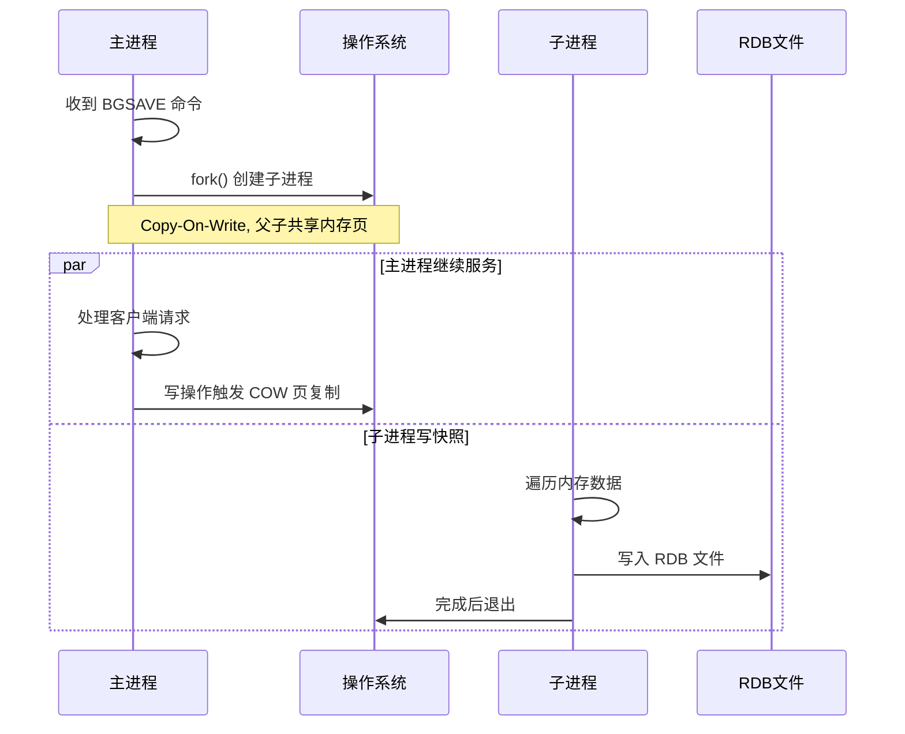
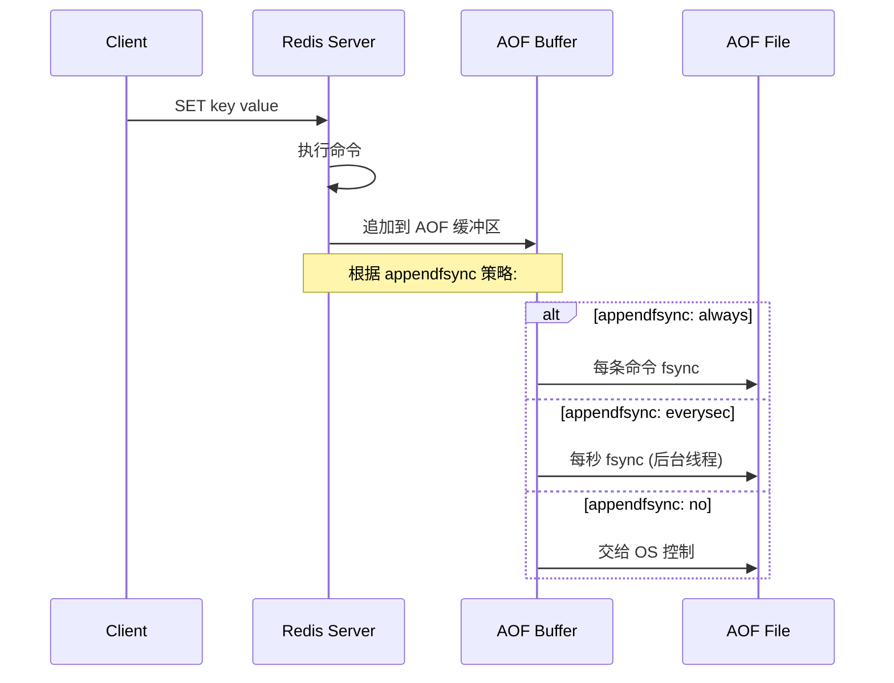
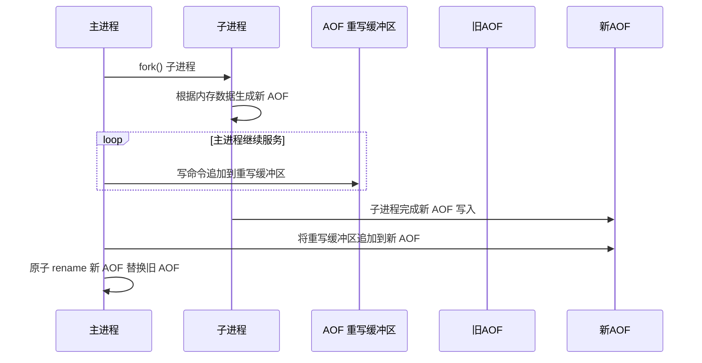
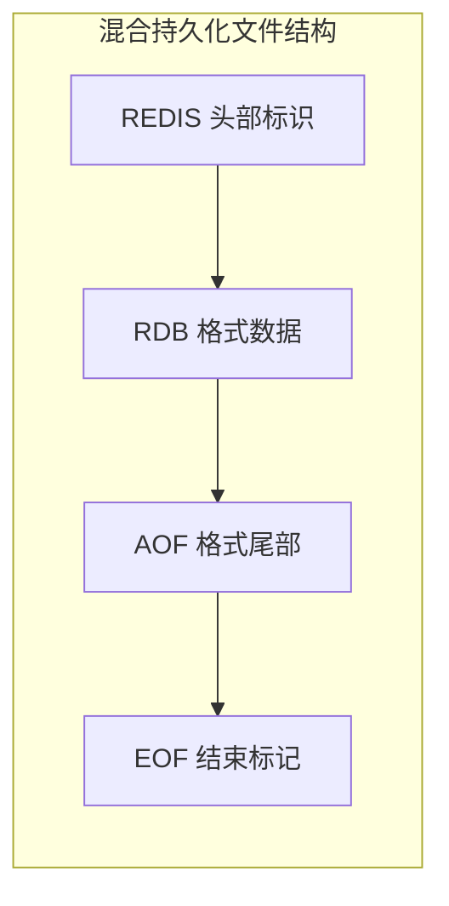

# Redis 持久化机制

## 持久化方式对比

| 特性 | RDB | AOF | 混合持久化 |
|------|-----|-----|-----------|
| 原理 | 内存快照 | 写命令日志 | RDB + AOF 尾部 |
| 文件体积 | 小 (压缩二进制) | 大 (文本命令) | 中等 |
| 恢复速度 | 快 | 慢 (重放命令) | 较快 |
| 数据安全 | 可能丢最后快照后数据 | 最多丢 1s (everysec) | 最多丢 1s |
| 写性能影响 | fork 时短暂阻塞 | 每条/每秒 fsync | 同 AOF |
| 适用场景 | 备份、灾备 | 数据安全要求高 | 生产环境推荐 |

## 1. RDB (Redis Database)

### BGSAVE 流程



### RDB 触发方式
- `SAVE`：主进程阻塞执行 (不推荐)
- `BGSAVE`：fork 子进程异步执行
- 配置自动触发：`save 900 1` (900s内至少1次修改)
- 主从全量同步时触发

### 写时复制 (COW) 原理
1. `fork()` 后父子进程共享物理内存页 (只读)
2. 主进程写操作时，内核将共享页复制为私有页
3. 子进程始终读 fork 时刻的快照数据
4. COW 优点：不需要双倍内存，fork 速度快

### COW 内存估算
```
RDB 期间额外内存 ≈ 写入量 * 页大小(4KB)
极端情况：全量写入 = 内存翻倍
```

## 2. AOF (Append Only File)

### AOF 写入流程



### AOF 重写流程



### AOF 重写优化
- 合并多条 SET 为一条 (取最终值)
- 省略已删除 key 的创建命令
- 过期 key 不写入
- LPUSH + LPOP = 空列表，不写入
- 不阻塞主进程 (BGREWRITEAOF)

## 3. 混合持久化 (Redis 4.0+)



### 工作流程
1. `BGREWRITEAOF` 触发子进程
2. 子进程将 **当前内存数据** 以 RDB 格式写入新 AOF 文件前半部分
3. 重写期间的增量命令以 AOF 格式追加到文件后半部分
4. 完成后原子替换旧 AOF 文件

### 恢复流程
1. 检测到 AOF 文件以 REDIS 开头 -> 混合模式
2. 加载 RDB 部分 (快速恢复大部分数据)
3. 重放 AOF 尾部命令 (恢复增量)

## 4. 生产环境建议

```
推荐: 混合持久化 (aof-use-rdb-preamble yes)
+ AOF everysec
+ RDB 定期备份 (每天/每周)

不推荐: 只用 RDB (数据丢失风险)
不推荐: appendfsync always (性能差)
```