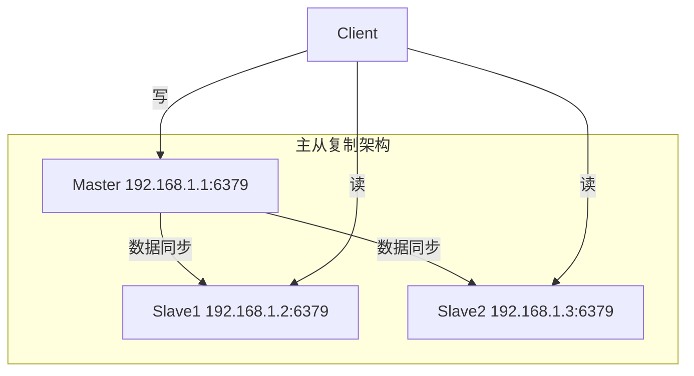
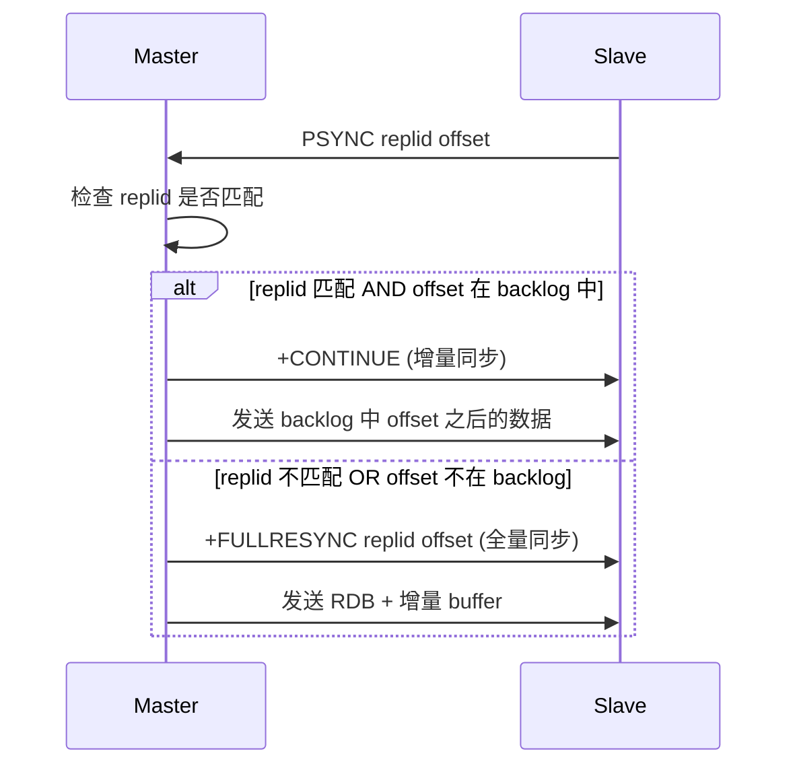
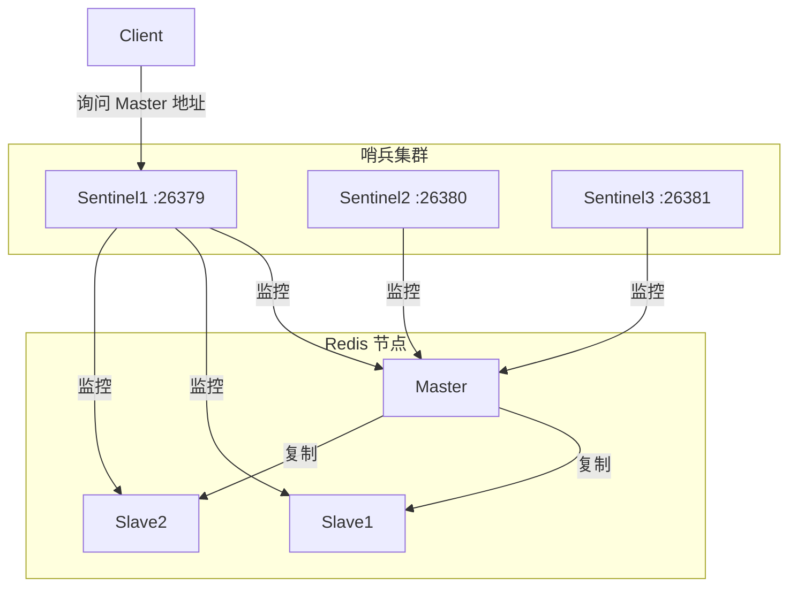
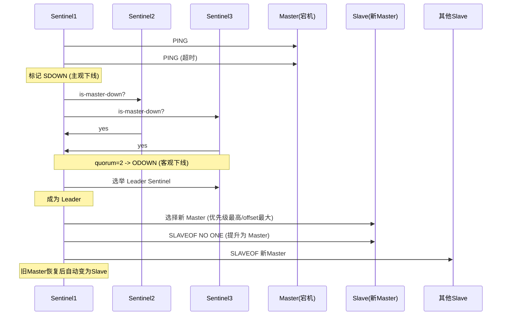
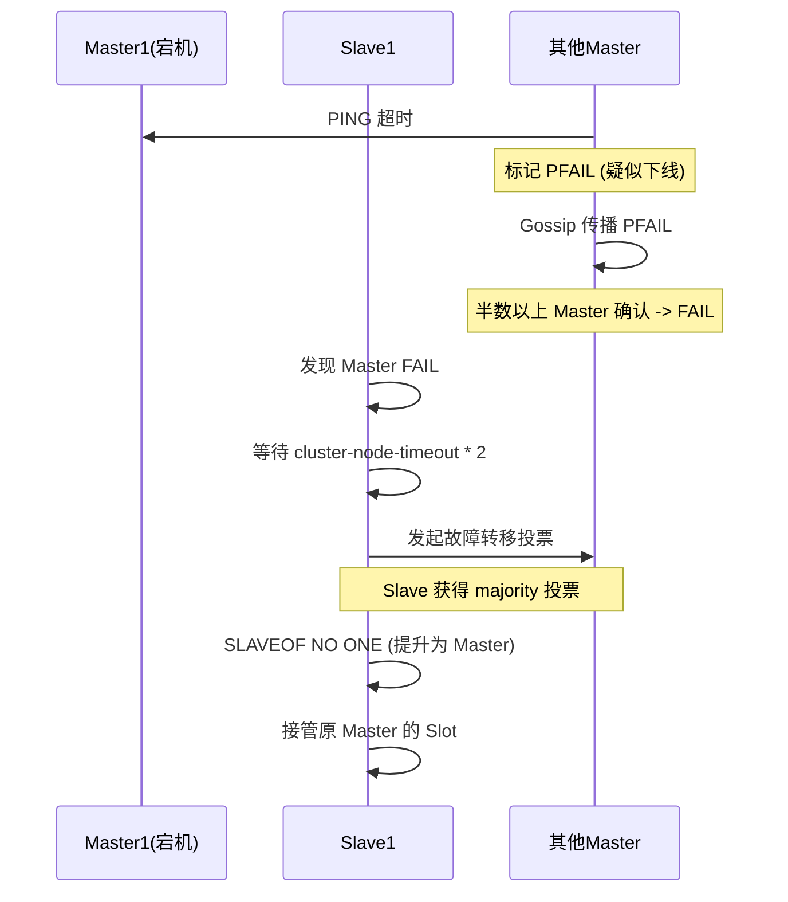

# Redis 集群与高可用

## 架构演进路线

```
单机 -> 主从复制 -> 哨兵模式 -> Cluster 集群
(读写分离) (自动故障转移) (数据分片)
```

## 1. 主从复制

### 架构



### 复制流程

1. Slave 执行 `REPLICAOF <master_ip> <master_port>`
2. Slave 向 Master 发送 `PSYNC ? -1` (首次同步)
3. Master 执行 BGSAVE 生成 RDB，同时记录增量命令到缓冲区
4. Master 将 RDB 发送给 Slave，Slave 加载 RDB
5. Master 将缓冲区增量命令发送给 Slave
6. 之后持续增量同步 (基于 replication offset)

### PSYNC 增量同步



### 复制积压缓冲区 (replication backlog)
- 默认 1MB (`repl-backlog-size`)
- FIFO 环形队列
- Slave 断线重连时，如果 offset 还在 backlog 中 -> 增量同步
- 如果不在 -> 全量同步

## 2. Sentinel 哨兵模式

### 架构



### 故障转移流程



### Sentinel 关键配置

```
sentinel monitor mymaster 127.0.0.1 6379 2  # quorum=2
sentinel down-after-milliseconds mymaster 30000  # 30s 无响应
sentinel failover-timeout mymaster 180000  # 故障转移超时
sentinel parallel-syncs mymaster 1  # 并行同步的 Slave 数
```

### ODOWN 需要多少哨兵
- `quorum` 是判定客观下线的最少票数
- 实际故障转移由 **Leader Sentinel** 执行 (需 majority 投票)
- 推荐: 3 个 Sentinel，quorum=2

## 3. Redis Cluster

### 架构

```mermaid
graph TB
    subgraph "Redis Cluster (3主3从)"
        M1[Master1<br/>Slots: 0-5460]
        M2[Master2<br/>Slots: 5461-10922]
        M3[Master3<br/>Slots: 10923-16383]
        S1[Slave1<br/>(M1 副本)]
        S2[Slave2<br/>(M2 副本)]
        S3[Slave3<br/>(M3 副本)]
    end
    M1 --- S1
    M2 --- S2
    M3 --- S3
    M1 -->|Gossip 协议| M2
    M2 -->|Gossip 协议| M3
    M3 -->|Gossip 协议| M1
```

### Slot 分布

```
16384 个哈希槽分配给各 Master:

Master1: 0    -> 5460   (5461 个槽)
Master2: 5461 -> 10922  (5462 个槽)
Master3: 10923-> 16383  (5461 个槽)
```

### 为什么是 16384 个槽

1. **心跳包大小**：节点间通过 Gossip 协议交换 slot 信息，16384 个槽只需 2KB bitmap；如果用 65536 需要 8KB
2. **节点数限制**：Redis 官方建议 <= 1000 节点，16384 槽足够分配 (平均每节点 16+ 槽)
3. **CRC16 算法**：分布均匀，对 16384 取模简单高效
4. **网络开销合理**：Gossip 每秒多次交换，2KB vs 8KB 差异显著

### 数据定位

```
slot = CRC16(key) % 16384

# hash_tag: 仅计算 {} 内的部分
CRC16("user:{1001}:profile")  -> 计算 "1001"
CRC16("user:{1001}:orders")   -> 计算 "1001"
# 两个 key 落到同一个 slot
```

### 节点通信 (Gossip 协议)

- MEET：新节点加入集群
- PING：定期发送心跳 (每秒随机选几个节点)
- PONG：回复 PING/MEET
- FAIL：广播节点下线

### 故障转移



## 4. 选型总结

| 场景 | 推荐方案 | 原因 |
|------|----------|------|
| 数据量 < 10G, QPS < 5万 | 哨兵 | 运维简单, 高可用 |
| 数据量 > 100G | Cluster | 数据分片, 突破单机内存 |
| QPS > 10万 | Cluster | 多 Master 分担读写 |
| 需要跨机房灾备 | 哨兵 + 异步复制 | Sentinel 跨机房部署 |
| 数据量 < 1G, 可接受停机 | 单机 | 最简单 |