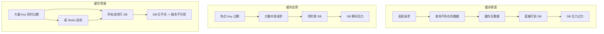
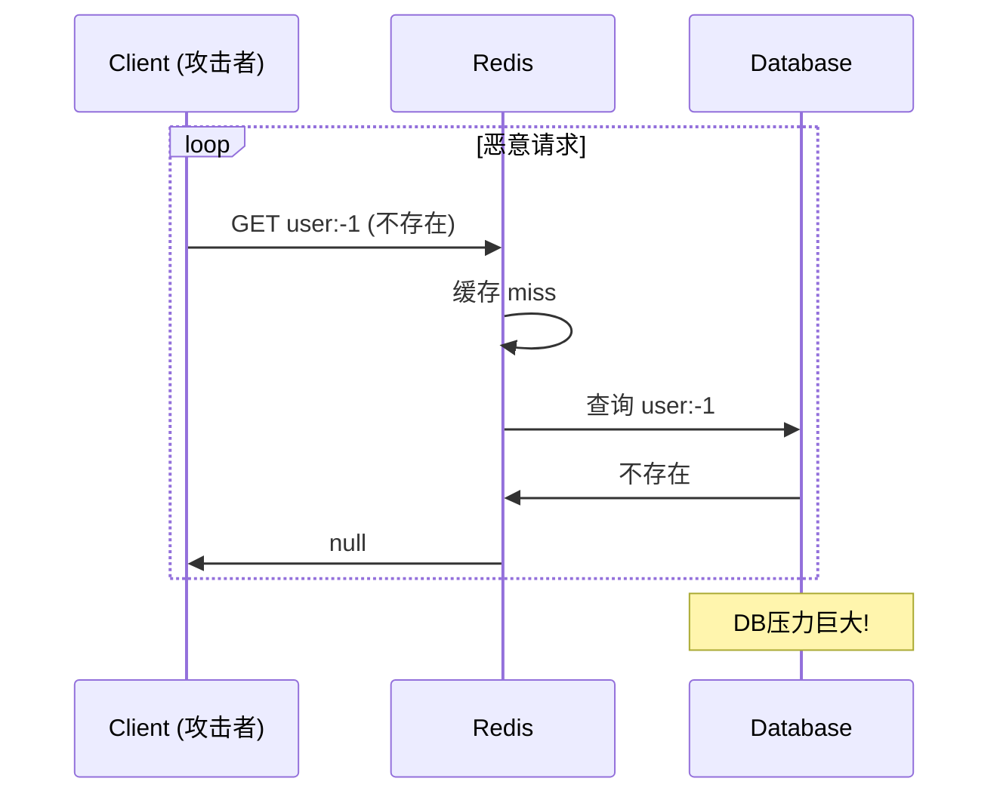
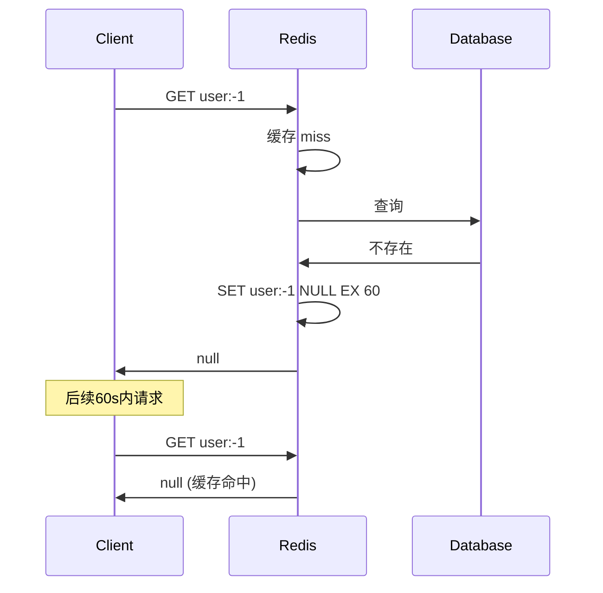
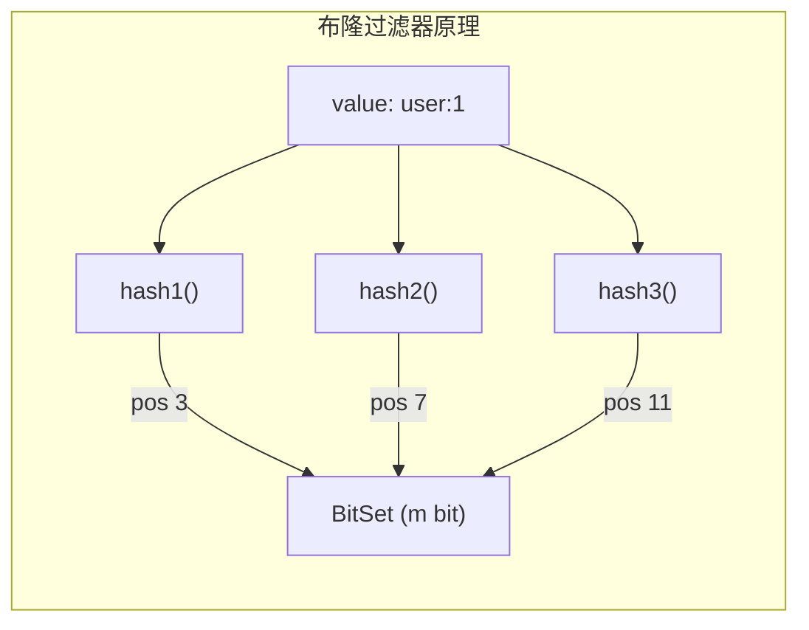
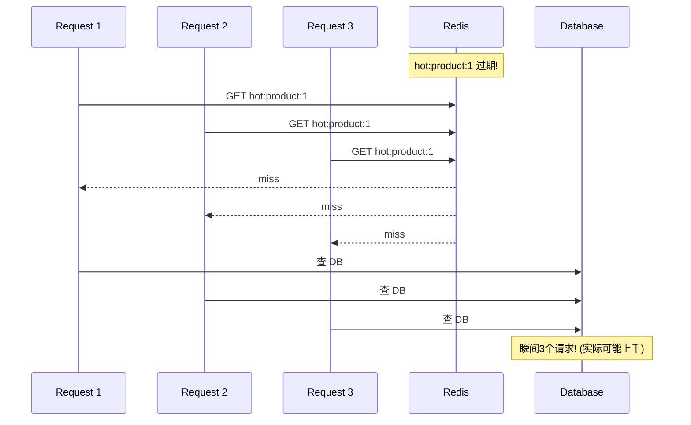
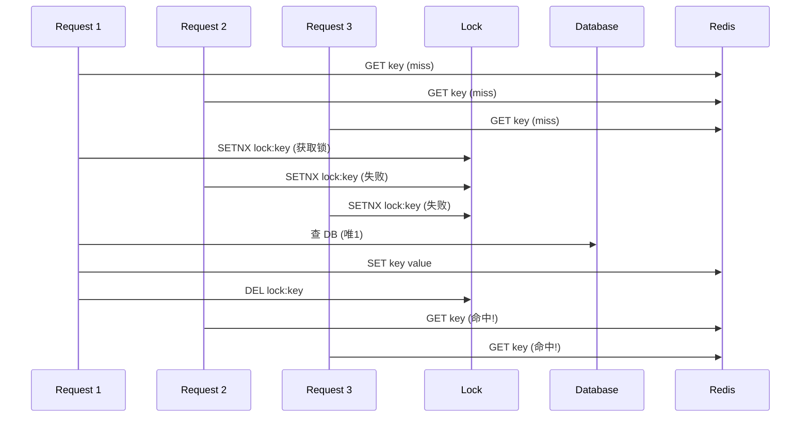
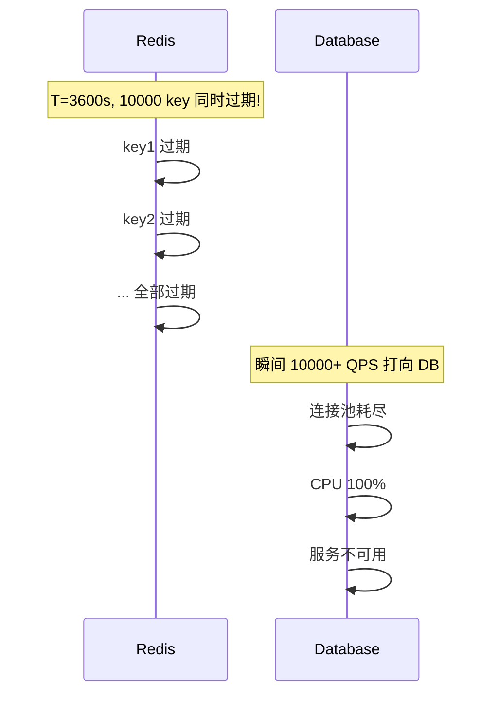

# 缓存穿透、击穿、雪崩

## 三大问题总览



## 1. 缓存穿透

### 问题描述
查询一个 **数据库中根本不存在** 的数据时，缓存层没有该数据，每次请求直接打到数据库。

### 场景序列



### 方案一：缓存空值



**代码实现：**
```java
String cacheValue = redis.get(key);
if (cacheValue != null) {
    return "NULL_CACHE".equals(cacheValue) ? null : cacheValue;
}
String dbValue = db.query(key);
if (dbValue != null) {
    redis.set(key, dbValue, 3600);
} else {
    redis.set(key, "NULL_CACHE", 60); // 短TTL
}
```

### 方案二：布隆过滤器



**布隆过滤器特性：**
- 不存在 -> 一定不存在 (无假阴性)
- 存在 -> 可能存在 (有假阳性/误判)
- 误判率公式：`(1 - e^(-k*n/m))^k`

**参数选择：**
| 预期元素数 n | 误判率 p | bit 数 m | hash 函数数 k |
|-------------|----------|----------|--------------|
| 100万 | 1% | ~960万 | 7 |
| 100万 | 0.1% | ~1440万 | 10 |
| 1000万 | 0.01% | ~1.92亿 | 13 |

**代码实现：**
```java
// 初始化时加载所有已存在的 key
BloomFilter bloomFilter = new BloomFilter(size, hashCount);
for (String key : allExistingKeys) {
    bloomFilter.add(key);
}

// 查询时先用布隆过滤
if (!bloomFilter.mightContain(key)) {
    return null; // 一定不存在，直接拒绝
}
// 可能存在，查缓存 -> 查 DB
```

### 方案对比

| 维度 | 缓存空值 | 布隆过滤器 |
|------|----------|------------|
| 实现复杂度 | 简单 | 中等 |
| 内存占用 | 取决于恶意 key 数量 | 固定大小，可控 |
| 删除支持 | 支持 (DEL) | 不支持 (计数布隆可) |
| 适用场景 | 少量不存在的key | 大量可能的 key |

## 2. 缓存击穿

### 问题描述
**热点 Key** 在过期瞬间，大量并发请求同时打到数据库。

### 场景序列



### 方案：互斥锁 (Mutex)



**代码实现 (关键逻辑)：**
```java
public String get(String key) {
    String value = redis.get(key);
    if (value != null) return value;

    String lockKey = "lock:" + key;
    if (redis.setnx(lockKey, "1", 10)) {  // 获取锁, 10s 过期
        try {
            // DCL: 双重检查
            value = redis.get(key);
            if (value != null) return value;
            // 查 DB 重建缓存
            value = db.query(key);
            redis.set(key, value, 3600);
        } finally {
            redis.del(lockKey);
        }
    } else {
        // 未获取锁, 等待后重试或返回降级数据
        Thread.sleep(50);
        return redis.get(key); // 重试
    }
    return value;
}
```

### 其他方案
- **永不过期**：物理不过期，逻辑过期 (后台线程异步更新)
- **提前刷新**：在过期前异步刷新热点 Key

## 3. 缓存雪崩

### 问题描述
**大量 Key 同时过期** 或 **Redis 宕机**，所有请求直接打到数据库。

### 场景序列



### 方案一：随机过期时间

```
实际 TTL = 基础 TTL + random(0, max_delta)

例如:
基础 TTL = 3600s
随机增量 = random(0, 600)s  (0~10分钟)
实际 TTL = 3600 ~ 4200s

效果: 将集中过期分散到 10 分钟窗口内
```

### 方案二：多级缓存

```
L1: Caffeine 本地缓存 (微秒级, JVM 内)
L2: Redis 分布式缓存 (毫秒级)
L3: Database (回源)

Redis 宕机时:
-> 降级到 L1 本地缓存
-> L1 也没有 -> 限流 + 熔断
```

### 方案三：限流 + 熔断

```java
// Sentinel 限流
@SentinelResource(value = "getProduct", fallback = "getProductFallback")
public Product getProduct(String id) {
    Product p = redis.get(id);
    if (p != null) return p;
    p = db.query(id);
    redis.set(id, p, randomTTL());
    return p;
}

// 降级方法
public Product getProductFallback(String id) {
    return Product.defaultValue(); // 或从本地缓存获取
}
```

### 方案四：Redis 高可用

```
主从 + 哨兵: 自动故障转移
Cluster: 部分节点故障不影响整体
异地多活: 跨机房容灾
```

## 综合方案总结

| 问题 | 根本原因 | 核心解决方案 | 辅助方案 |
|------|----------|--------------|----------|
| 穿透 | 查不存在的数据 | 布隆过滤器 + 空值缓存 | 参数校验、限流 |
| 击穿 | 热点 key 过期 | 互斥锁 / 永不过期 | 异步刷新 |
| 雪崩 | 大量 key 同时过期 | 随机过期时间 | 多级缓存 + 熔断 |
| 雪崩 | Redis 宕机 | 高可用 (哨兵/集群) | 限流降级 |