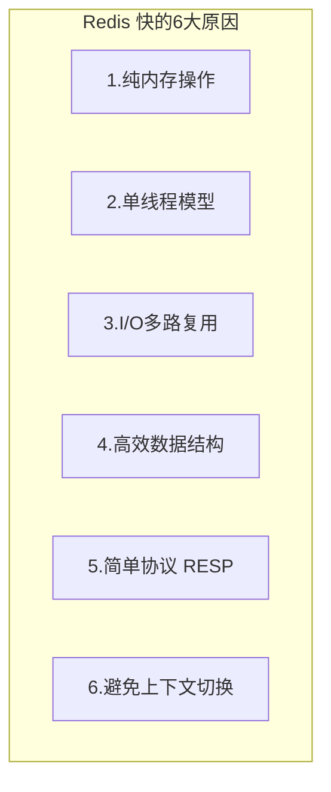
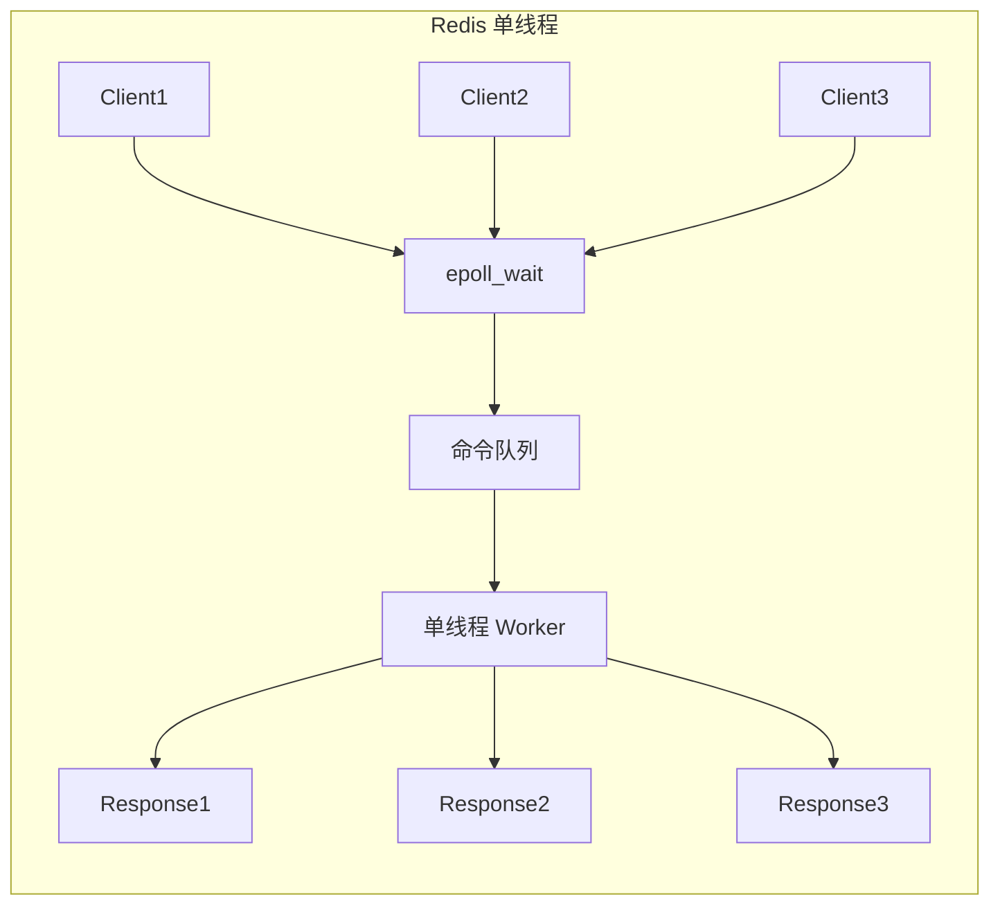
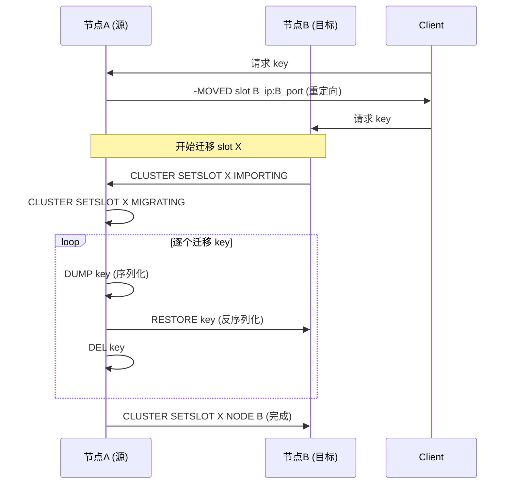

# Redis 面试高频问题

## Q1: 缓存穿透、击穿、雪崩分别是什么？如何解决？

### 缓存穿透
**定义**：查询一个数据库中不存在的数据，缓存层永远没有，每次直接打到 DB。

**解决方案**：
1. **缓存空值**：将 null 也缓存，设置较短 TTL (30-60s)
2. **布隆过滤器**：在缓存前加一层布隆过滤器，不存在的 key 直接拒绝
3. **参数校验**：对非法参数 (如负数 ID) 直接拦截
4. **限流**：对单个 key 的查询频率做限制

### 缓存击穿
**定义**：热点 Key 在过期瞬间，大量并发请求直接打到数据库。

**解决方案**：
1. **互斥锁 (SETNX)**：重建缓存时加锁，只允许一个请求查 DB
2. **永不过期**：物理不设过期时间，用后台线程异步更新
3. **逻辑过期**：value 中包含过期时间，发现过期后加锁异步刷新，旧值继续返回

### 缓存雪崩
**定义**：大量 Key 同时过期或 Redis 宕机，流量全部打到 DB。

**解决方案**：
1. **随机过期时间**：`TTL = base + random(0, 600)`，错开过期
2. **Redis 高可用**：主从 + 哨兵 / Cluster
3. **多级缓存**：L1 本地缓存 + L2 Redis
4. **降级 + 限流**：Sentinel/Hystrix 熔断降级

---

## Q2: Redis 为什么这么快？



| 原因 | 详细说明 |
|------|----------|
| 纯内存操作 | 数据在内存中，纳秒级访问，无磁盘 I/O |
| 单线程模型 | 避免锁竞争、上下文切换开销 (Redis 6.0+ I/O 多线程) |
| I/O 多路复用 | epoll/kqueue/select，一个线程处理大量连接 |
| 高效数据结构 | SDS、Ziplist、Skiplist、Intset，极致优化 |
| RESP 协议 | 文本协议，简单高效，解析快 |
| 避免上下文切换 | 单线程处理命令，无 CPU 上下文切换损耗 |

### 单线程 vs 多线程对比



### Redis 6.0+ I/O 多线程
- 网络读写用多线程 (默认关闭)
- 命令执行仍是单线程
- 配置：`io-threads 4` `io-threads-do-reads yes`

---

## Q3: Redis 内存淘汰策略有哪些？

### 8 种淘汰策略

| 策略 | 说明 | 适用场景 |
|------|------|----------|
| `noeviction` | 不淘汰，写入报错 | 不允许数据丢失 |
| `allkeys-lru` | 所有 key 中 LRU 淘汰 | 通用缓存 (推荐) |
| `volatile-lru` | 有过期时间的 key 中 LRU 淘汰 | 混合场景 |
| `allkeys-lfu` | 所有 key 中 LFU 淘汰 | 热点数据缓存 |
| `volatile-lfu` | 有过期时间的 key 中 LFU 淘汰 | 热点 + 持久混合 |
| `allkeys-random` | 所有 key 随机淘汰 | 数据访问均匀 |
| `volatile-random` | 有过期时间的 key 随机淘汰 | -- |
| `volatile-ttl` | 有过期时间的 key 中 TTL 最短淘汰 | -- |

### LRU vs LFU

| 特性 | LRU (最近最少使用) | LFU (最不经常使用) |
|------|-------------------|-------------------|
| 淘汰依据 | 最近访问时间 | 访问频率 |
| 适合场景 | 一般缓存 | 热点数据缓存 |
| 缺点 | 偶发访问也能留存 | 历史高频数据难淘汰 |

### Redis 近似 LRU
- 随机采样 N 个 key (`maxmemory-samples 5`)
- 淘汰其中最久未访问的
- 性能高，效果接近真实 LRU

---

## Q4: Redis 持久化 RDB vs AOF 怎么选？

| 维度 | RDB | AOF |
|------|-----|-----|
| 文件大小 | 小 (压缩) | 大 (文本) |
| 恢复速度 | 快 | 慢 (重放命令) |
| 数据安全 | 丢失较多 | 最多 1s |
| 性能影响 | fork 短暂阻塞 | fsync 策略决定 |
| 运维成本 | 低 | 需要重写 |

**推荐**：混合持久化 `aof-use-rdb-preamble yes` + AOF everysec

---

## Q5: Redis Cluster 数据如何分布？Slot 迁移过程？

### 数据分布
```
slot = CRC16(key) % 16384
每个 Master 负责一部分 slot 范围
```

### Slot 迁移过程



**ask 错误 vs moved 错误：**
- `MOVED`：slot 永久属于新节点 (客户端更新 slot 映射)
- `ASK`：slot 正在迁移中 (仅本次重定向，下次仍问原节点)

---

## Q6: Redis 大 Key 和热 Key 如何发现与处理？

### 大 Key

**发现方式：**
- `redis-cli --bigkeys`：统计各种类型的最大 key
- `MEMORY USAGE <key>`：精确内存占用
- `redis-rdb-tools`：离线分析 RDB 文件

**处理方案：**
| key 类型 | 方案 |
|----------|------|
| String | 压缩 (snappy/gzip) 或拆为多个 key |
| List/Hash/Set/ZSet | 拆分为多个小 key，按范围/哈希取 |
| 通用 | 删除用 UNLINK (异步)，业务侧控制大小 |

**危害：**
- 内存不均 (单节点撑爆)
- 阻塞 (DEL 大 key 阻塞主线程)
- 网络拥塞 (一次返回数据量大)
- 过期时异步删除占用 CPU

### 热 Key

**发现方式：**
- `redis-cli --hotkeys` (Redis 4.0+)
- `MONITOR` 命令临时监控 (生产慎用)
- 客户端 SDK 统计 (如 Jedis/Lettuce 拦截器)
- Proxy 层统计 (Codis/Twemproxy)

**处理方案：**
1. **本地缓存**：Caffeine/Guava 缓存热 key
2. **读写分离**：热 key 读请求分散到多个 Slave
3. **Key 拆分**：`hot:key:1`, `hot:key:2`, ..., `hot:key:N`
4. **限流**：单 key 级别限流
5. **自适应**：Proxy 层根据 QPS 自动做本地缓存

---

## 面试加分项

1. **源码层面理解**：SDS 的 `sdshdr5/8/16/32/64` 五种类型，节省内存
2. **Redis 6.0+ 新特性**：ACL、RESP3、客户端缓存
3. **Redis 7.0+ 新特性**：Redis Functions、AOF 多时间戳、MPVCC
4. **架构演进思路**：单机 -> 主从 -> 哨兵 -> 集群 -> 多集群 Proxy
5. **压测数据**：能说出 QPS 量级 (单机 10w+ QPS)
6. **真实踩坑**：大 Key DEL 阻塞、RDB fork 内存翻倍、Cluster 跨 slot 事务失败